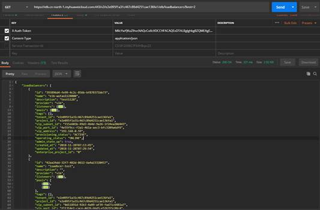
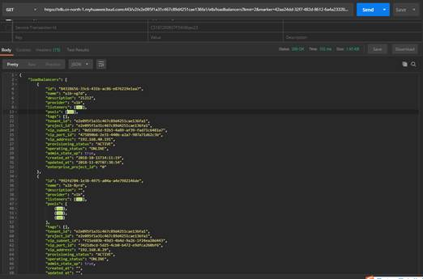
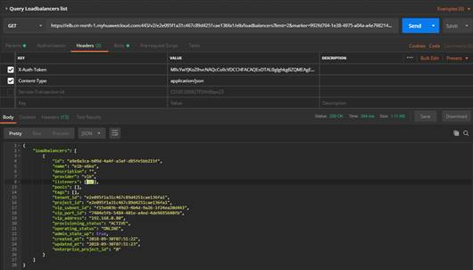

# 分页查询<a name="elb_qs_0014"></a>

## 调试<a name="zh-cn_topic_0168012213_zh-cn_topic_0135706204_section3683205810399"></a>

您可以在[API Explorer](https://apiexplorer.developer.huaweicloud.com/apiexplorer/doc?product=ELB&api=ListLoadbalancers&version=v2)中直接运行调试该接口。

## 操作步骤<a name="zh-cn_topic_0168012213_section1141515425142"></a>

以GET /v2/\{project \_id\}/elb/loadbalancers接口为例，示例帐号下有5个ELB对象，每页查询2个，示范分页查询遍历所有ELB对象的过程。

1.  Postman中设置好头部信息，将获取到的Token放入头部，设置limit为2，查询第一页，如下图。

    **图 1**  分页查询-01<a name="zh-cn_topic_0168012213_fig1349765316912"></a>  
    

2.  <a name="zh-cn_topic_0168012213_li5687192117717"></a>判断上一次查询返回实例数是否小于limit个数，如果小于则表示已查询到最后一页，否则需要继续查询下一页。示例中需要查询下一页，设置marker为上一页中最后一个ELB的ID，设置limit为2，查询第二页，如下图。

    **图 2**  分页查询-02<a name="zh-cn_topic_0168012213_fig1648516555124"></a>  
    

3.  同样判断方法，查询第三页，如下图。

    **图 3**  分页查询-03<a name="zh-cn_topic_0168012213_fig138733613139"></a>  
    

4.  此时上一页查询响应个数小于limit，表示分页查询完成。

## 示例代码<a name="zh-cn_topic_0168012213_section050133689"></a>

[2](#zh-cn_topic_0168012213_li5687192117717)中请求体如下：

```
GET https://elb.cn-north-1.myhuaweicloud.com:443/v2/e2e095f1a31c467c89d4251cae136fa1/elb/loadbalancers?limit=2&marker=42aa24dd-32f7-482d-8612-6a4a23320457
```

[2](#zh-cn_topic_0168012213_li5687192117717)中响应体如下：

```
{
    "loadbalancers": [
        {
            "id": "84328656-33c6-431b-ac86-e876219e1aa7",
            "name": "ulb-vg7d",
            "description": "21212",
            "provider": "vlb",
            "listeners": [
                {
                    "id": "8bad548d-740f-44db-bc91-c10271a0c750"
                }
            ],
            "pools": [
                {
                    "id": "bc632a6f-b691-4f07-8523-2c4c7009d28e"
                },
                {
                    "id": "599a4c5b-c00c-4491-9860-f322200c72a3"
                }
            ],
            "tags": [],
            "tenant_id": "e2e095f1a31c467c89d4251cae136fa1",
            "project_id": "e2e095f1a31c467c89d4251cae136fa1",
            "vip_subnet_id": "0d11891d-92b3-4a89-af39-fad71c6481a7",
            "vip_port_id": "475890b6-2e31-440b-a2a7-907a71d62c3b",
            "vip_address": "192.168.40.191",
            "provisioning_status": "ACTIVE",
            "operating_status": "ONLINE",
            "admin_state_up": true,
            "created_at": "2018-10-11T14:11:19",
            "updated_at": "2018-11-07T07:38:54",
            "enterprise_project_id": "0"
        },
        {
            "id": "992fd704-1e38-4975-a04a-a4e7982146de",
            "name": "ulb-8yrd",
            "description": "",
            "provider": "vlb",
            "listeners": [
                {
                    "id": "ad49e548-1466-43de-9247-10f56e1f2e0e"
                },
                {
                    "id": "bdba3fa8-574f-4c6e-a808-8f21b54b9b1a"
                }
            ],
            "pools": [
                {
                    "id": "10977afc-dfb9-40fa-afa5-2177aa8f8529"
                },
                {
                    "id": "18238c04-5b33-4e5c-8069-8728dece4b54"
                },
                {
                    "id": "5389884f-e884-4c98-9e5f-1b8da5cb3fd0"
                }
            ],
            "tags": [],
            "tenant_id": "e2e095f1a31c467c89d4251cae136fa1",
            "project_id": "e2e095f1a31c467c89d4251cae136fa1",
            "vip_subnet_id": "f15e603b-49d3-4b4d-9a26-1f24ea20d443",
            "vip_port_id": "3421dbcd-5d25-4cb0-b472-e9dfca260bf6",
            "vip_address": "192.168.0.29",
            "provisioning_status": "ACTIVE",
            "operating_status": "ONLINE",
            "admin_state_up": true,
            "created_at": "",
            "updated_at": "",
            "enterprise_project_id": "0"
        }
    ]
}
```

