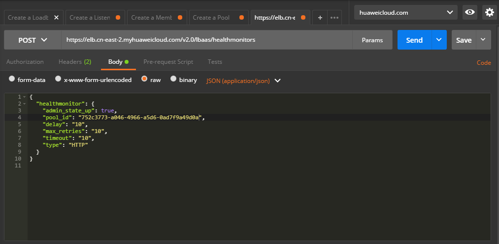

# 创建健康检查<a name="elb_qs_0009"></a>

## 调试<a name="zh-cn_topic_0135706226_zh-cn_topic_0135706204_section3683205810399"></a>

您可以在[API Explorer](https://apiexplorer.developer.huaweicloud.com/apiexplorer/doc?product=ELB&api=CreateHealthmonitor&version=v2)中直接运行调试该接口。

## 接口格式<a name="zh-cn_topic_0135706226_section14216843"></a>

<a name="zh-cn_topic_0135706226_table62515659"></a>
<table><thead align="left"><tr id="zh-cn_topic_0135706226_row619185"><th class="cellrowborder" valign="top" width="33.33333333333333%" id="mcps1.1.4.1.1"><p id="zh-cn_topic_0135706226_p50154042"><a name="zh-cn_topic_0135706226_p50154042"></a><a name="zh-cn_topic_0135706226_p50154042"></a>方法</p>
</th>
<th class="cellrowborder" valign="top" width="33.33333333333333%" id="mcps1.1.4.1.2"><p id="zh-cn_topic_0135706226_p35945571"><a name="zh-cn_topic_0135706226_p35945571"></a><a name="zh-cn_topic_0135706226_p35945571"></a>URI</p>
</th>
<th class="cellrowborder" valign="top" width="33.33333333333333%" id="mcps1.1.4.1.3"><p id="zh-cn_topic_0135706226_p25910100"><a name="zh-cn_topic_0135706226_p25910100"></a><a name="zh-cn_topic_0135706226_p25910100"></a>说明</p>
</th>
</tr>
</thead>
<tbody><tr id="zh-cn_topic_0135706226_row18343350"><td class="cellrowborder" valign="top" width="33.33333333333333%" headers="mcps1.1.4.1.1 "><p id="zh-cn_topic_0135706226_p9416368"><a name="zh-cn_topic_0135706226_p9416368"></a><a name="zh-cn_topic_0135706226_p9416368"></a>POST</p>
</td>
<td class="cellrowborder" valign="top" width="33.33333333333333%" headers="mcps1.1.4.1.2 "><p id="zh-cn_topic_0135706226_p24528363"><a name="zh-cn_topic_0135706226_p24528363"></a><a name="zh-cn_topic_0135706226_p24528363"></a>/v2.0/lbaas/healthmonitors</p>
</td>
<td class="cellrowborder" valign="top" width="33.33333333333333%" headers="mcps1.1.4.1.3 "><p id="zh-cn_topic_0135706226_p40640399"><a name="zh-cn_topic_0135706226_p40640399"></a><a name="zh-cn_topic_0135706226_p40640399"></a>创建健康检查。</p>
</td>
</tr>
</tbody>
</table>

## 接口约束<a name="zh-cn_topic_0135706226_section60842729"></a>

-   安全组需放通网段100.125.0.0/16流量。
-   admin\_state\_up参数必须是true。
-   UDP的检查健康只能使用在UDP的后端云服务器组上。

## 具体步骤<a name="zh-cn_topic_0135706226_section10713655"></a>

1.  设置请求消息头。Postman中设置好头部信息，将获取到的Token放入头部。

    **图 1**  设置请求消息头-创建健康检查<a name="zh-cn_topic_0135706226_fig14871631476"></a>  
    

2.  <a name="zh-cn_topic_0135706226_li33311077"></a>在Body标签中填写请求消息体。

    **图 2**  填写请求消息体-创建健康检查<a name="zh-cn_topic_0135706226_fig11178144815715"></a>  
    

3.  填写URL。

    ```
    https://elb.cn-east-2.myhuaweicloud.com/v2.0/lbaas/healthmonitors
    ```

4.  发送请求。选择请求方法为POST，点击Send按钮，得到服务端响应。

    ```
    {
        "healthmonitor": {
            "monitor_port": null,
            "name": "",
            "admin_state_up": true,
            "tenant_id": "0d0bf0e8fb564cc9abbe526dbdca9248",
            "delay": 10,
            "expected_codes": "200",
            "max_retries": 10,
            "http_method": "GET",
            "timeout": 10,
            "pools": [
                {
                    "id": "752c3773-a046-4966-a5d6-0ad7f9a49d0a"
                }
            ],
            "url_path": "/",
            "type": "HTTP",
            "id": "9b6d7438-a6eb-4d49-ae77-3c130e3b7ae8"
        }
    }
    ```


## 示例代码<a name="zh-cn_topic_0135706226_section4498114215258"></a>

[2](#zh-cn_topic_0135706226_li33311077)中消息体内容

```
{ 
  "healthmonitor": { 
    "admin_state_up": true, 
    "pool_id": "752c3773-a046-4966-a5d6-0ad7f9a49d0a", 
    "delay": "10", 
    "max_retries": "10", 
    "timeout": "10", 
    "type": "HTTP" 
  } 
} 
```

