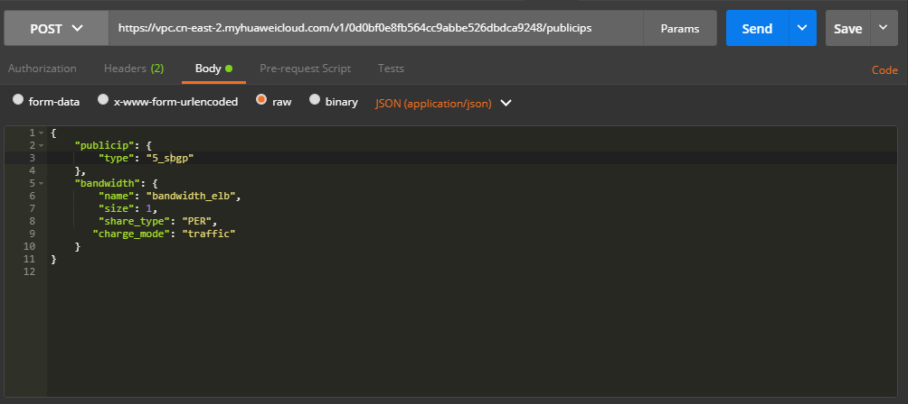
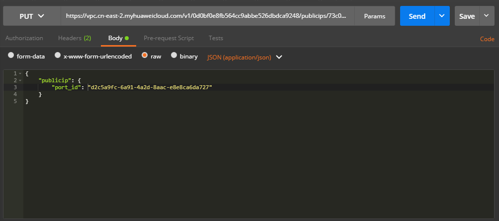

# 创建公网负载均衡器<a name="ZH-CN_TOPIC_0210354319"></a>

给一个ELB绑上一个弹性公网IP，这个ELB就成了公网ELB，客户端就可以从外网访问位于ELB后面的后端服务器了。

## 购买弹性公网IP<a name="zh-cn_topic_0135706211_section2787194773920"></a>

**接口格式**

<a name="zh-cn_topic_0135706211_table1836811442916"></a>
<table><thead align="left"><tr id="zh-cn_topic_0135706211_row113681147293"><th class="cellrowborder" valign="top" width="33.33333333333333%" id="mcps1.1.4.1.1"><p id="zh-cn_topic_0135706211_p123681849299"><a name="zh-cn_topic_0135706211_p123681849299"></a><a name="zh-cn_topic_0135706211_p123681849299"></a>方法</p>
</th>
<th class="cellrowborder" valign="top" width="33.3033303330333%" id="mcps1.1.4.1.2"><p id="zh-cn_topic_0135706211_p113689492917"><a name="zh-cn_topic_0135706211_p113689492917"></a><a name="zh-cn_topic_0135706211_p113689492917"></a>URI</p>
</th>
<th class="cellrowborder" valign="top" width="33.36333633363336%" id="mcps1.1.4.1.3"><p id="zh-cn_topic_0135706211_p18368104162912"><a name="zh-cn_topic_0135706211_p18368104162912"></a><a name="zh-cn_topic_0135706211_p18368104162912"></a>说明</p>
</th>
</tr>
</thead>
<tbody><tr id="zh-cn_topic_0135706211_row93681452910"><td class="cellrowborder" valign="top" width="33.33333333333333%" headers="mcps1.1.4.1.1 "><p id="zh-cn_topic_0135706211_p73684412293"><a name="zh-cn_topic_0135706211_p73684412293"></a><a name="zh-cn_topic_0135706211_p73684412293"></a>POST</p>
</td>
<td class="cellrowborder" valign="top" width="33.3033303330333%" headers="mcps1.1.4.1.2 "><p id="zh-cn_topic_0135706211_p193681341292"><a name="zh-cn_topic_0135706211_p193681341292"></a><a name="zh-cn_topic_0135706211_p193681341292"></a>/v1/{tenant_id}/publicips</p>
</td>
<td class="cellrowborder" valign="top" width="33.36333633363336%" headers="mcps1.1.4.1.3 "><p id="zh-cn_topic_0135706211_p53680442916"><a name="zh-cn_topic_0135706211_p53680442916"></a><a name="zh-cn_topic_0135706211_p53680442916"></a>申请弹性公网IP</p>
</td>
</tr>
</tbody>
</table>

**具体步骤**

1.  设置请求消息头。

    在Postman中设置好头部信息，将获取到的Token放入头部，如下图所示。

    

2.  <a name="zh-cn_topic_0135706211_li95182052144919"></a>在Body标签中填写请求消息体。

    

3.  填写URL。

    ```
    https://vpc.cn-east-2.myhuaweicloud.com/v1/0d0bf0e8fb564cc9abbe526dbdca9248/publicips
    ```

4.  发送请求。选择请求方法为POST，点击Send按钮，得到服务端响应

    ```
    {
        "publicip": {
            "id": "73c079fc-357a-4d34-8ba1-818a9d9a2aa2",
            "status": "PENDING_CREATE",
            "type": "5_sbgp",
            "public_ip_address": "122.112.235.121",
            "tenant_id": "0d0bf0e8fb564cc9abbe526dbdca9248",
            "create_time": "2018-07-11 02:40:32",
            "bandwidth_size": 0,
            "enterprise_project_id": "0"
        }
    }
    ```

    > **说明：**   
    >请注意，此时响应体中的tenant\_id实为web页面上的项目ID。  


**示例代码**

[2](#zh-cn_topic_0135706211_li95182052144919)中所发送的消息体

```
{
    "publicip": {
        "type": "5_sbgp"
    },
    "bandwidth": {
        "name": "bandwidth_elb",
        "size": 1,
        "share_type": "PER",
        "charge_mode": "traffic"
    }
}
```

> **说明：**   
>此处的消息体字段和格式等，具体请参考《虚拟私有云API参考》。  

## 绑定弹性公网IP<a name="zh-cn_topic_0135706211_section137585014302"></a>

**接口格式**

<a name="zh-cn_topic_0135706211_table128792007305"></a>
<table><thead align="left"><tr id="zh-cn_topic_0135706211_row1887815010305"><th class="cellrowborder" valign="top" width="18.18%" id="mcps1.1.4.1.1"><p id="zh-cn_topic_0135706211_p1587816053011"><a name="zh-cn_topic_0135706211_p1587816053011"></a><a name="zh-cn_topic_0135706211_p1587816053011"></a>方法</p>
</th>
<th class="cellrowborder" valign="top" width="51.519999999999996%" id="mcps1.1.4.1.2"><p id="zh-cn_topic_0135706211_p5878200193020"><a name="zh-cn_topic_0135706211_p5878200193020"></a><a name="zh-cn_topic_0135706211_p5878200193020"></a>URI</p>
</th>
<th class="cellrowborder" valign="top" width="30.3%" id="mcps1.1.4.1.3"><p id="zh-cn_topic_0135706211_p4878603301"><a name="zh-cn_topic_0135706211_p4878603301"></a><a name="zh-cn_topic_0135706211_p4878603301"></a>说明</p>
</th>
</tr>
</thead>
<tbody><tr id="zh-cn_topic_0135706211_row1487910043015"><td class="cellrowborder" valign="top" width="18.18%" headers="mcps1.1.4.1.1 "><p id="zh-cn_topic_0135706211_p7879105308"><a name="zh-cn_topic_0135706211_p7879105308"></a><a name="zh-cn_topic_0135706211_p7879105308"></a>PUT</p>
</td>
<td class="cellrowborder" valign="top" width="51.519999999999996%" headers="mcps1.1.4.1.2 "><p id="zh-cn_topic_0135706211_p38793023010"><a name="zh-cn_topic_0135706211_p38793023010"></a><a name="zh-cn_topic_0135706211_p38793023010"></a>/v1/{tenant_id}/publicips/{publicip_id}</p>
</td>
<td class="cellrowborder" valign="top" width="30.3%" headers="mcps1.1.4.1.3 "><p id="zh-cn_topic_0135706211_p587914019306"><a name="zh-cn_topic_0135706211_p587914019306"></a><a name="zh-cn_topic_0135706211_p587914019306"></a>绑定弹性公网IP</p>
</td>
</tr>
</tbody>
</table>

**具体步骤**

1.  设置请求消息头。

    在Postman中设置好头部信息，将获取到的Token放入头部，如下图所示。

    

2.  <a name="zh-cn_topic_0135706211_li148803073011"></a>在Body标签中填写请求消息体。

    

    > **说明：**   
    >port\_id的值可以通过调用虚拟私有云（VPC）的接口获得，请求方式如下：  
    >```  
    >GET https://vpc.cn-north-1.myhuaweicloud.com/v2.0/ports?network_id=网络ID&fixed_ips=ip_address=ELB私网IP地址  
    >```  

    选择“网络 \> 虚拟私有云”，单击相应的虚拟私有云名称，从子网页面获得网络ID和ELB私网IP地址的值。

3.  填写URL。

    ```
    https://vpc.cn-east-2.myhuaweicloud.com/v1/{{project_id}}/publicips/{{eip_id}}
    ```

    > **说明：**   
    >eip\_id为[购买弹性公网IP](#zh-cn_topic_0135706211_section2787194773920)时返回的ID。  

4.  发送请求。选择请求方法为PUT，点击Send按钮，得到服务端响应

    ```
    {
        "publicip": {
            "id": "73c079fc-357a-4d34-8ba1-818a9d9a2aa2",
            "status": "ACTIVE",
            "type": "5_sbgp",
            "port_id": "d2c5a9fc-6a91-4a2d-8aac-e8e8ca6da727",
            "public_ip_address": "122.112.235.121",
            "private_ip_address": "192.168.0.160",
            "tenant_id": "0d0bf0e8fb564cc9abbe526dbdca9248",
            "create_time": "2018-07-11 02:40:32",
            "bandwidth_size": 1
        }
    }
    ```


**示例代码**

[2](#zh-cn_topic_0135706211_li148803073011)中消息体内容

```
{
    "publicip": {
        "port_id": "d2c5a9fc-6a91-4a2d-8aac-e8e8ca6da727"
    }
}
```

