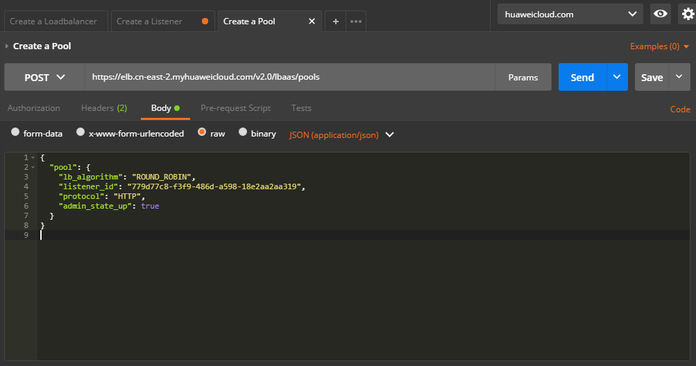

# 创建后端云服务器组<a name="elb_qs_0007"></a>

## 调试<a name="zh-cn_topic_0135706223_zh-cn_topic_0135706204_section3683205810399"></a>

您可以在[API Explorer](https://apiexplorer.developer.huaweicloud.com/apiexplorer/doc?product=ELB&api=CreatePool&version=v2)中直接运行调试该接口。

## 接口格式<a name="zh-cn_topic_0135706223_section8857414"></a>

<a name="zh-cn_topic_0135706223_table12789249"></a>
<table><thead align="left"><tr id="zh-cn_topic_0135706223_row12666702"><th class="cellrowborder" valign="top" width="33.33333333333333%" id="mcps1.1.4.1.1"><p id="zh-cn_topic_0135706223_p19369923"><a name="zh-cn_topic_0135706223_p19369923"></a><a name="zh-cn_topic_0135706223_p19369923"></a>方法</p>
</th>
<th class="cellrowborder" valign="top" width="33.33333333333333%" id="mcps1.1.4.1.2"><p id="zh-cn_topic_0135706223_p25459945"><a name="zh-cn_topic_0135706223_p25459945"></a><a name="zh-cn_topic_0135706223_p25459945"></a>URI</p>
</th>
<th class="cellrowborder" valign="top" width="33.33333333333333%" id="mcps1.1.4.1.3"><p id="zh-cn_topic_0135706223_p48989671"><a name="zh-cn_topic_0135706223_p48989671"></a><a name="zh-cn_topic_0135706223_p48989671"></a>说明</p>
</th>
</tr>
</thead>
<tbody><tr id="zh-cn_topic_0135706223_row8740454"><td class="cellrowborder" valign="top" width="33.33333333333333%" headers="mcps1.1.4.1.1 "><p id="zh-cn_topic_0135706223_p36888206"><a name="zh-cn_topic_0135706223_p36888206"></a><a name="zh-cn_topic_0135706223_p36888206"></a>POST</p>
</td>
<td class="cellrowborder" valign="top" width="33.33333333333333%" headers="mcps1.1.4.1.2 "><p id="zh-cn_topic_0135706223_p35154694"><a name="zh-cn_topic_0135706223_p35154694"></a><a name="zh-cn_topic_0135706223_p35154694"></a>/v2.0/lbaas/pools</p>
</td>
<td class="cellrowborder" valign="top" width="33.33333333333333%" headers="mcps1.1.4.1.3 "><p id="zh-cn_topic_0135706223_p28957942"><a name="zh-cn_topic_0135706223_p28957942"></a><a name="zh-cn_topic_0135706223_p28957942"></a>创建后端云服务器组。</p>
</td>
</tr>
</tbody>
</table>

## 具体步骤<a name="zh-cn_topic_0135706223_section12607865"></a>

1.  设置请求消息头。在Postman中设置好头部信息，将获取到的Token放入头部，如下图所示。

    **图 1**  设置请求消息头-创建后端云服务器组<a name="zh-cn_topic_0135706223_fig4161327657"></a>  
    

2.  <a name="zh-cn_topic_0135706223_li11878413"></a>在Body标签中填写请求消息体。

    **图 2**  填写请求消息体-创建后端云服务器组<a name="zh-cn_topic_0135706223_fig2036517552518"></a>  
    

3.  填写URL。

    ```
    https://elb.cn-east-2.myhuaweicloud.com/v2.0/lbaas/pools
    ```

4.  发送请求。选择请求方法为POST，点击Send按钮，得到服务端响应：

    ```
    {
        "pool": {
            "lb_algorithm": "ROUND_ROBIN",
            "protocol": "HTTP",
            "description": "",
            "admin_state_up": true,
            "loadbalancers": [
                {
                    "id": "abe3ee34-1882-408f-a2ba-1ce7e428d6e3"
                }
            ],
            "tenant_id": "0d0bf0e8fb564cc9abbe526dbdca9248",
            "session_persistence": null,
            "healthmonitor_id": null,
            "listeners": [
                {
                    "id": "ecb4d58e-3b09-4a9d-9ad2-159b21e13f83"
                }
            ],
            "members": [],
            "id": "752c3773-a046-4966-a5d6-0ad7f9a49d0a",
            "name": ""
        }
    }
    ```


## 示例代码<a name="zh-cn_topic_0135706223_section14604170"></a>

[2](#zh-cn_topic_0135706223_li11878413)中消息体内容

```
{
    "pool": {
        "lb_algorithm": "ROUND_ROBIN",
        "listener_id": "{{listener_id}}",
        "protocol": "HTTP",
        "admin_state_up": true
    }
}
```

