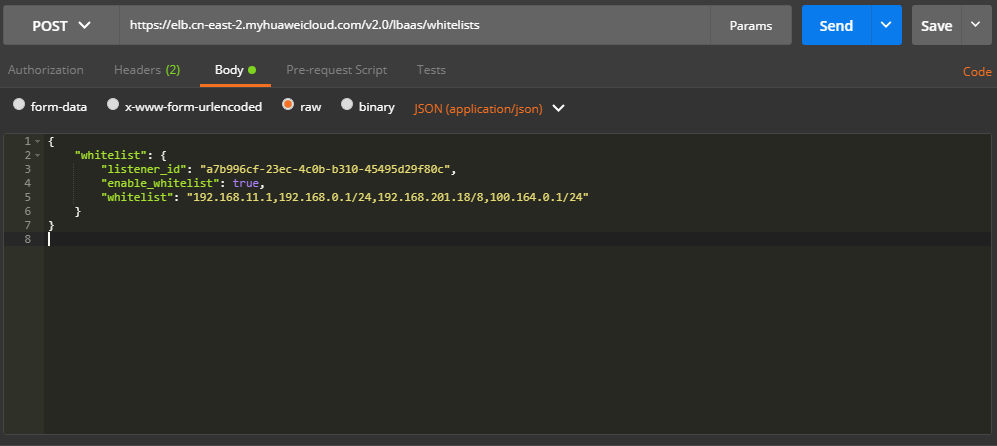

# 创建白名单<a name="elb_qs_0012"></a>

## 调试<a name="zh-cn_topic_0135706203_zh-cn_topic_0135706204_section3683205810399"></a>

您可以在[API Explorer](https://apiexplorer.developer.huaweicloud.com/apiexplorer/doc?product=ELB&api=CreateWhitelist&version=v2)中直接运行调试该接口。

## 接口格式<a name="zh-cn_topic_0135706203_section34837877"></a>

<a name="zh-cn_topic_0135706203_table65308864"></a>
<table><thead align="left"><tr id="zh-cn_topic_0135706203_row43073965"><th class="cellrowborder" valign="top" width="33.33333333333333%" id="mcps1.1.4.1.1"><p id="zh-cn_topic_0135706203_p66439141"><a name="zh-cn_topic_0135706203_p66439141"></a><a name="zh-cn_topic_0135706203_p66439141"></a>方法</p>
</th>
<th class="cellrowborder" valign="top" width="33.33333333333333%" id="mcps1.1.4.1.2"><p id="zh-cn_topic_0135706203_p12861354"><a name="zh-cn_topic_0135706203_p12861354"></a><a name="zh-cn_topic_0135706203_p12861354"></a>URI</p>
</th>
<th class="cellrowborder" valign="top" width="33.33333333333333%" id="mcps1.1.4.1.3"><p id="zh-cn_topic_0135706203_p35136739"><a name="zh-cn_topic_0135706203_p35136739"></a><a name="zh-cn_topic_0135706203_p35136739"></a>说明</p>
</th>
</tr>
</thead>
<tbody><tr id="zh-cn_topic_0135706203_row27503609"><td class="cellrowborder" valign="top" width="33.33333333333333%" headers="mcps1.1.4.1.1 "><p id="zh-cn_topic_0135706203_p13199827"><a name="zh-cn_topic_0135706203_p13199827"></a><a name="zh-cn_topic_0135706203_p13199827"></a>POST</p>
</td>
<td class="cellrowborder" valign="top" width="33.33333333333333%" headers="mcps1.1.4.1.2 "><p id="zh-cn_topic_0135706203_p62553049"><a name="zh-cn_topic_0135706203_p62553049"></a><a name="zh-cn_topic_0135706203_p62553049"></a>/v2.0/lbaas/whitelists</p>
</td>
<td class="cellrowborder" valign="top" width="33.33333333333333%" headers="mcps1.1.4.1.3 "><p id="zh-cn_topic_0135706203_p33632245"><a name="zh-cn_topic_0135706203_p33632245"></a><a name="zh-cn_topic_0135706203_p33632245"></a>创建一个whitelist。</p>
</td>
</tr>
</tbody>
</table>

## 具体步骤<a name="zh-cn_topic_0135706203_section45105443"></a>

1.  设置请求消息头。Postman中设置好头部信息，将获取到的Token放入头部，如下图。

    **图 1**  设置请求消息头-创建白名单<a name="zh-cn_topic_0135706203_fig179352191816"></a>  
    

2.  <a name="zh-cn_topic_0135706203_li27446478"></a>在Body标签中填写请求消息体。

    **图 2**  填写请求消息体-创建白名单<a name="zh-cn_topic_0135706203_fig6975123717813"></a>  
    

3.  填写URL

    ```
    https://elb.cn-east-2.myhuaweicloud.com/v2.0/lbaas/whitelists
    ```

4.  发送请求。

    选择请求方法为POST，点击Send按钮，得到服务端响应：

    ```
    {
        "whitelist": {
            "tenant_id": "0d0bf0e8fb564cc9abbe526dbdca9248",
            "whitelist": "192.168.11.1,192.168.0.1/24,192.168.201.18/8,100.164.0.1/24",
            "enable_whitelist": true,
            "id": "317a0ea1-e47b-4e8b-996f-0556270245c3",
            "listener_id": "a7b996cf-23ec-4c0b-b310-45495d29f80c"
        }
    }
    ```


## 示例代码<a name="zh-cn_topic_0135706203_section3295803"></a>

[2](#zh-cn_topic_0135706203_li27446478)中消息体内容

```
{
    "whitelist": {
        "listener_id": "a7b996cf-23ec-4c0b-b310-45495d29f80c",
        "enable_whitelist": true,
        "whitelist": "192.168.11.1,192.168.0.1/24,192.168.201.18/8,100.164.0.1/24"
    }
}
```

