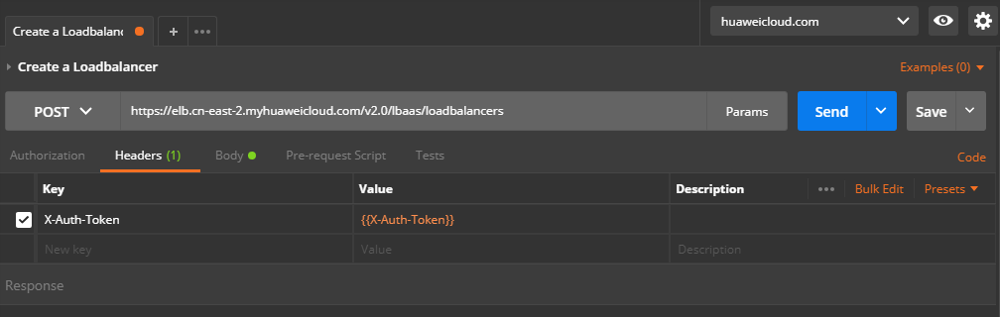
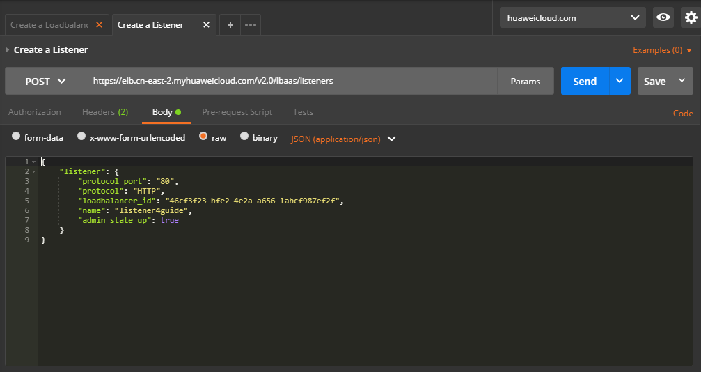

# 创建监听器<a name="elb_qs_0006"></a>

## 调试<a name="zh-cn_topic_0135706204_section3683205810399"></a>

您可以在[API Explorer](https://apiexplorer.developer.huaweicloud.com/apiexplorer/doc?product=ELB&version=v2&api=CreateListener)中直接运行调试该接口。

## 接口格式<a name="zh-cn_topic_0135706204_section58994294"></a>

<a name="zh-cn_topic_0135706204_table4329376"></a>
<table><thead align="left"><tr id="zh-cn_topic_0135706204_row48017058"><th class="cellrowborder" valign="top" width="23.232323232323232%" id="mcps1.1.4.1.1"><p id="zh-cn_topic_0135706204_p64176508"><a name="zh-cn_topic_0135706204_p64176508"></a><a name="zh-cn_topic_0135706204_p64176508"></a>方法</p>
</th>
<th class="cellrowborder" valign="top" width="30.303030303030305%" id="mcps1.1.4.1.2"><p id="zh-cn_topic_0135706204_p30914650"><a name="zh-cn_topic_0135706204_p30914650"></a><a name="zh-cn_topic_0135706204_p30914650"></a>URI</p>
</th>
<th class="cellrowborder" valign="top" width="46.464646464646464%" id="mcps1.1.4.1.3"><p id="zh-cn_topic_0135706204_p21058725"><a name="zh-cn_topic_0135706204_p21058725"></a><a name="zh-cn_topic_0135706204_p21058725"></a>说明</p>
</th>
</tr>
</thead>
<tbody><tr id="zh-cn_topic_0135706204_row28035140"><td class="cellrowborder" valign="top" width="23.232323232323232%" headers="mcps1.1.4.1.1 "><p id="zh-cn_topic_0135706204_p56253856"><a name="zh-cn_topic_0135706204_p56253856"></a><a name="zh-cn_topic_0135706204_p56253856"></a>POST</p>
</td>
<td class="cellrowborder" valign="top" width="30.303030303030305%" headers="mcps1.1.4.1.2 "><p id="zh-cn_topic_0135706204_p60268448"><a name="zh-cn_topic_0135706204_p60268448"></a><a name="zh-cn_topic_0135706204_p60268448"></a>/v2.0/lbaas/listeners</p>
</td>
<td class="cellrowborder" valign="top" width="46.464646464646464%" headers="mcps1.1.4.1.3 "><p id="zh-cn_topic_0135706204_p49906092"><a name="zh-cn_topic_0135706204_p49906092"></a><a name="zh-cn_topic_0135706204_p49906092"></a>创建一个监听器。</p>
</td>
</tr>
</tbody>
</table>

## 接口约束<a name="zh-cn_topic_0135706204_section61186599"></a>

同一负载均衡器下监听某一端口的监听器不能多于1个。

## 具体步骤<a name="zh-cn_topic_0135706204_section13808481"></a>

1.  设置请求消息头。在Postman中设置好头部信息，将获取到的Token放入头部，如下图所示。

    **图 1**  设置请求消息头-创建监听器<a name="zh-cn_topic_0135706204_fig98119255218"></a>  
    

2.  <a name="zh-cn_topic_0135706204_li62117599"></a>在Body标签中填写请求消息体。

    **图 2**  填写请求消息体-创建监听器<a name="zh-cn_topic_0135706204_fig1289457652"></a>  
    

3.  填写URL。

    ```
    https://elb.cn-east-2.myhuaweicloud.com/v2.0/lbaas/listeners
    ```

4.  发送请求。选择请求方法为POST，点击Send按钮，得到服务端响应。

    ```
    {
        "listener": {
            "protocol_port": 80,
            "protocol": "HTTP",
            "description": "",
            "default_tls_container_ref": null,
            "admin_state_up": true,
            "loadbalancers": [
                {
                    "id": "abe3ee34-1882-408f-a2ba-1ce7e428d6e3"
                }
            ],
            "tenant_id": "0d0bf0e8fb564cc9abbe526dbdca9248",
            "sni_container_refs": [],
            "connection_limit": -1,
            "default_pool_id": null,
            "id": "779d77c8-f3f9-486d-a598-18e2aa2aa319",
            "name": "listener4guide"
        }
    }
    ```


## 示例代码<a name="zh-cn_topic_0135706204_section19415151483720"></a>

[2](#zh-cn_topic_0135706204_li62117599)中消息体内容

```
{
    "listener": {
        "protocol_port": "80",
        "protocol": "HTTP",
        "loadbalancer_id": "abe3ee34-1882-408f-a2ba-1ce7e428d6e3",
        "name": "listener4guide",
        "admin_state_up": true
    }
}
```

