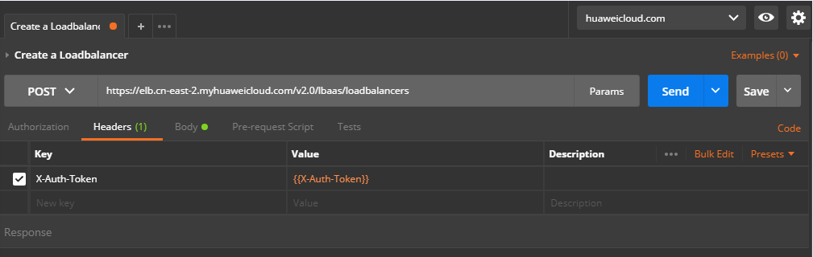
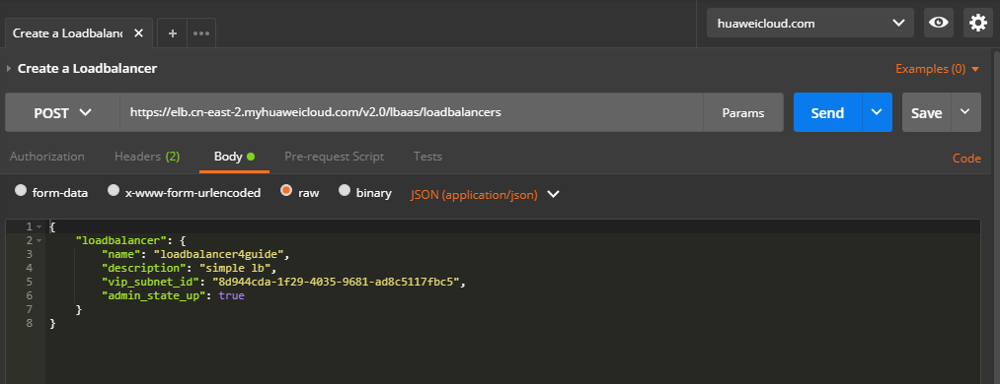

# 创建负载均衡器<a name="elb_qs_0004"></a>

假设用户已在云平台创建了虚拟私有云和若干弹性云服务器，现在为了实现所提供服务的高性能和高可用性，需要使用弹性负载均衡技术来将请求分发到不同的后端云服务器。

## 调试<a name="zh-cn_topic_0135706200_section3683205810399"></a>

您可以在[API Explorer](https://apiexplorer.developer.huaweicloud.com/apiexplorer/doc?product=ELB&api=CreateLoadbalancer&version=v2)中直接运行调试该接口。

## 接口格式<a name="zh-cn_topic_0135706200_section28788730"></a>

<a name="zh-cn_topic_0135706200_table27697526"></a>
<table><thead align="left"><tr id="zh-cn_topic_0135706200_row9977790"><th class="cellrowborder" valign="top" width="29.292929292929294%" id="mcps1.1.4.1.1"><p id="zh-cn_topic_0135706200_p2894687"><a name="zh-cn_topic_0135706200_p2894687"></a><a name="zh-cn_topic_0135706200_p2894687"></a>方法</p>
</th>
<th class="cellrowborder" valign="top" width="35.35353535353536%" id="mcps1.1.4.1.2"><p id="zh-cn_topic_0135706200_p33143133"><a name="zh-cn_topic_0135706200_p33143133"></a><a name="zh-cn_topic_0135706200_p33143133"></a>URI</p>
</th>
<th class="cellrowborder" valign="top" width="35.35353535353536%" id="mcps1.1.4.1.3"><p id="zh-cn_topic_0135706200_p239263"><a name="zh-cn_topic_0135706200_p239263"></a><a name="zh-cn_topic_0135706200_p239263"></a>说明</p>
</th>
</tr>
</thead>
<tbody><tr id="zh-cn_topic_0135706200_row19380366"><td class="cellrowborder" valign="top" width="29.292929292929294%" headers="mcps1.1.4.1.1 "><p id="zh-cn_topic_0135706200_p26305809"><a name="zh-cn_topic_0135706200_p26305809"></a><a name="zh-cn_topic_0135706200_p26305809"></a>POST</p>
</td>
<td class="cellrowborder" valign="top" width="35.35353535353536%" headers="mcps1.1.4.1.2 "><p id="zh-cn_topic_0135706200_p50395793"><a name="zh-cn_topic_0135706200_p50395793"></a><a name="zh-cn_topic_0135706200_p50395793"></a>/v3/{project_id}/elb/loadbalancers</p>
</td>
<td class="cellrowborder" valign="top" width="35.35353535353536%" headers="mcps1.1.4.1.3 "><p id="zh-cn_topic_0135706200_p55527413"><a name="zh-cn_topic_0135706200_p55527413"></a><a name="zh-cn_topic_0135706200_p55527413"></a>创建负载均衡器。</p>
</td>
</tr>
</tbody>
</table>

## 具体步骤<a name="zh-cn_topic_0135706200_section57771982"></a>

1.  设置请求消息头。

    在Postman中设置好头部信息，将获取到的Token放入头部，如下图。

    **图 1**  设置请求消息头-创建负载均衡器<a name="zh-cn_topic_0135706200_fig9571194319585"></a>  
    

    > **说明：** 
    >Token的值可以用环境变量传入，也可以直接填写。

2.  <a name="zh-cn_topic_0135706200_li1268820384356"></a>在Body标签中填写请求消息体。

    **图 2**  填写请求消息体-创建负载均衡器<a name="zh-cn_topic_0135706200_fig173212123592"></a>  
    

    上图中的代码请见[示例代码](#zh-cn_topic_0135706200_section545924519464)，或参考《弹性负载均衡API参考》添加其他需要的字段。

3.  填写URL。

    请求的URL由几部分组成，每部分都有不同的含义：

    <a name="zh-cn_topic_0135706200_table15734461"></a>
    <table><thead align="left"><tr id="zh-cn_topic_0135706200_row163859550434"><th class="cellrowborder" colspan="4" valign="top" id="mcps1.1.6.1.1"><p id="zh-cn_topic_0135706200_p295112734414"><a name="zh-cn_topic_0135706200_p295112734414"></a><a name="zh-cn_topic_0135706200_p295112734414"></a>Endpoint</p>
    </th>
    <th class="cellrowborder" valign="top" id="mcps1.1.6.1.2"><p id="zh-cn_topic_0135706200_p6386165512431"><a name="zh-cn_topic_0135706200_p6386165512431"></a><a name="zh-cn_topic_0135706200_p6386165512431"></a>URI</p>
    </th>
    </tr>
    </thead>
    <tbody><tr id="zh-cn_topic_0135706200_row12330925"><td class="cellrowborder" valign="top" width="20%" headers="mcps1.1.6.1.1 "><p id="zh-cn_topic_0135706200_p59280891"><a name="zh-cn_topic_0135706200_p59280891"></a><a name="zh-cn_topic_0135706200_p59280891"></a>https://</p>
    </td>
    <td class="cellrowborder" valign="top" width="20%" headers="mcps1.1.6.1.1 "><p id="zh-cn_topic_0135706200_p37022841"><a name="zh-cn_topic_0135706200_p37022841"></a><a name="zh-cn_topic_0135706200_p37022841"></a>elb</p>
    </td>
    <td class="cellrowborder" valign="top" width="20%" headers="mcps1.1.6.1.1 "><p id="zh-cn_topic_0135706200_p46060111"><a name="zh-cn_topic_0135706200_p46060111"></a><a name="zh-cn_topic_0135706200_p46060111"></a>.cn-north-1</p>
    </td>
    <td class="cellrowborder" valign="top" width="20%" headers="mcps1.1.6.1.1 "><p id="zh-cn_topic_0135706200_p39881510"><a name="zh-cn_topic_0135706200_p39881510"></a><a name="zh-cn_topic_0135706200_p39881510"></a>.myhuaweicloud.com</p>
    </td>
    <td class="cellrowborder" valign="top" width="20%" headers="mcps1.1.6.1.2 "><p id="zh-cn_topic_0135706200_p9176869"><a name="zh-cn_topic_0135706200_p9176869"></a><a name="zh-cn_topic_0135706200_p9176869"></a>/v2.0/lbaas/loadbalancers</p>
    </td>
    </tr>
    <tr id="zh-cn_topic_0135706200_row15482964"><td class="cellrowborder" valign="top" width="20%" headers="mcps1.1.6.1.1 "><p id="zh-cn_topic_0135706200_p798132744416"><a name="zh-cn_topic_0135706200_p798132744416"></a><a name="zh-cn_topic_0135706200_p798132744416"></a>-</p>
    </td>
    <td class="cellrowborder" valign="top" width="20%" headers="mcps1.1.6.1.1 "><p id="zh-cn_topic_0135706200_p48016815"><a name="zh-cn_topic_0135706200_p48016815"></a><a name="zh-cn_topic_0135706200_p48016815"></a>服务名</p>
    </td>
    <td class="cellrowborder" valign="top" width="20%" headers="mcps1.1.6.1.1 "><p id="zh-cn_topic_0135706200_p64156767"><a name="zh-cn_topic_0135706200_p64156767"></a><a name="zh-cn_topic_0135706200_p64156767"></a>region</p>
    </td>
    <td class="cellrowborder" valign="top" width="20%" headers="mcps1.1.6.1.1 "><p id="zh-cn_topic_0135706200_p29315611"><a name="zh-cn_topic_0135706200_p29315611"></a><a name="zh-cn_topic_0135706200_p29315611"></a>endpoint</p>
    </td>
    <td class="cellrowborder" valign="top" width="20%" headers="mcps1.1.6.1.2 "><p id="zh-cn_topic_0135706200_p25754316"><a name="zh-cn_topic_0135706200_p25754316"></a><a name="zh-cn_topic_0135706200_p25754316"></a>URI</p>
    </td>
    </tr>
    </tbody>
    </table>

    上述URL表明使用的接口是华北-北京一region的ELB服务提供的loadbalancer接口。

4.  发送请求。选择请求方法为POST，点击Send按钮，得到服务端响应。

    ```
    {
        "loadbalancer": {
            "description": "simple lb",
            "admin_state_up": true,
            "tenant_id": "0d0bf0e8fb564cc9abbe526dbdca9248",
            "provisioning_status": "ACTIVE",
            "vip_subnet_id": "8d944cda-1f29-4035-9681-ad8c5117fbc5",
            "listeners": [],
            "vip_address": "192.168.0.144",
            "vip_port_id": "b06bdc8f-cc00-41b4-8aba-280a333342ee",
            "provider": "vlb",
            "pools": [],
            "id": "bb2f1569-4c03-4e48-8e02-a2d831c0db56",
            "operating_status": "ONLINE",
            "name": "loadbalancer4guide"
        }
    }
    ```

    如果信息都填写正确，将会得到新创建的ELB的全部信息。这时登录web控制台，就可以看到一个名为loadbalancer4guide的负载均衡器。


## 示例代码<a name="zh-cn_topic_0135706200_section545924519464"></a>

[2](#zh-cn_topic_0135706200_li1268820384356)中消息体内容。

```
{ 
    "loadbalancer": { 
        "name": "loadbalancer1", 
        "description": "simple lb", 
        "vip_subnet_id": "58077bdb-d470-424b-8c45-2e3c65060a5b", 
        "admin_state_up": true 
    } 
} 
```

> **说明：** 
>vip\_subnet\_id的值为欲创建的ELB所在子网的子网IPv4网络ID。

