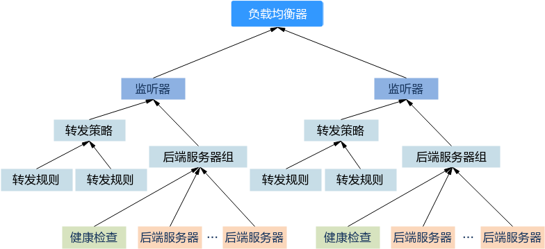

# 删除独享型负载均衡器

## 操作场景

本章节通过示例演示如何调用API来删除负载均衡器。

删除负载均衡器时，需要逐个删除负载均衡器下的资源。负载均衡器关联的资源如[图1](#zh-cn_topic_0293839404_fig14527132320389)，包括监听器、转发策略、后端服务器组、健康检查和后端服务器。

**图 1**  负载均衡器关联资源  

## 操作步骤

请按照下列步骤逐个删除负载均衡器关联的资源后再删除负载均衡器。如果没有配置关联的资源，则跳过相应的步骤，例如未配置健康检查，则跳过[1](#zh-cn_topic_0293839404_li693163653915)。

1.  删除关联的监听器下的后端服务器组的健康检查器。
    1.  发送“DELETE https://\{elb\_endpoint\}/v3/\{project\_id\}/elb/healthmonitors/\{healthmonitor\_id\}”，project\_id为项目ID，healthmonitor\_id为健康检查器ID。
    2.  在Request Header中增加“X-Auth-Token”。
    3.  查看请求响应结果。
        -   请求成功时，返回HTTP STATUS = 204，空body体。
        -   请求异常时，错误码请参见  [错误码](错误码.md)。

2.  移除关联的监听器下的后端服务器组的所有服务器。
    1.  发送“DELETE https://\{elb\_endpoint\}/v3/\{project\_id\}/elb/pools/\{pool\_id\}/members/\{member\_id\}”，project\_id为项目ID，pool\_id为服务器组ID，member\_id为服务器器ID。
    2.  在Request Header中增加“X-Auth-Token”。
    3.  查看请求响应结果。
        -   请求成功时，返回HTTP STATUS = 204，空body体。
        -   请求异常时，错误码请参见  [错误码](错误码.md)。

3.  删除关联的监听器下的所有后端服务器组。
    1.  发送“DELETE https://\{elb\_endpoint\}/v3/\{project\_id\}/elb/pools/\{pool\_id\}”，project\_id为项目ID，pool\_id为服务器组ID。
    2.  在Request Header中增加“X-Auth-Token”。
    3.  查看请求响应结果。
        -   请求成功时，返回HTTP STATUS = 204，空body体。
        -   请求异常时，错误码请参见  [错误码](错误码.md)。

4.  删除关联的监听器下的所有转发策略的转发规则。
    1.  发送“DELETE https://\{elb\_endpoint\}/v3/\{project\_id\}/elb/l7policies/\{policy\_id\}/rules/\{rule\_id\}”，project\_id为项目ID，policy\_id为转发策略ID，rule\_id为转发规则ID。
    2.  在Request Header中增加“X-Auth-Token”。
    3.  查看请求响应结果。
        -   请求成功时，返回HTTP STATUS = 204，空body体。
        -   请求异常时，错误码请参见  [错误码](错误码.md)。

5.  删除关联的监听器下的所有转发策略。
    1.  发送“DELETE https://\{elb\_endpoint\}/v3/\{project\_id\}/elb/l7policies/\{policy\_id\}”，project\_id为项目ID，policy\_id为转发策略ID。
    2.  在Request Header中增加“X-Auth-Token”。
    3.  查看请求响应结果。
        -   请求成功时，返回HTTP STATUS = 204，空body体。
        -   请求异常时，错误码请参见  [错误码](错误码.md)。

6.  删除负载均衡器关联的监听器。
    1.  发送“DELETE https://\{elb\_endpoint\}/v3/\{project\_id\}/elb/listeners/\{listener\_id\}”，project\_id为项目ID，listener\_id为监听器ID。
    2.  在Request Header中增加“X-Auth-Token”。
    3.  查看请求响应结果。
        -   请求成功时，返回HTTP STATUS = 204，空body体。
        -   请求异常时，错误码请参见  [错误码](错误码.md)。

7.  删除负载均衡器。
    1.  发送“DELETE https://\{elb\_endpoint\}/v3/\{project\_id\}/elbloadbalancers/\{loadbalancer\_id\}”，project\_id为项目ID，loadbalancer\_id为负载均衡器ID。
    2.  在Request Header中增加“X-Auth-Token”。
    3.  查看请求响应结果。
        -   请求成功时，返回HTTP STATUS = 204，空body体。
        -   请求异常时，错误码请参见  [错误码](错误码.md)。

