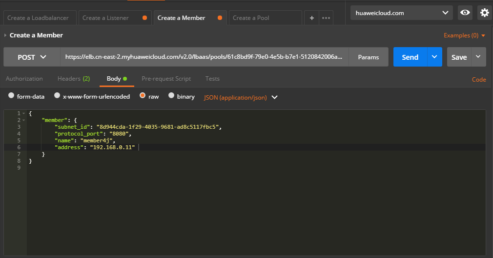

# 添加后端云服务器<a name="elb_qs_0008"></a>

## 调试<a name="zh-cn_topic_0135706201_zh-cn_topic_0135706204_section3683205810399"></a>

您可以在[API Explorer](https://apiexplorer.developer.huaweicloud.com/apiexplorer/doc?product=ELB&api=CreateMember&version=v2)中直接运行调试该接口。

## 接口格式<a name="zh-cn_topic_0135706201_section36006405"></a>

<a name="zh-cn_topic_0135706201_table8410660"></a>
<table><thead align="left"><tr id="zh-cn_topic_0135706201_row51282467"><th class="cellrowborder" valign="top" width="12.120000000000001%" id="mcps1.1.4.1.1"><p id="zh-cn_topic_0135706201_p60239196"><a name="zh-cn_topic_0135706201_p60239196"></a><a name="zh-cn_topic_0135706201_p60239196"></a>方法</p>
</th>
<th class="cellrowborder" valign="top" width="54.55%" id="mcps1.1.4.1.2"><p id="zh-cn_topic_0135706201_p47536713"><a name="zh-cn_topic_0135706201_p47536713"></a><a name="zh-cn_topic_0135706201_p47536713"></a>URI</p>
</th>
<th class="cellrowborder" valign="top" width="33.33%" id="mcps1.1.4.1.3"><p id="zh-cn_topic_0135706201_p25268563"><a name="zh-cn_topic_0135706201_p25268563"></a><a name="zh-cn_topic_0135706201_p25268563"></a>说明</p>
</th>
</tr>
</thead>
<tbody><tr id="zh-cn_topic_0135706201_row33487713"><td class="cellrowborder" valign="top" width="12.120000000000001%" headers="mcps1.1.4.1.1 "><p id="zh-cn_topic_0135706201_p28150236"><a name="zh-cn_topic_0135706201_p28150236"></a><a name="zh-cn_topic_0135706201_p28150236"></a>POST</p>
</td>
<td class="cellrowborder" valign="top" width="54.55%" headers="mcps1.1.4.1.2 "><p id="zh-cn_topic_0135706201_p65576619"><a name="zh-cn_topic_0135706201_p65576619"></a><a name="zh-cn_topic_0135706201_p65576619"></a>/v2.0/lbaas/pools/{pool_id}/members</p>
</td>
<td class="cellrowborder" valign="top" width="33.33%" headers="mcps1.1.4.1.3 "><p id="zh-cn_topic_0135706201_p10105911"><a name="zh-cn_topic_0135706201_p10105911"></a><a name="zh-cn_topic_0135706201_p10105911"></a>添加属于某个后端云服务器组的后端云服务器。</p>
</td>
</tr>
</tbody>
</table>

## 接口约束<a name="zh-cn_topic_0135706201_section30837727"></a>

-   属于一个pool的两个member不能有相同的address和port。
-   创建member时指定的子网必须和VIP所在子网处在同一个VPC下。
-   admin\_state\_up参数必须是true。

## 具体步骤<a name="zh-cn_topic_0135706201_section9104094"></a>

1.  设置请求消息头。Postman中设置好头部信息，将获取到的Token放入头部，如下图：

    **图 1**  设置请求消息头-添加后端云服务器组<a name="zh-cn_topic_0135706201_fig33014541363"></a>  
    

2.  <a name="zh-cn_topic_0135706201_li20015355"></a>在Body标签中填写请求消息体。

    **图 2**  填写请求消息体-添加后端云服务器组<a name="zh-cn_topic_0135706201_fig117218138710"></a>  
    

3.  <a name="zh-cn_topic_0135706201_li104117348571"></a>查询虚拟机的subnet\_id和主网卡IP。

    填写URL。

    ```
    GET https://{VPCEndpoint}/v2.0/ports?device_id={ecs_id}
    ```

    在响应体中获取primary\_interface为true的port的subnet\_id和ip\_address。响应体示例如下：

    ```
    {
        "ports": [
            {
                "id": "4813697b-62ba-4f4b-90e5-13bbbdec7198",
                "name": "",
                "status": "ACTIVE",
                "admin_state_up": true,
                "fixed_ips": [
                    {
                        "subnet_id": "d97b6b89-6aa2-4636-a86b-132eb4eb566e",
                        "ip_address": "10.1.1.89"
                    }
                ],
                "mac_address": "fa:16:3e:cb:8d:0a",
                "network_id": "1b76b9c2-9b7e-4ced-81bd-d13f7389d7c9",
                "tenant_id": "04dd36f978800fe22f9bc00bea090736",
                "project_id": "04dd36f978800fe22f9bc00bea090736",
                "device_id": "f738c464-b5c2-45df-86c0-7f436620cd54",
                "device_owner": "compute:cn-north-4a",
                "security_groups": [
                    "7a233393-5be2-4dff-8360-1558dd950f6e"
                ],
                "extra_dhcp_opts": [],
                "allowed_address_pairs": [],
                "binding:vnic_type": "normal",
                "binding:vif_details": {},
                "binding:profile": {},
                "port_security_enabled": true,
                "created_at": "2019-11-19T09:28:38",
                "updated_at": "2019-11-19T09:28:39"
            },
            {
                "id": "94971c39-46f0-443a-85e8-31cb7497c78e",
                "name": "",
                "status": "ACTIVE",
                "admin_state_up": true,
                "fixed_ips": [
                    {
                        "subnet_id": "8d944cda-1f29-4035-9681-ad8c5117fbc5",
                        "ip_address": "192.168.0.11"
                    }
                ],
                "mac_address": "fa:16:3e:5c:d2:57",
                "network_id": "1b76b9c2-9b7e-4ced-81bd-d13f7389d7c9",
                "tenant_id": "04dd36f978800fe22f9bc00bea090736",
                "project_id": "04dd36f978800fe22f9bc00bea090736",
                "device_id": "f738c464-b5c2-45df-86c0-7f436620cd54",
                "device_owner": "compute:cn-north-4a",
                "security_groups": [
                    "a10dfc31-0055-4b84-b36e-1291b918125c",
                    "7a233393-5be2-4dff-8360-1558dd950f6e"
                ],
                "extra_dhcp_opts": [],
                "allowed_address_pairs": [],
                "binding:vnic_type": "normal",
                "binding:vif_details": {
                    "primary_interface": true
                },
                "binding:profile": {},
                "port_security_enabled": true,
                "created_at": "2019-11-12T17:17:51",
                "updated_at": "2019-11-12T17:17:51"
            }
        ]
    }
    ```

4.  填写URL。

    ```
    https://{ELBEndpoint}/v2.0/lbaas/pools/{pool_id}/members
    ```

5.  发送请求。body体中的subnet\_id和address为[步骤3](#zh-cn_topic_0135706201_li104117348571)中获取的值，选择请求方法为POST，点击Send按钮，得到服务端响应。

    ```
    {
        "member": {
            "name": "member4j",
            "weight": 1,
            "admin_state_up": false,
            "subnet_id": "8d944cda-1f29-4035-9681-ad8c5117fbc5",
            "tenant_id": "0d0bf0e8fb564cc9abbe526dbdca9248",
            "address": "192.168.0.11",
            "protocol_port": 8080,
            "id": "97f18d73-e97d-434c-8cb7-3274a83dda73",
            "operating_status": "ONLINE"
        }
    }
    ```


## 示例代码<a name="zh-cn_topic_0135706201_section14827986"></a>

[2](#zh-cn_topic_0135706201_li20015355)中消息体内容

```
{
    "member": {
        "subnet_id": "8d944cda-1f29-4035-9681-ad8c5117fbc5",
        "protocol_port": "8080",
        "name": "member4j",
        "address": "192.168.0.11"
    }
}
```

