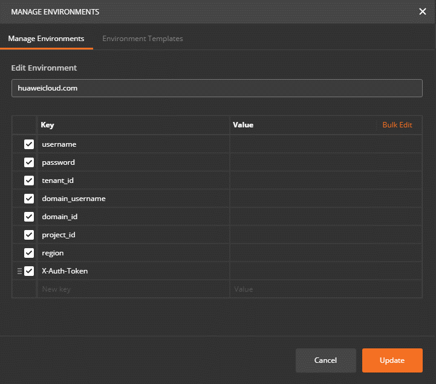
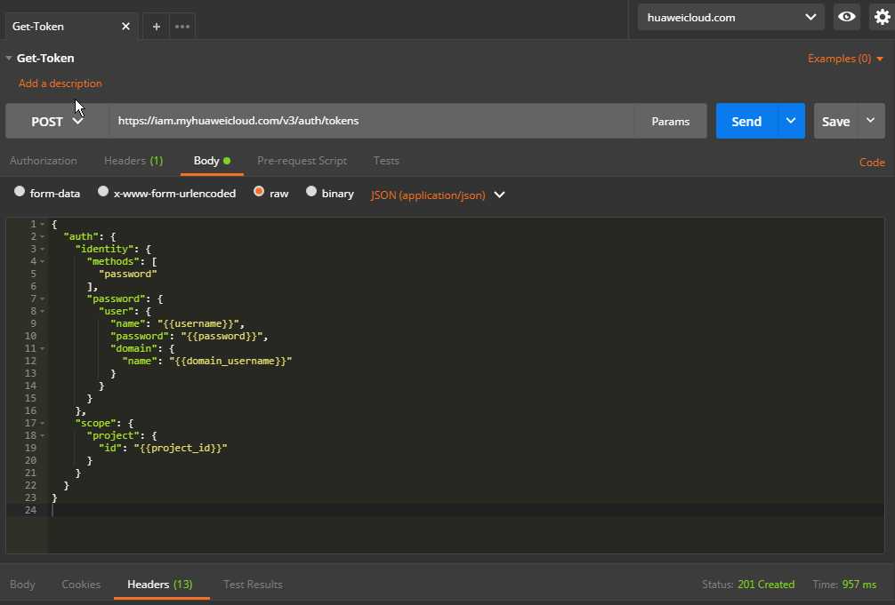
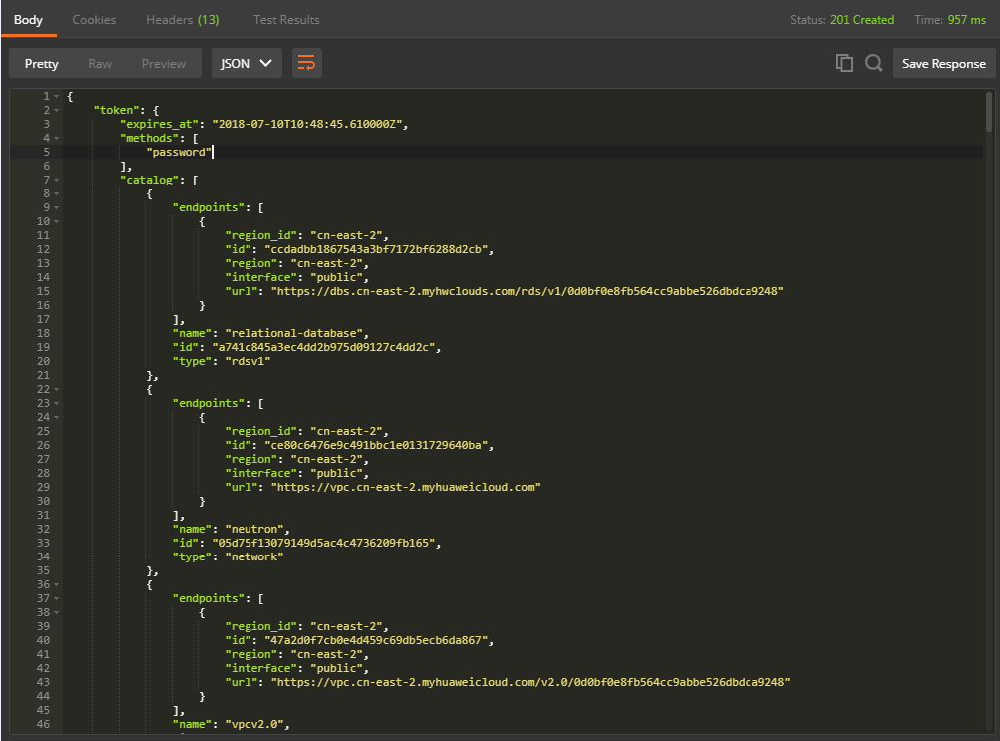
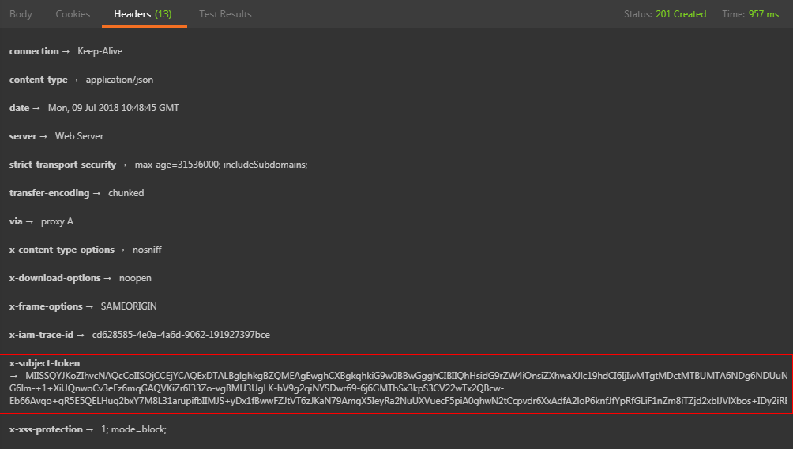

# 获取Token<a name="elb_qs_0002"></a>

在调用任何ELB API时，用户都需要调用统一身份认证服务（IAM）的接口进行鉴权。

## 具体步骤<a name="zh-cn_topic_0135706228_section20330987"></a>

1.  创建环境变量，点击Postman主页上的环境变量管理按钮（下图最右侧齿轮），如[表1](#zh-cn_topic_0135706228_table161114763919)所示。创建一组名为“huaweicloud.com”的变量，在Key部分至少包含username、password、domain\_username、project\_id，并填写对应的Value。变量具体的值可以在web控制台-我的凭证中获得。

    **图 1**  环境变量管理<a name="zh-cn_topic_0135706228_fig956272612246"></a>  
    

    **图 2**  环境变量值<a name="zh-cn_topic_0135706228_fig1077404515406"></a>  
    

    > **说明：** 
    >上图中各项变量可在web控制台上的“我的凭证”中获取，web上的属性和变量的对应关系请参考[表1](#zh-cn_topic_0135706228_table161114763919)。

    **表 1**  变量说明

    <a name="zh-cn_topic_0135706228_table161114763919"></a>
    <table><thead align="left"><tr id="zh-cn_topic_0135706228_row66112077392"><th class="cellrowborder" valign="top" width="50%" id="mcps1.2.3.1.1"><p id="zh-cn_topic_0135706228_p19519328153915"><a name="zh-cn_topic_0135706228_p19519328153915"></a><a name="zh-cn_topic_0135706228_p19519328153915"></a>变量</p>
    </th>
    <th class="cellrowborder" valign="top" width="50%" id="mcps1.2.3.1.2"><p id="zh-cn_topic_0135706228_p105195282394"><a name="zh-cn_topic_0135706228_p105195282394"></a><a name="zh-cn_topic_0135706228_p105195282394"></a>说明</p>
    </th>
    </tr>
    </thead>
    <tbody><tr id="zh-cn_topic_0135706228_row36118712396"><td class="cellrowborder" valign="top" width="50%" headers="mcps1.2.3.1.1 "><p id="zh-cn_topic_0135706228_p165196281392"><a name="zh-cn_topic_0135706228_p165196281392"></a><a name="zh-cn_topic_0135706228_p165196281392"></a>username</p>
    </td>
    <td class="cellrowborder" valign="top" width="50%" headers="mcps1.2.3.1.2 "><p id="zh-cn_topic_0135706228_p14519162853918"><a name="zh-cn_topic_0135706228_p14519162853918"></a><a name="zh-cn_topic_0135706228_p14519162853918"></a>用户名</p>
    </td>
    </tr>
    <tr id="zh-cn_topic_0135706228_row19611272393"><td class="cellrowborder" valign="top" width="50%" headers="mcps1.2.3.1.1 "><p id="zh-cn_topic_0135706228_p452115282398"><a name="zh-cn_topic_0135706228_p452115282398"></a><a name="zh-cn_topic_0135706228_p452115282398"></a>password</p>
    </td>
    <td class="cellrowborder" valign="top" width="50%" headers="mcps1.2.3.1.2 "><p id="zh-cn_topic_0135706228_p4521428133911"><a name="zh-cn_topic_0135706228_p4521428133911"></a><a name="zh-cn_topic_0135706228_p4521428133911"></a>密码</p>
    </td>
    </tr>
    <tr id="zh-cn_topic_0135706228_row1361114717398"><td class="cellrowborder" valign="top" width="50%" headers="mcps1.2.3.1.1 "><p id="zh-cn_topic_0135706228_p14521102883917"><a name="zh-cn_topic_0135706228_p14521102883917"></a><a name="zh-cn_topic_0135706228_p14521102883917"></a>tenant_id</p>
    </td>
    <td class="cellrowborder" valign="top" width="50%" headers="mcps1.2.3.1.2 "><p id="zh-cn_topic_0135706228_p105211528103911"><a name="zh-cn_topic_0135706228_p105211528103911"></a><a name="zh-cn_topic_0135706228_p105211528103911"></a>用户ID</p>
    </td>
    </tr>
    <tr id="zh-cn_topic_0135706228_row4611197183915"><td class="cellrowborder" valign="top" width="50%" headers="mcps1.2.3.1.1 "><p id="zh-cn_topic_0135706228_p15210283390"><a name="zh-cn_topic_0135706228_p15210283390"></a><a name="zh-cn_topic_0135706228_p15210283390"></a>domain_username</p>
    </td>
    <td class="cellrowborder" valign="top" width="50%" headers="mcps1.2.3.1.2 "><p id="zh-cn_topic_0135706228_p75216288396"><a name="zh-cn_topic_0135706228_p75216288396"></a><a name="zh-cn_topic_0135706228_p75216288396"></a>帐号名</p>
    </td>
    </tr>
    <tr id="zh-cn_topic_0135706228_row1661257123914"><td class="cellrowborder" valign="top" width="50%" headers="mcps1.2.3.1.1 "><p id="zh-cn_topic_0135706228_p05211328163911"><a name="zh-cn_topic_0135706228_p05211328163911"></a><a name="zh-cn_topic_0135706228_p05211328163911"></a>domain_id</p>
    </td>
    <td class="cellrowborder" valign="top" width="50%" headers="mcps1.2.3.1.2 "><p id="zh-cn_topic_0135706228_p185211928113915"><a name="zh-cn_topic_0135706228_p185211928113915"></a><a name="zh-cn_topic_0135706228_p185211928113915"></a>帐号ID</p>
    </td>
    </tr>
    <tr id="zh-cn_topic_0135706228_row1961211710397"><td class="cellrowborder" valign="top" width="50%" headers="mcps1.2.3.1.1 "><p id="zh-cn_topic_0135706228_p1252172873918"><a name="zh-cn_topic_0135706228_p1252172873918"></a><a name="zh-cn_topic_0135706228_p1252172873918"></a>project_id</p>
    </td>
    <td class="cellrowborder" valign="top" width="50%" headers="mcps1.2.3.1.2 "><p id="zh-cn_topic_0135706228_p95215286397"><a name="zh-cn_topic_0135706228_p95215286397"></a><a name="zh-cn_topic_0135706228_p95215286397"></a>项目ID</p>
    </td>
    </tr>
    <tr id="zh-cn_topic_0135706228_row116123753915"><td class="cellrowborder" valign="top" width="50%" headers="mcps1.2.3.1.1 "><p id="zh-cn_topic_0135706228_p185213287399"><a name="zh-cn_topic_0135706228_p185213287399"></a><a name="zh-cn_topic_0135706228_p185213287399"></a>region</p>
    </td>
    <td class="cellrowborder" valign="top" width="50%" headers="mcps1.2.3.1.2 "><p id="zh-cn_topic_0135706228_p95212286392"><a name="zh-cn_topic_0135706228_p95212286392"></a><a name="zh-cn_topic_0135706228_p95212286392"></a>局点</p>
    </td>
    </tr>
    <tr id="zh-cn_topic_0135706228_row17612570391"><td class="cellrowborder" valign="top" width="50%" headers="mcps1.2.3.1.1 "><p id="zh-cn_topic_0135706228_p652112813914"><a name="zh-cn_topic_0135706228_p652112813914"></a><a name="zh-cn_topic_0135706228_p652112813914"></a>X-Auth-Token</p>
    </td>
    <td class="cellrowborder" valign="top" width="50%" headers="mcps1.2.3.1.2 "><p id="zh-cn_topic_0135706228_p20521728113917"><a name="zh-cn_topic_0135706228_p20521728113917"></a><a name="zh-cn_topic_0135706228_p20521728113917"></a>租户Token</p>
    </td>
    </tr>
    </tbody>
    </table>

2.  <a name="zh-cn_topic_0135706228_li183485915248"></a>填写消息。

    **图 3**  填写消息<a name="zh-cn_topic_0135706228_fig1526918281108"></a>  
    

    选择raw格式，并在稍右侧选择JSON\(application/json\)。

    > **说明：** 
    >详情请参考《统一身份认证服务API参考》。

3.  发送请求。

    发送请求并在地址栏填写请求的URL，这里我们将请求发送到所有局点公用的IAM 后端地址，并在后面加上IAM提供的URI（即“/v3/auth/tokens”部分）。

    选择请求方式为POST，并点击Send按钮，如果以上信息填写正确，则会得到类似下图的响应。

    **图 4**  发送请求<a name="zh-cn_topic_0135706228_fig1917411401007"></a>  
    

    切换到Headers页面，其中的x-subject-token就是我们接下来发送请求所需的Token。

    **图 5**  x-subject-token<a name="zh-cn_topic_0135706228_fig43694551206"></a>  
    

    在调用ELB资源接口时，请在请求的头部添加X-Auth-Token字段，并将值设为获取到的Token。如果获取到的响应为401消息，请认真检查请求体内的信息是否填写正确。


## 示例代码<a name="zh-cn_topic_0135706228_section48761158"></a>

[2](#zh-cn_topic_0135706228_li183485915248)中消息体内容。

```
{
    "auth": {
        "identity": {
            "methods": [
                "password"
            ],
            "password": {
                "user": {
                    "name": "{{username}}",
                    "password": "{{password}}",
                    "domain": {
                        "name": "{{domain_username}}"
                    }
                }
            }
        },
        "scope": {
            "project": {
                "id": "{{project_id}}"
            }
        }
    }
}
```

> **说明：** 
>消息体中的“\{\{”和“\}\}”表示变量引用。

