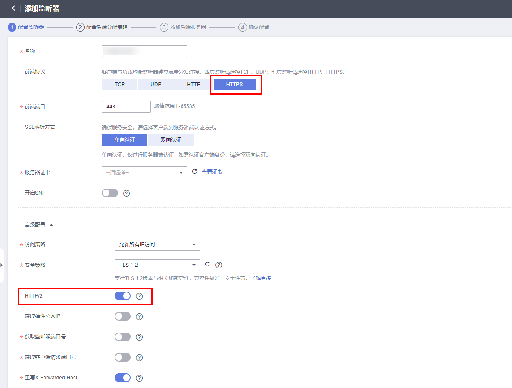
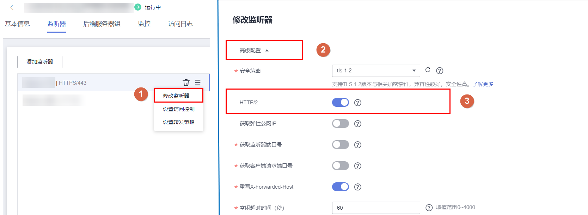

# HTTP/2

## 操作场景

HTTP/2，即超文本传输协议 2.0，是下一代HTTP协议。如果您需要保证HTTPS业务更加安全，可以在配置HTTPS监听器时，开启HTTP/2功能。如果您已创建了HTTPS监听器，可以在已创建的HTTPS监听器中开启或者关闭支持HTTP/2功能。

## 开启HTTPS监听器的HTTP/2功能

1.  登录管理控制台。
2.  在管理控制台左上角单击图标，选择区域和项目。
3.  单击页面左上角的，选择“网络 \> 弹性负载均衡”。
4.  在“负载均衡器”界面，单击需要开启HTTP/2功能的监听器的负载均衡器名称。
5.  在该负载均衡界面的“监听器”页签，单击“添加监听器”。
6.  在“添加监听器”界面，前端协议选择“HTTPS”。
7.  在“添加监听器”界面，展开高级配置，打开HTTP/2功能。
8.  配置完成，单击“完成”。

    **图 1**  开启HTTP监听器的HTTP/2功能  
    

> **说明：** 
>只有HTTPS监听器可以开启或关闭HTTP/2功能。

## 修改HTTPS监听器的HTTP/2功能

1.  登录管理控制台。
2.  在管理控制台左上角单击图标，选择区域和项目。
3.  单击页面左上角的，选择“网络 \> 弹性负载均衡”。
4.  在“负载均衡器”界面，单击需要修改HTTP/2功能的负载均衡器名称。
5.  切换至“监听器”页签，在需要修改HTTP/2功能开关的监听器名称所在行，单击。
6.  在“修改监听器”界面，展开高级配置，开启或者关闭HTTP/2功能。
7.  确认正确，单击“完成”。

    **图 2**  修改HTTP监听器的HTTP/2功能  
    

