# HTTPS双向认证<a name="zh_cn_elb_03_0006"></a>

## 使用场景<a name="section1125557164611"></a>

一般的HTTPS业务场景只对服务器做认证，因此只需要配置服务器的证书即可。某些关键业务（如银行支付），需要对通信双方的身份都要做认证，即双向认证，以确保业务的安全性。

此时，除了配置服务器的证书之外，还需要配置客户端的证书，以实现通信双方的双向认证功能。

本章节以自签名证书为例，介绍如何配置HTTPS双向认证。但是自签名证书存在安全隐患，建议客户使用[云证书管理](https://support.huaweicloud.com/productdesc-ccm/ccm_01_0001.html)服务购买证书、或购买其他权威机构颁发的证书。

## 使用OpenSSL制作CA证书<a name="section1271620810310"></a>

1.  登录到任意一台安装有openssl工具的Linux机器。
2.  创建工作目录并进入该目录。

    **mkdir ca**

    **cd ca**

3.  创建CA证书的openssl配置文件ca\_cert.conf，内容如下：

    ```
    [ req ]
    distinguished_name     = req_distinguished_name
    prompt                 = no
     
    [ req_distinguished_name ]
     O                      = ELB
    ```

4.  创建CA证书私钥文件ca.key。

    **openssl genrsa -out ca.key 2048**

    **图 1**  生成CA证书私钥文件<a name="fig11774181536"></a>  
    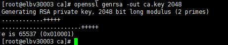

5.  创建CA证书的csr请求文件ca.csr。

    **openssl req -out ca.csr -key ca.key -new -config ./ca\_cert.conf**

6.  创建自签名的CA证书ca.crt。

    **openssl x509 -req -in ca.csr -out ca.crt -sha1 -days 5000 -signkey ca.key**

    **图 2**  创建自签名CA证书<a name="fig197751281635"></a>  
    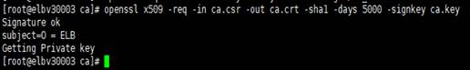


## 使用CA证书签发服务器证书<a name="section780514219136"></a>

用户可以用权威CA签发的证书或者自签名的证书，这里以自签名证书为例说明如何创建服务器证书。

1.  登录到生成CA证书的服务器。
2.  创建与CA平级的目录，并进入该目录。

    **mkdir server**

    **cd server**

3.  创建服务器证书的openssl配置文件server\_cert.conf，内容如下：

    ```
    [ req ]
    distinguished_name     = req_distinguished_name
    prompt                 = no
     
    [ req_distinguished_name ]
     O                      = ELB
     CN                     = www.test.com
    ```

    > **说明：** 
    >CN字段可以根据需求改为服务器对应的域名、IP地址。

4.  创建服务器证书私钥文件server.key。

    **openssl genrsa -out server.key 2048**

5.  创建服务器证书的csr请求文件server.csr。

    **openssl req -out server.csr -key server.key -new -config ./server\_cert.conf**

6.  使用CA证书签发服务器证书server.crt。

    **openssl x509 -req -in server.csr -out server.crt -sha1 -CAcreateserial -days 5000** **-CA ../ca/ca.crt -CAkey ../ca/ca.key**

    **图 3**  签发服务器证书<a name="fig2950152511512"></a>  
    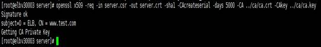


## 使用CA证书签发客户端证书<a name="section12889123219228"></a>

1.  登录到生成CA证书的服务器。
2.  创建与CA平级的目录，并进入该目录。

    **mkdir client**

    **cd client**

3.  创建客户端证书的openssl配置文件client\_cert.conf，内容如下：

    ```
    [ req ]
    distinguished_name     = req_distinguished_name
    prompt                 = no
     
    [ req_distinguished_name ]
     O                      = ELB
     CN                     = www.test.com
    ```

    > **说明：** 
    >CN字段可以根据需求改为对应的域名、IP地址。

4.  创建客户端证书私钥文件client.key。

    **openssl genrsa -out client.key 2048**

    **图 4**  创建客户端证书私钥文件<a name="fig111292173318"></a>  
    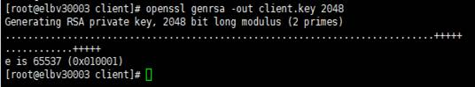

5.  创建客户端证书的csr请求文件client.csr。

    **openssl req -out client.csr -key client.key -new -config ./client\_cert.conf**

    **图 5**  创建客户端证书csr文件<a name="fig194011485320"></a>  
    

6.  使用CA证书签发客户端证书client.crt。

    **openssl x509 -req -in client.csr -out client.crt -sha1 -CAcreateserial -days 5000** **-CA ../ca/ca.crt -CAkey ../ca/ca.key**

    **图 6**  签发客户端证书<a name="fig18699120133313"></a>  
    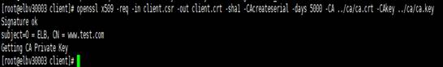

7.  把客户端证书格式转为浏览器可识别的p12格式。

    **openssl pkcs12 -export -clcerts -in client.crt -inkey client.key -out client.p12**

    > **说明：** 
    >该命令执行时需要输入导出密码，请输入并记住该密码，在证书导入浏览器时需要使用。


## 配置服务器证书和私钥<a name="section742022961613"></a>

1.  登录负载均衡控制台页面。
2.  单击“证书管理 \> 创建证书”。
3.  在创建证书页面，证书类型选择“服务器证书”，同时把前面生成的服务器证书server.crt以及私钥server.key的内容复制到对应的区域，点击“确定”按钮。

    > **说明：** 
    >复制内容时请将最后的换行符删除，避免保存时报错。

    **图 7**  创建证书<a name="fig8643184913507"></a>  
    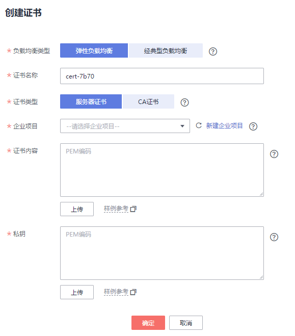

    > **说明：** 
    >服务器证书和私钥内容只支持上传pem格式。


## 配置CA证书<a name="section209731612366"></a>

1.  登录负载均衡控制台页面。
2.  单击“证书管理 \> 创建证书”。
3.  在创建证书页面，证书类型选择“CA证书”，同时把[使用OpenSSL制作CA证书](#section1271620810310)创建的客户端CA证书ca.crt的内容复制到证书内容区域，点击“确定”按钮。

    > **说明：** 
    >复制内容时请将最后的换行符删除，避免保存时报错。

    **图 8**  创建证书<a name="fig11879161995312"></a>  
    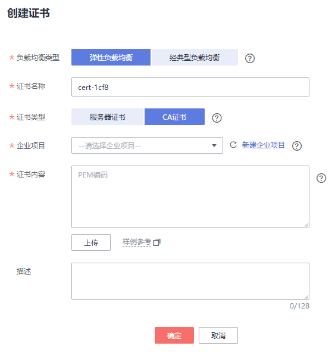

    > **说明：** 
    >CA证书内容只支持上传pem格式。


## 配置HTTPS双向认证<a name="section1332618585177"></a>

1.  登录负载均衡控制台页面。
2.  在添加监听器页面，协议类型选择“HTTPS”，“SSL解析方式”选择“双向认证”，并且在服务器证书和CA证书两个配置项中选择所添加的服务器证书和CA证书对应的名称。

    **图 9**  添加监听器<a name="fig1137713334556"></a>  
    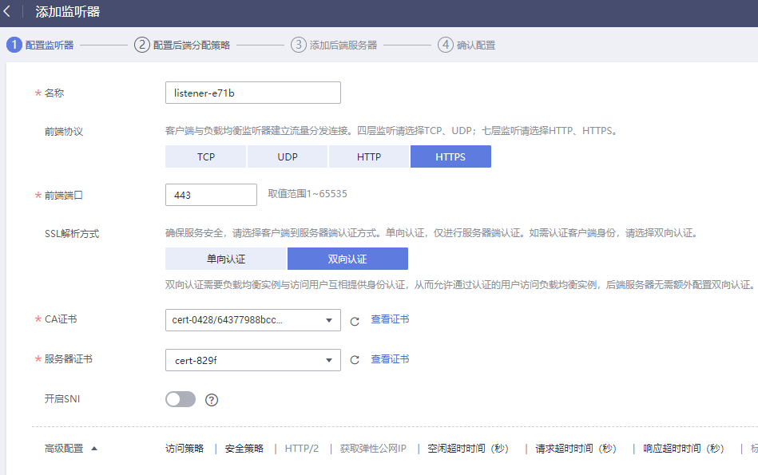

    > **说明：** 
    >目前除“中国-香港”外，其他区域均已上线双向认证功能。


**添加后端服务器**

请参考[后端服务器](添加或移除后端服务器（共享型）.md)相关操作指导，此处不展开描述。

## 导入客户端证书并测试<a name="section378773315196"></a>

**浏览器方式功能测试**

1.  浏览器导入客户端证书（以Internet Explorer 11为例说明）
    1.  把客户端证书从Linux机器导出来，即前面签发的client.p12证书文件。
    2.  单击“设置 \> Internet选项”，切换到“内容”页签。
    3.  单击“证书”，然后单击“导入”，导入client.p12证书文件。

        **图 10**  安装client.p12证书<a name="fig19175233171119"></a>  
        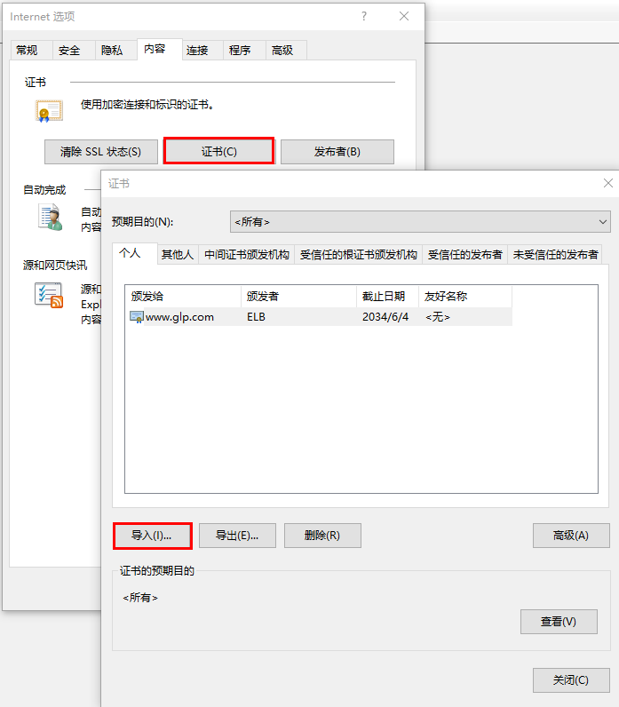

2.  测试验证

    在浏览器中输入地址，浏览器会弹出证书选择窗口，如下，选择客户端证书，然后点确定按钮，可以正常访问网站，如[图12 正常访问网站](#fig4534121145715)。

    **图 11**  正常访问网站<a name="fig4534121145715"></a>  
    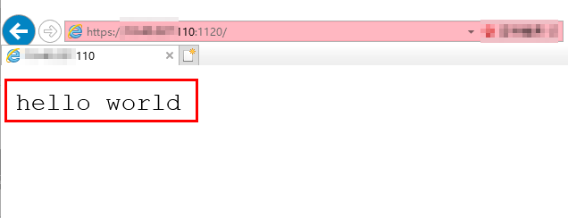


**Curl工具方式功能测试**

1.  导入客户端证书

    把客户端证书client.crt和客户端私钥文件client.key拷贝到新目录，如目录/home/client\_cert。

2.  测试验证

    在shell界面，输入以下命令，请输入正确的证书地址和密钥文件地址，以及负载均衡器的IP地址和监听器端口\(以下用https://XXX.XXX.XXX.XXX:XXX** **表示，以实际IP地址和端口为准\)。

    ```
    curl -k --cert /home/client_cert/client.crt --key /home/client_cert/client.key https://XXX.XXX.XXX.XXX:XXX/ -I
    ```

    如果可以正确获得响应码，如[图12](#fig12908105320246)说明验证成功。

    **图 12**  正确响应码示例<a name="fig12908105320246"></a>  
    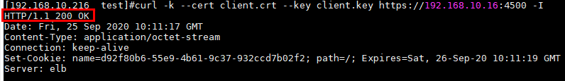


