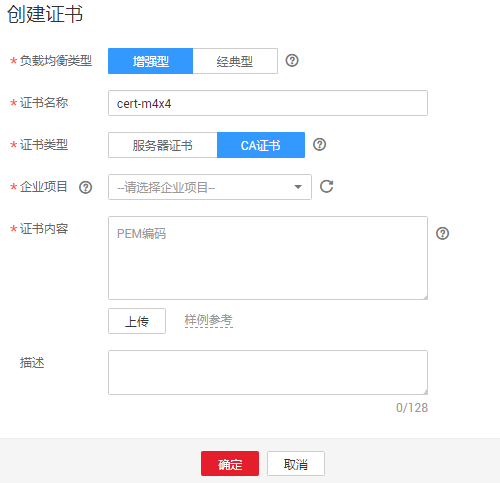

# HTTPS双向认证<a name="zh_cn_elb_03_0006"></a>

## 使用场景<a name="section1125557164611"></a>

一般的HTTPS业务场景只对服务器做认证，因此只需要配置服务器的证书即可，某些关键业务（如银行支付），需要对通信双方的身份都要做认证，即双向认证，以确保业务的安全性，此时，除了配置服务器的证书之外，还需要配置客户端的证书，以实现通信双方的双向认证功能。以下说明如何在ELB上配置双向认证功能。

## 证书准备<a name="section780514219136"></a>

**服务器证书准备**

用户可以用权威CA签发的证书或者自签名的证书，这里以自签名证书为例说明如何创建服务器证书。

1.  登录到任意一台安装有openssl工具的linux机器。
2.  创建工作目录并进入该目录。

    **mkdir server**

    **cd server**

3.  创建CA证书的openssl配置文件ca\_cert.conf，内容如下：

    ```
    [ req ]
    distinguished_name     = req_distinguished_name
    prompt                 = no
     
    [ req_distinguished_name ]
     O                      = ELB
    ```

4.  创建服务器证书的openssl配置文件server\_cert.conf，内容如下：

    ```
    [ req ]
    distinguished_name     = req_distinguished_name
    prompt                 = no
     
    [ req_distinguished_name ]
     O                      = ELB
     CN                     = www.test.com
    ```

    > **说明：**   
    >CN字段可以根据需求改为服务器对应的域名、IP地址。  

5.  创建CA证书私钥文件ca.key以及服务器证书私钥文件server.key。

    **openssl genrsa -out ca.key 2048**

    **openssl genrsa -out server.key 2048**

6.  创建CA证书以及服务器证书的csr请求文件ca.csr/server.csr。

    **openssl req -out ca.csr -key ca.key -new -config ./ca\_cert.conf**

    **openssl req -out server.csr -key server.key -new -config ./server\_cert.conf**

7.  创建自签名的CA证书ca.crt以及用该CA证书签名的服务器证书server.crt。

    **openssl x509 -req -in ca.csr -out ca.crt -sha1 -days 5000 -signkey ca.key**

    **openssl x509 -req -in server.csr -out server.crt -sha1 -CAcreateserial -days 5000** **-CA ca.crt -CAkey ca.key**


**客户端证书准备**

1.  登录到任意一台安装有openssl工具的linux机器。
2.  创建工作目录并进入该目录。

    **mkdir client**

    **cd client**

3.  创建CA证书的openssl配置文件ca\_cert.conf，内容如下：

    ```
    [ req ]
    distinguished_name     = req_distinguished_name
    prompt                 = no
     
    [ req_distinguished_name ]
     O                      = ELB
    ```

4.  创建客户端证书的openssl配置文件client\_cert.conf，内容如下：

    ```
    [ req ]
    distinguished_name     = req_distinguished_name
    prompt                 = no
     
    [ req_distinguished_name ]
     O                      = ELB
     CN                     = www.test.com
    ```

    > **说明：**   
    >CN字段可以根据需求改为对应的域名、IP地址。  

5.  创建CA证书私钥文件ca.key以及客户端证书私钥文件client.key。

    **openssl genrsa -out ca.key 2048**

    **openssl genrsa -out client.key 2048**

6.  创建CA证书以及客户端证书的csr请求文件ca.csr/client.csr。

    **openssl req -out ca.csr -key ca.key -new -config ./ca\_cert.conf**

    **openssl req -out client.csr -key client.key -new -config ./client\_cert.conf**

7.  创建自签名的CA证书ca.crt以及用该CA证书签名的客户端证书client.crt。

    **openssl x509 -req -in ca.csr -out ca.crt -sha1 -days 5000 -signkey ca.key**

    **openssl x509 -req -in client.csr -out client.crt -sha1 -CAcreateserial -days 5000** **-CA ca.crt -CAkey ca.key**

8.  把客户端证书格式转为浏览器可识别的p12格式。

    **openssl pkcs12 -export -clcerts -in client.crt -inkey client.key -out client.p12**

    > **说明：**   
    >该命令执行时需要输入导出密码，请输入并记住该密码，在证书导入浏览器时需要使用。  


## 配置证书<a name="section742022961613"></a>

**配置服务器证书和私钥**

1.  登录负载均衡控制台页面。
2.  在创建证书页面，证书类型选择“服务器证书”，同时把[证书准备](#section780514219136)创建的服务器证书server.crt以及私钥server.key的内容复制到对应的区域，点击“确定”按钮。

    **图 1**  创建证书<a name="fig8643184913507"></a>  
    

    > **说明：**   
    >服务器证书和私钥内容只支持pem格式。  


**配置CA证书**

1.  登录负载均衡控制台页面。
2.  在创建证书页面，证书类型选择“CA证书”，同时把[证书准备](#section780514219136)创建的客户端CA证书ca.crt的内容复制到证书内容区域，点击“确定”按钮。

    **图 2**  创建证书<a name="fig11879161995312"></a>  
    

    > **说明：**   
    >CA证书内容只支持pem格式。  


## 配置监听器<a name="section1332618585177"></a>

**绑定服务器证书和CA证书**

1.  登录负载均衡控制台页面。
2.  在添加监听器页面，协议类型选择“HTTPS”，打开双向认证开关，并且在证书和CA证书两个配置项中选择所添加的服务器证书和CA证书对应的ID。

    **图 3**  添加监听器<a name="fig1137713334556"></a>  
    

    > **说明：**   
    >只有增强型监听器才支持双向认证功能。  


**添加后端服务器**

请参考[后端服务器](https://support.huaweicloud.com/usermanual-elb/zh-cn_topic_0052569729.html)相关操作指导，此处不展开描述。

