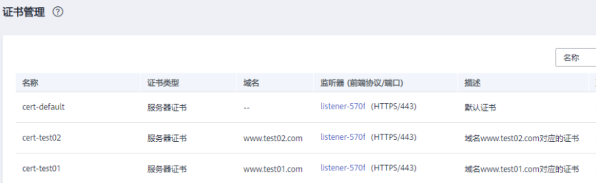
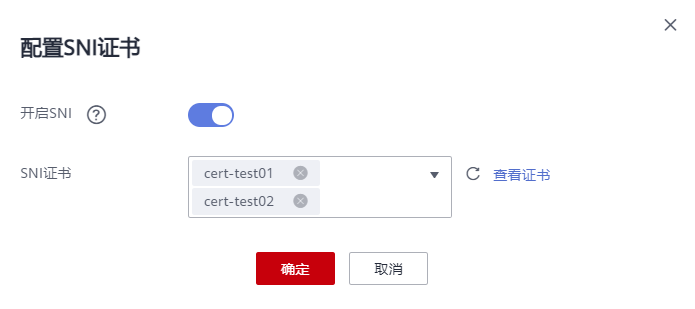

# SNI证书-HTTPS监听器绑定多个证书（多域名访问）

## 操作场景

本章节指导用户通过配置HTTPS监听器绑定多个证书，实现同一个监听器根据多个域名自动选择证书来完成HTTPS认证和访问后端的诉求。

您需要在创建HTTPS监听器时开启SNI功能。SNI（Server Name Indication）是为了解决一个服务器使用域名证书的TLS扩展，开启SNI之后，用户需要添加域名对应的证书。开启SNI后，允许客户端在发起SSL握手请求时就提交请求的域名信息，负载均衡收到SSL请求后，会根据域名去查找证书，如果找到域名对应的证书，则返回该证书；如果没有找到域名对应的证书，则返回缺省证书。

负载均衡在配置HTTPS 监听器时，支持此功能，支持绑定多个证书。

单个监听器可以配置的SNI证书数量不超过30个。

## 前提条件

-   已创建负载均衡器，具体步骤可参照[创建共享型负载均衡器](创建共享型负载均衡器.md)或[创建独享型负载均衡器](创建独享型负载均衡器.md)。
-   已经创建HTTPS监听器，具体步骤可参照[添加HTTPS监听器](添加HTTPS监听器.md)。

-   已经创建用于SNI证书，具体步骤可参照[创建/修改/删除证书](创建-修改-删除证书.md)。

    > **说明：** 
    >-   用于SNI的证书，需要指定域名，一个证书可以指定多个域名。且指定的域名必须与证书中的域名保持一致。
    >-   SNI证书匹配规则：
    >    当证书的域名为\*.test.com，那么可支持a.test.com、b.test.com等，不支持a.b.test.com、c.d.test.com等。
    >    且依据最长尾缀匹配：当证书中的域名同时存在\*.b.test.com和\*.test.com时，那么a.b.test.com会优先匹配到\*.b.test.com。
    >-   ELB不会自动选择未过期的证书，如果您有证书过期了，需要手动更换或者删除证书，详见[绑定/更换证书](绑定-更换证书.md)。
    >下图中的cer-default为创建HTTPS监听器时绑定的默认证书，cert-test01和cert-test02为新创建的用于SNI的证书。
    >其中，证书cert-test01填写的域名为www.test01.com、cert-test02填写的域名为www.test02.com。
    >如果访问负载均衡的域名与SNI证书匹配成功，则会返回SNI的证书认证鉴权。如果匹配失败，则会返回默认证书认证鉴权。
    >**图 1**  配置证书说明  
    >

## 操作步骤

1.  登录管理控制台。
2.  在管理控制台左上角单击图标，选择区域和项目。
3.  单击页面左上角的，选择“网络 \> 弹性负载均衡”。

1.  在“负载均衡器”界面，单击负载均衡名称。
2.  切换到“监听器”页签，在需要添加SNI的监听器的基本信息页面，单击SNI右侧“配置”。
3.  开启SNI的开关，选择需要配置的SNI证书。

    **图 2**  配置SNI证书  
    

4.  单击“确定”。

