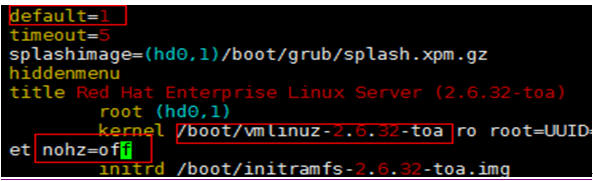
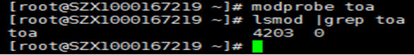

# TOA插件配置<a name="zh_cn_elb_06_0001"></a>

## 操作场景<a name="zh-cn_topic_0040807238_section38584869111927"></a>

ELB可以针对客户访问的业务为访问者提供个性化的管理策略，制定策略之前需要获取来访者的真实IP。TOA内核模块主要用来获取ELB转化过的访问者真实IP地址（仅支持IPv4），该插件安装在ELB后端服务器。

本文档仅适用于四层（TCP协议）服务，当客户需要在操作系统中编译TOA内核模块时，可参考本文档进行配置。

Linux内核版本为2.6.32和Linux内核版本为3.0以上的操作系统，在配置TOA内核模块的操作步骤上有所区别，具体操作请参照相应的操作步骤进行配置。

> **说明：** 
>-   TOA不支持UDP协议的监听器。
>-   TOA模块在以下操作系统中验证可以正常工作，其他内核版本安装方法类似。
>    -   CentOS 6.8（Kernel version 2.6.32）
>    -   Suse 11 sp3 \(Kernel version 3.0.76\)
>    -   CentOS 7/7.2 \(Kernel version 3.10.0\)
>    -   Ubuntu 16.04.3 \(Kernel version 4.4.0\)
>    -   Ubuntu 18.04 \(Kernel version 4.15.0\)
>    -   OpenSUSE 42.2 \(Kernel version 4.4.36\)
>    -   CoreOS 10.10.5 \(Kernel version 4.9.16\)
>    -   Debian 8.2.0 \(Kernel version 3.16.0\)

## 前提条件<a name="zh-cn_topic_0040807238_section29028108105843"></a>

-   编译内核模块开发环境需与当前内核版本开发环境一致。
-   确保虚拟机可以访问开放源。
-   如果是非root用户，需拥有sudo权限。

## 操作步骤<a name="zh-cn_topic_0040807238_section32663382105928"></a>

-   **以下操作步骤是针对Linux内核版本为3.0以上的操作系统。**

1.  准备编译环境。

    > **说明：** 
    >安装内核模块开发包的过程中，如果源里面找不到对应内核版本的安装包，需要自行去网上下载需要的安装包。

    以下是不同Linux发行版本的操作说明，请根据环境选择对应的方案。

    -   CentOS环境下的操作步骤。
        1.  执行如下命令，安装gcc编译器。

            **sudo yum install gcc**

        2.  执行如下命令，安装make工具。

            **sudo yum install make**

        3.  执行如下命令，安装内核模块开发包，开发包头文件与库的版本需要与内核版本一致。

            **sudo yum install kernel-devel-\`uname -r\`**

            > **说明：** 
            >如果自带源里没有对应的内核开发包，可以到如下地址中去下载对应的rpm包。
            >地址：https://mirror.netcologne.de/oracle-linux-repos/ol7\_latest/getPackage/
            >以3.10.0-693.11.1.el7.x86\_64为例，下载后执行以下命令安装：
            >**rpm -ivh**  kernel-devel-3.10.0-693.11.1.el7.x86\_64.rpm。


    -   Ubuntu、Debian环境下的操作步骤。
        1.  执行如下命令，安装gcc编译器。

            **sudo apt-get install gcc**

        2.  执行如下命令，安装make工具。

            **sudo apt-get install make**

        3.  执行如下命令，安装内核模块开发包，开发包头文件与库的版本需要与内核版本一致。

            **sudo apt-get install linux-headers-\`uname -r\`**

    -   SUSE环境下的操作步骤。
        1.  执行如下命令，安装gcc编译器。

            **sudo zypper install gcc**

        2.  执行如下命令，安装make工具。

            **sudo zypper install make**

        3.  执行如下命令，安装内核模块开发包，开发包头文件与库的版本需要与内核版本一致。

            **sudo zypper install kernel-default-devel**

    -   CoreOS环境下的操作步骤。

        CoreOS环境下在容器内进行内核模块的编译时，需要先启动一个用于内核模块开发的容器，然后再进行编译。

        详细过程参见CoreOS官方文档，获取方式如下链接所示。

        [https://coreos.com/os/docs/latest/kernel-modules.html](https://coreos.com/os/docs/latest/kernel-modules.html)

2.  编译内核模块
    1.  使用git工具，执行如下命令，下载TOA内核模块源代码。

        **git** **clone** [https://github.com/Huawei/TCP\_option\_address.git](https://github.com/Huawei/TCP_option_address)

        > **说明：** 
        >如果未安装git工具，请进入以下链接下载TOA模块源代码。
        >[https://github.com/Huawei/TCP\_option\_address](https://github.com/Huawei/TCP_option_address)

    2.  执行如下命令，进入源码目录，编译模块。

        **cd src**

        **make**

        编译过程未提示warning或者error，说明编译成功，检查当前目录下是否已经生成toa.ko文件。

        > **说明：** 
        >如果报错提示“config\_retpoline=y but not supported by the compiler， Compiler update recommended”，表明gcc版本过老，建议将gcc升级为较新版本


3.  <a name="zh-cn_topic_0040807238_li64464787101517"></a>加载内核模块
    1.  执行如下命令，加载内核模块。

        **sudo insmod toa.ko**

    2.  执行如下命令，验证模块加载情况，查看内核输出信息。

        **dmesg | grep TOA**

        若提示信息包含“TOA: toa loaded”，说明内核模块加载成功。

        > **说明：** 
        >CoreOS在容器中编译完内核模块后，需要将内核模块复制到宿主系统，然后在宿主系统中加载内核模块。由于编译内核模块的容器和宿主系统共享/lib/modules目录，可以在容器中将内核模块复制到该目录下，以供宿主系统使用。


4.  自动加载内核模块

    为了使TOA内核模块在系统启动时生效，可以将加载TOA内核模块的命令加到客户的启动脚本中。

    自动加载内核模块的方法有以下两种方法：

    -   客户可以根据自身需求，在自定义的启动脚本中添加加载TOA内核模块的命令。
    -   参考以下操作步骤配置启动脚本。
        1.  在“/etc/sysconfig/modules/“目录下新建toa.modules文件。该文件包含了TOA内核模块的加载脚本。

            toa.modules文件内容，请参考如下示例：

            **\#!/bin/sh**

            **/sbin/modinfo -F filename /root/toa/toa.ko \> /dev/null 2\>&1**

            **if \[ $? -eq 0 \]; then**

            **/sbin/insmod /root/toa/toa.ko**

            **fi**

            其中“/root/toa/toa.ko“为TOA内核模块文件的路径，客户需要将其替换为自己编译的TOA内核模块路径。

        2.  执行以下命令，为toa.modules启动脚本添加可执行权限。

            **sudo** **chmod +x /etc/sysconfig/modules/toa.modules**

            > **说明：** 
            >客户升级内核后，会导致现有TOA内核模块不匹配，因此需要重新编译TOA内核模块。


5.  安装多节点

    如果要在相同的客户操作系统中加载此内核模块，可以将toa.ko文件拷贝到需要加载此模块的虚拟机中，然后参照[3](#zh-cn_topic_0040807238_li64464787101517)步骤加载内核模块。

    内核模块加载成功以后，应用程序可以正常获取访问者的真实源IP地址。

    > **说明：** 
    >节点的操作系统发行版与内核版本必须相同。

6.  验证TOA内核模块

    TOA内核模块安装成功后即可直接获取到源地址，此处提供一个验证的例子。

    执行如下命令，在安装有python的后端服务器中启动一个简易的HTTP服务。

    **python -m SimpleHTTPServer **_port_

    其中，_port_需要与ELB添加该后端服务器时配置的端口一致，默认为80。

    启动之后，通过客户端访问ELB的IP时，服务端的访问日志如下：

    ```
    192.168.0.90 - - [06/Aug/2020 14:24:21] "GET / HTTP/1.1" 200 –
    ```

    > **说明：** 
    >上述访问日志中**192.168.0.90，**是后端服务器可以获取到的客户端源IP地址，即客户访问后端服务器的真实IP地址。


-   **以下操作步骤是针对Linux内核版本为2.6.32的操作系统。**

    > **说明：** 
    >TOA插件支持2.6.32-xx内核版本的操作系统（CentOS 6.8镜像）。参考如下步骤，进行配置。


1.  从以下网站中获取含有TOA模块的内核源代码包（Linux-2.6.32-220.23.1.el6.x86\_64.rs.src.tar.gz）。

    [http://kb.linuxvirtualserver.org/images/3/34/Linux-2.6.32-220.23.1.el6.x86\_64.rs.src.tar.gz](http://kb.linuxvirtualserver.org/images/3/34/Linux-2.6.32-220.23.1.el6.x86_64.rs.src.tar.gz)

2.  解压TOA模块的内核源码包。
3.  修改编译相关参数。
    1.  进入“linux-2.6.32-220.23.1.el6.x86\_64.rs”文件夹。
    2.  编辑“net/toa/toa.h”文件。

        将\#define TCPOPT\_TOA200配置项修改为\#define TCPOPT\_TOA254

    3.  在shell页面，执行以下命令。

        **sed -i 's/CONFIG\_IPV6=m/CONFIG\_IPV6=y/g' .config**

        **echo -e '\\n\# toa\\nCONFIG\_TOA=m' \>\> .config**

        配置之后IPV6模块将会被编译进内核中，TOA会被编译成单独内核模块，可以单独启动和停止。

    4.  编辑Makefile。

        可在“EXTRAVERSION =”等号后加上自定义的一些说明，将会在“uname -r”中显示，例如-toa。

4.  执行以下命令，编译软件包。

    **make -j  _n_**

    > **说明：** 
    >n可以依据系统CPU核数配置相应的参数，例如：4核CPU，可配置为4，从而加快编译速度。

5.  执行以下命令，安装内核模块。

    **make modules\_install**

    命令执行结果如[图1](#zh-cn_topic_0040807238_fig22762118104555)所示。

    **图 1**  安装内核模块<a name="zh-cn_topic_0040807238_fig22762118104555"></a>  
    

6.  执行如下命令，安装内核。

    **make install**

    命令执行结果如[图2](#zh-cn_topic_0040807238_fig58895487104737)所示。

    **图 2**  安装内核<a name="zh-cn_topic_0040807238_fig58895487104737"></a>  
    

7.  打开“/boot/grub/grub.conf”文件，配置开机默认启动，如[图3](#zh-cn_topic_0040807238_fig28703665105040)所示。
    1.  将开机默认启动内核由第一个内核修改为第零个内核，即“default=1”修改为“default=0”。
    2.  在新增的含有toa模块的vmlinuz-2.6.32-toa内核行末尾添加“nohz=off”参数。如果不关闭nohz，大压力下CPU0可能会消耗过高，导致压力不均匀

        **图 3**  配置文件<a name="zh-cn_topic_0040807238_fig28703665105040"></a>  
        

    3.  修改完成后保存退出，重启操作系统。

        重启系统时，系统将加载vmlinuz-2.6.32-toa内核。

8.  待系统重启完成之后，执行以下命令加载TOA模块。

    **modprobe toa**

    建议将modprobe toa命令加入开机启动脚本，以及系统定时监控脚本中，如[图4](#zh-cn_topic_0040807238_fig15588814105614)所示。

    **图 4**  modprobe toa命令<a name="zh-cn_topic_0040807238_fig15588814105614"></a>  
    

    TOA模块加载完成后，查询内核信息如[图5](#zh-cn_topic_0040807238_fig13244290105833)所示。

    **图 5**  查询内核<a name="zh-cn_topic_0040807238_fig13244290105833"></a>  
    

9.  验证TOA内核模块

    TOA内核模块安装成功后即可直接获取到源地址，此处提供一个验证的例子。

    执行如下命令，在安装有python的后端服务器中启动一个简易的HTTP服务。

    **python -m SimpleHTTPServer **_port_

    其中，_port_需要与ELB添加该后端服务器时配置的端口一致，默认为80。

    启动之后，通过客户端访问ELB的IP时，服务端的访问日志如下：

    ```
    192.168.0.90 - - [06/Aug/2020 14:24:21] "GET / HTTP/1.1" 200 –
    ```

    > **说明：** 
    >上述访问日志中**192.168.0.90，**是后端服务器可以获取到的客户端源IP地址，即客户访问后端服务器的真实IP地址。


