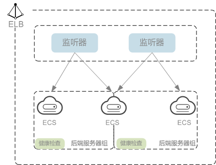
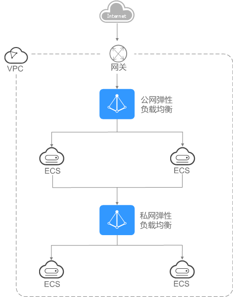

# 什么是负载均衡器

负载均衡器是指您创建的承载业务的负载均衡服务实体。创建负载均衡器后，您还需要在负载均衡器中添加监听器和后端服务器，然后才能使用负载均衡服务提供的功能。

**图 1**  负载均衡器结构图  

## 网络类型

按照网络类型分类，负载均衡器分为**公网负载均衡器**和**私网负载均衡器**。

-   **公网负载均衡器：**负责处理来自公网访问请求分发的负载均衡实体。

    公网负载均衡器接收公网的访问请求，然后向绑定了监听器的后端服务器分发这些请求。创建公网负载均衡器时，需要为负载均衡器创建EIP或者绑定已有的EIP 。

    **使用场景**

    -   需要通过服务器集群对公网提供服务，且需要统一的入口，并将公网用户请求合理地分配到服务器集群时。
    -   需要对服务器集群做故障容错和故障恢复时。

    **费用说明**

    公网负载均衡因为绑定了EIP ，会收取公网IP相关的费用。更多关于计费的内容，请参见[计费说明（共享型负载均衡器）](https://support.huaweicloud.com/productdesc-elb/elb_pro_0014.html)和[计费说明（独享型）](https://support.huaweicloud.com/productdesc-elb/elb_pro_0015.html)。

-   **私网负载均衡器：**负责处理来自弹性负载均衡同一个VPC内访问请求的负载均衡实体。

    私网负载均衡器由于没有公网域名和EIP，所以只能在VPC内部被访问，不能被Internet的公网用户访问。私网负载均衡通过使用私有IP将来自同一个VPC内的访问请求分发到后端服务器上，通常用于内部服务集群。

    **使用场景**

    私网负载均衡的客户端和服务器端均在云平台内部，通过VPC内网访问，主要场景如下：

    -   当内部服务器端有多台，需要将客户端请求合理地分发到各台服务器时；
    -   当需要对内部服务器集群做故障容错和故障恢复时；
    -   当用户想对外屏蔽自己的物理IP地址，对客户端提供透明化的服务时；

    **费用说明**

    私网负载均衡不收取费用。

    **同时使用公网负载均衡和私网负载均衡：**

    例如，某业务Web服务器和数据库服务器分开部署，Web服务器需要对公网用户提供访问，后端的数据库服务器只能通过内网进行访问。该场景可以同时使用公网负载均衡器和私网负载均衡器，将Web服务器连接至公网负载均衡器，将相应的数据库服务器连接至私网负载均衡器。公网负载均衡器接收来自公网的请求并分发至后端Web服务器，处理后将对数据库的请求发送到私网负载均衡，再由私网负载均衡转发请求至数据库服务器。

    **图 2**  同时使用公网负载均衡和私网负载均衡  
    

