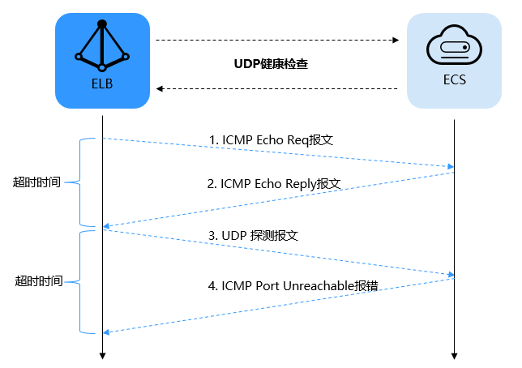

# 健康检查介绍

负载均衡器会定期向后端服务器发送请求以测试其运行状态，这些测试称为健康检查。通过健康检查来判断后端服务器是否可用。负载均衡器如果判断后端服务器健康检查异常，就不会将流量分发到异常后端服务器，而是分发到健康检查正常的后端服务器，从而提高了业务的可靠性。当异常的后端服务器恢复正常运行后，负载均衡器会将其自动恢复到负载均衡服务中，承载业务流量。

如果您的业务对负载比较敏感，过于频繁的健康检查报文可能会对您的正常业务产生影响。您可以根据实际的业务情况，通过增大健康检查间隔，或者将七层健康检查改为四层健康检查等方式来降低对业务的影响。如果您的业务系统自身有健康检查机制，也可以关闭负载均衡器的健康检查，但是为了保障业务的持续可用，不建议这样做。

## 前提条件

对于四层监听器，健康检查适用的版本是HTTP 1.1；对于七层监听器，共享型负载均衡健康检查适用的版本是HTTP 1.1，独享型适用HTTP 1.0。

## TCP健康检查

对于四层（TCP）和七层（HTTP/HTTPS）监听器，您可以配置TCP健康检查，通过发起TCP三次握手来获取后端服务器的状态信息，如[图1](#fig3642114224015)所示。

**图 1**  TCP健康检查  

TCP健康检查的机制如下：

1.  ELB节点根据健康检查配置，向后端服务器（IP+健康检查端口）发送TCP SYN报文。
2.  后端服务器收到请求报文后，如果相应的端口已经被正常监听，则会返回SYN+ACK报文。
    -   如果在超时时间内没有收到后端服务器的SYN+ACK报文，则判定健康检查失败。然后发送RST报文给后端服务器中断TCP连接。
    -   如果在超时时间内收到了SYN+ACK报文，则发送ACK给后端服务器，判定健康检查成功，并发送RST报文给后端服务器中断TCP连接。

> **须知：** 
>正常的TCP三次握手后，会进行数据传输，但是在健康检查时会发送RST中断建立的TCP连接。该实现方式可能会导致后端服务器中的应用认为TCP连接异常退出，并打印错误信息，如“Connection reset by peer”。解决方案如下：
>-   采用HTTP方式进行健康检查。
>-   后端服务器忽略健康检查的连接错误。

## UDP健康检查

对于四层（UDP）监听器，默认配置UDP健康检查，通过发送UDP探测报文获取后端服务器的状态信息，如[图2](#fig10983238164318)所示。

**图 2**  UDP健康检查  

UDP健康检查机制如下：

1.  四层ELB节点根据健康检查配置，向后端服务器发送ICMP Echo Request报文。
    -   如果在超时时间内没有收到ICMP Echo Reply报文，则判定健康检查失败。
    -   如果在超时时间内收到了ICMP Echo Reply报文，则向后端服务器发送UDP探测报文。

2.  如果在超时时间内没有收到后端服务器返回的ICMP Port Unreachable报文，则判定健康检查成功。否则，判定健康检查失败。

## HTTP健康检查

对于四层（TCP）和七层（HTTP/HTTPS）监听器，您可以配置HTTP健康检查，通过HTTP GET请求来获取状态信息。对于HTTPS监听器，由于负载均衡器对TLS协议进行了卸载，负载均衡器与后端服务器之间使用HTTP传输，健康检查也采用HTTP方式，以提高系统的性能。健康原理如[图3](#fig18544191717440)所示。

**图 3**  HTTP健康检查  

具体机制如下：

1.  七层ELB节点根据健康检查配置，向后端服务器（IP+端口+检查路径）发出HTTP GET请求（可以选择设置域名）。
2.  后端服务器收到请求后，根据服务的情况返回相应的HTTP状态码。
    -   如果七层ELB节点在响应超时时间内收到了后端服务器的响应，将HTTP状态码与预置的状态码进行对比，如果匹配则认为健康检查成功，后端服务器运行正常。
    -   如果七层ELB节点在响应超时时间内没有收到后端服务器的响应，则判定健康检查失败。

## 健康检查时间窗

健康检查机制的引入，有效提高了业务服务的可用性。但是，为了避免频繁的健康检查失败引起的切换对系统可用性的冲击，健康检查只有连续多次检查成功或失败后，才会进行状态切换。

以共享型负载均衡的健康检查为例，健康检查时间窗由以下三个因素决定：

-   检查间隔：每隔多久进行一次健康检查。
-   超时时间：等待服务器返回健康检查的时间。
-   最大重试次数：健康检查连续成功的次数。

系统必须连续3次检查失败，才会判定后端服务器健康检查失败，与“最大重试次数”设置的数值无关。

健康检查时间窗的计算方法如下：

-   健康检查成功时间窗 = 超时时间×最大重试次数 + 检查间隔×\(最大重试次数-1\)
-   健康检查失败时间窗 = 超时时间×**3**  + 检查间隔×\(**3**-1\)

如[图4](#fig7858105712204)所示:

-   检查间隔：4s
-   超时时间：2s

健康检查检测到后端服务器从正常到失败状态，健康检查失败时间窗 = 超时时间×**3**+检查间隔×\(**3**-1\)  = 2 x 3+4 x \(3-1\) = 14s。

**图 4**  健康检查失败时间窗  

## 健康检查异常排查

如果您的健康检查异常，排查方法请参考[健康检查异常如何排查](https://support.huaweicloud.com/elb_faq/zh-cn_topic_0018127975.html)。

