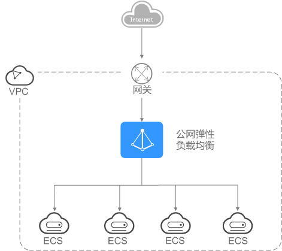
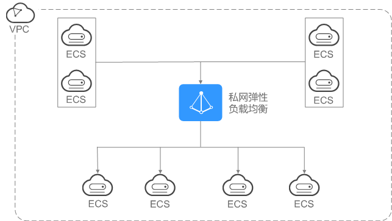

# 公网和私网负载均衡器

## 公网负载均衡器

公网负载均衡器通过公网IP对外提供服务，将来自公网的客户端请求按照指定的负载均衡策略分发到后端云服务器进行处理。

对于增强型公网负载均衡，不仅支持公网访问，也支持私网访问。

**图 1**  公网负载均衡器  

## 私网负载均衡器

私网负载均衡器通过私网IP对外提供服务，将来自同一个VPC的客户端请求按照指定的负载均衡策略分发到后端进行处理。

**图 2**  私网负载均衡器  

