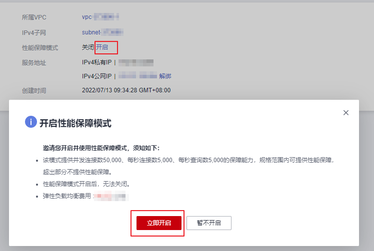

# 共享型实例开启性能保障模式

## 操作场景

共享型实例性能保障模式提供并发连接数5万、每秒新建连接数5000、每秒查询数5000 的保障能力，可以为您提供更加稳定、更高质量的负载均衡服务，解决非性能保障模式下资源易抢占的问题。

2022年7月10号起，新创建的共享型实例默认开启性能保障模式，无需执行本节操作。

2022年7月10号前创建的共享型实例均未开启性能保障模式，您可以参考本节操作开启性能保障模式。

## 使用须知

-   性能保障模式开启后，无法关闭。
-   性能保障模式开启后，将按需收取弹性负载均衡实例费用。具体价格请参考[价格详情](https://www.huaweicloud.com/pricing.html?tab=detail#/elb)。

## 开启性能保障模式

1.  登录管理控制台。
2.  在管理控制台左上角单击图标，选择区域和项目。
3.  单击页面左上角的，选择“网络 \> 弹性负载均衡”。
4.  单击需要开启性能保障模式的共享型实例，进入“基本信息”页面。
5.  单击性能保障模式的“开启”。
6.  选择“立即开启”即可开启性能保障模式。

    **图 1**  开启性能保障模式  
    

