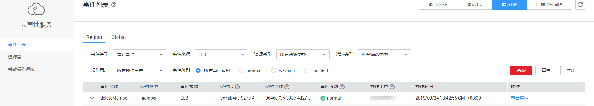
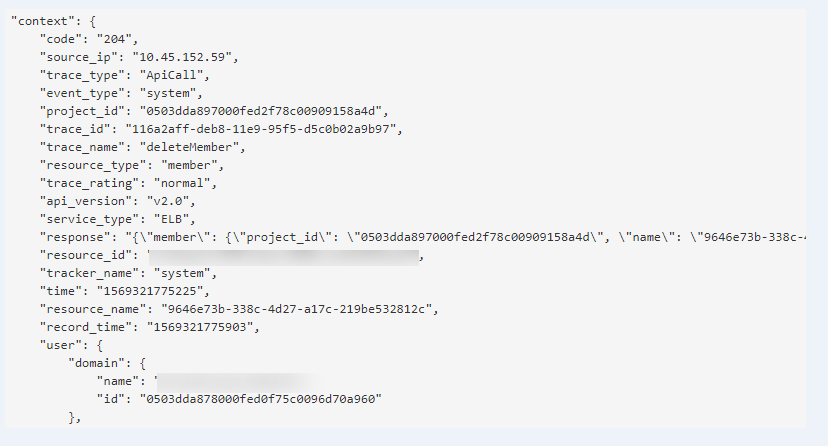

# 查看审计日志<a name="elb_ug_sj_0002"></a>

## 操作场景<a name="section71051526193816"></a>

在您开启了云审计服务后，系统开始记录云服务资源的操作。云审计服务管理控制台保存最近7天的操作记录。

本节介绍如何在云审计服务管理控制台查看最近7天的操作记录。

## 操作步骤<a name="zh-cn_topic_0107211964_section35541637205812"></a>

1.  登录管理控制台。
2.  在管理控制台左上角单击图标，选择区域和项目。
3.  单击“服务列表”，选择“管理与监管 \> 云审计服务”，进入云审计服务信息页面。
4.  单击左侧导航树的“事件列表”，进入事件列表信息页面。
5.  事件列表支持通过筛选来查询对应的操作事件。当前事件列表支持四个维度的组合查询，详细信息如下：
    -   事件类型、事件来源、资源类型和筛选类型。

        在下拉框中选择查询条件。

        其中筛选类型选择事件名称时，还需选择某个具体的事件名称。

        选择资源ID时，还需选择或者手动输入某个具体的资源ID。

        选择资源名称时，还需选择或手动输入某个具体的资源名称。

    -   操作用户：在下拉框中选择某一具体的操作用户，此操作用户指用户级别，而非租户级别。
    -   事件级别：可选项为“所有事件级别”、“normal”、“warning”、“incident”，只可选择其中一项。
    -   时间范围：可选择查询最近七天内任意时间段的操作事件。

6.  在需要查看的记录左侧，单击展开该记录的详细信息。如[图 展开记录](#fig133800413018)所示。

    **图 1**  展开记录<a name="fig133800413018"></a>  
    

7.  在需要查看的记录右侧，单击“查看事件”，弹出一个窗口，如[图 查看事件](#fig18381171611912)所示，显示了该操作事件结构的详细信息。

    **图 2**  查看事件<a name="fig18381171611912"></a>  
    

    关于云审计服务事件结构的关键字段详解，请参见[《云审计服务用户指南》](https://support.huaweicloud.com/usermanual-cts/cts_03_0010.html)的事件结构。


## 审计日志示例<a name="section20682111543419"></a>

-   创建负载均衡器

    ```
    request {"loadbalancer":{"name":"elb-test-zcy","description":"","tenant_id":"05041fffa40025702f6dc009cc6f8f33","vip_subnet_id":"ed04fd93-e74b-4794-b63e-e72baa02a2da","admin_state_up":true}}
    code 201
    source_ip 124.71.93.36
    trace_type ConsoleAction
    event_type system
    project_id 05041fffa40025702f6dc009cc6f8f33
    trace_id b39b21a1-8d49-11ec-b548-2be046112888
    trace_name createLoadbalancer
    resource_type loadbalancer
    trace_rating normal
    api_version v2.0
    service_type ELB
    response {"loadbalancer": {"description": "", "provisioning_status": "ACTIVE", "provider": "vlb", "project_id": "05041fffa40025702f6dc009cc6f8f33", "vip_address": "172.18.0.205", "pools": [], "operating_status": "ONLINE", "name": "elb-test-zcy", "created_at": "2022-02-14T03:53:39", "listeners": [], "id": "7ebe23cd-1d46-4a49-b707-1441c7f0d0d1", "vip_port_id": "5b36ff96-3773-4736-83cf-38c54abedeea", "updated_at": "2022-02-14T03:53:41", "tags": [], "admin_state_up": true, "vip_subnet_id": "ed04fd93-e74b-4794-b63e-e72baa02a2da", "tenant_id": "05041fffa40025702f6dc009cc6f8f33"}}
    resource_id 7ebe23cd-1d46-4a49-b707-1441c7f0d0d1
    tracker_name system
    time 2022/02/14 11:53:42 GMT+08:00
    resource_name elb-test-zcy
    record_time 2022/02/14 11:53:42 GMT+08:00
    request_id
    user {"domain": {"name": "CBUInfo", "id": "0503dda87802345ddafed096d70a960"}, "name": "zcy", "id": "09f106afd2345cdeff5c009c58f5b4a"}
    ```

-   删除负载均衡器

    ```
    request
    code 204
    source_ip 124.71.93.36
    trace_type ConsoleAction
    event_type system
    project_id 05041fffa40025702f6dc009cc6f8f33
    trace_id 4f838bbf-8d4a-11ec-a1fe-1f93fdaf3bec
    trace_name deleteLoadbalancer
    resource_type loadbalancer
    trace_rating normal
    api_version v2.0
    service_type ELB
    response {"loadbalancer": {"listeners": [], "vip_port_id": "5b36ff96-3773-4736-83cf-38c54abedeea", "tags": [], "tenant_id": "05041fffa40025702f6dc009cc6f8f33", "admin_state_up": true, "id": "7ebe23cd-1d46-4a49-b707-1441c7f0d0d1", "operating_status": "ONLINE", "description": "", "pools": [], "vip_subnet_id": "ed04fd93-e74b-4794-b63e-e72baa02a2da", "project_id": "05041fffa40025702f6dc009cc6f8f33", "provisioning_status": "ACTIVE", "name": "elb-test-zcy", "created_at": "2022-02-14T03:53:39", "vip_address": "172.18.0.205", "updated_at": "2022-02-14T03:53:41", "provider": "vlb"}}
    resource_id 7ebe23cd-1d46-4a49-b707-1441c7f0d0d1
    tracker_name system
    time 2022/02/14 11:58:03 GMT+08:00
    resource_name elb-test-zcy
    record_time 2022/02/14 11:58:03 GMT+08:00
    request_id
    user {"domain": {"name": CBUInfo", "id": "0503dda87802345ddafed096d70a960"}, "name": "zcy", "id": "09f106afd2345cdeff5c009c58f5b4a"}
    ```


