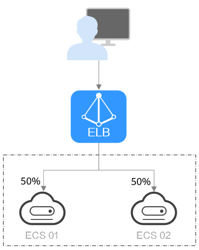
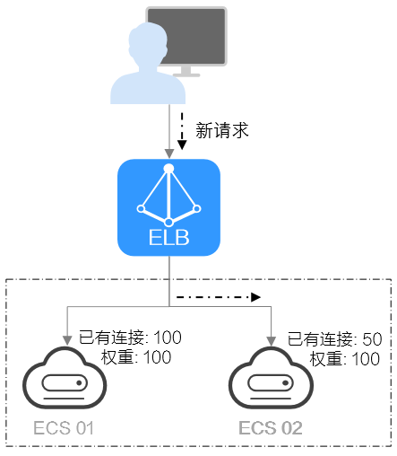
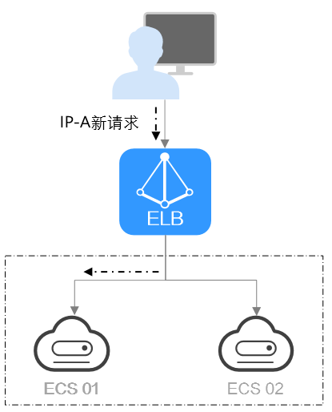
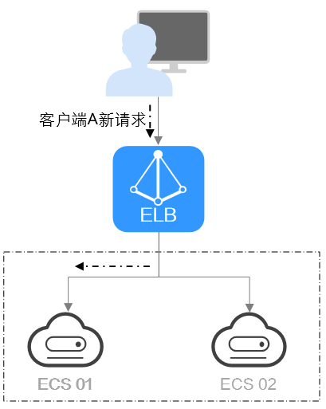

# 流量分配策略

负载均衡器会接收来自客户端的请求，并将请求转发到一个或多个可用区的后端服务器中进行处理。请求的流量分发与负载均衡器所绑定的后端服务器组配置的分配策略类型相关。

## 分配策略类型

独享型负载均衡支持加权轮询算法、加权最少连接、源IP算法、连接ID算法，共享型负载均衡支持加权轮询算法、加权最少连接、源IP算法。

-   加权轮询算法：根据后端服务器的权重，按顺序依次将请求分发给不同的服务器。它用相应的权重表示服务器的处理性能，按照权重的高低以及轮询方式将请求分配给各服务器，权重大的后端服务器被分配的概率高。相同权重的服务器处理相同数目的连接数。常用于短连接服务，例如HTTP等服务。

    [图1](#zh-cn_topic_0093253454_fig7538148162412)展示弹性负载均衡器使用加权轮询算法的流量分发流程。假设可用区内有2台权重相同的后端服务器，负载均衡器节点会将50%的客户端流量分发到其可用区中的每一台后端服务器。

    **图 1**  加权轮询算法流量分发  
    

-   加权最少连接：最少连接是通过当前活跃的连接数来估计服务器负载情况的一种动态调度算法。加权最少连接就是在最少连接数的基础上，根据服务器的不同处理能力，给每个服务器分配不同的权重，使其能够接受相应权值数的服务请求。常用于长连接服务，例如数据库连接等服务。

    [图2](#zh-cn_topic_0093253454_fig193917324513)展示弹性负载均衡器使用加权最少连接算法的流量分发流程。假设可用区内有2台权重相同的后端服务器，ECS 01已有100个连接，ECS 02已有50个连接，则新的连接会优先分配到ECS 02上。

    **图 2**  加权最少连接算法流量分发  
    

-   源IP算法：将请求的源IP地址进行一致性Hash运算，得到一个具体的数值，同时对后端服务器进行编号，按照运算结果将请求分发到对应编号的服务器上。这可以使得对不同源IP的访问进行负载分发，同时使得同一个客户端IP的请求始终被派发至某特定的服务器。该方式适合负载均衡无cookie功能的TCP协议。

    [图3](#zh-cn_topic_0093253454_fig3381171135617)展示弹性负载均衡器使用源IP算法的流量分发流程。假设可用区内有2台权重相同的后端服务器，ECS 01已经处理了一个IP-A的请求，则IP-A新发起的请求会自动分配到ECS 01上。

    **图 3**  源IP算法流量分发  
    

-   连接ID算法：利用报文里的连接ID字段进行一致性hash算法，得到一个具体的数值，同时对后端服务器进行编号，按照运算结果将请求分发到对应编号的服务器上。这可以使得对不同连接ID的访问进行负载分发，同时使得同一个连接ID的请求始终被派发至某特定的服务器。该方式适合于负载均衡QUIC协议应用的报文流。

    > **说明：** 
    >当前仅独享型负载均衡支持连接ID算法。

    [图4](#zh-cn_topic_0093253454_zh-cn_topic_0236111231_fig3381171135617)展示弹性负载均衡器使用连接ID算法的流量分发流程。假设可用区内有2台权重相同的后端服务器，ECS 01已经处理了一个客户端A的请求，则客户端A的新发起的请求会自动分配到ECS 01上。

    **图 4**  连接ID算法流量分发  
    

## 修改分配策略

1.  登录管理控制台。
2.  在管理控制台左上角单击图标，选择区域和项目。
3.  单击页面左上角的，选择“网络 \> 弹性负载均衡”。
4.  在“负载均衡器”界面，单击需要修改分配策略的负载均衡名称。
5.  在该负载均衡界面，切换到“后端服务器组”页签，单击后端服务器组所在行的。
6.  选择“分配策略类型”。

    > **说明：** 
    >修改分配策略立即生效，不影响已经建立连接的流量转发，只影响新建连接的流量分配。

7.  单击“确定”。

