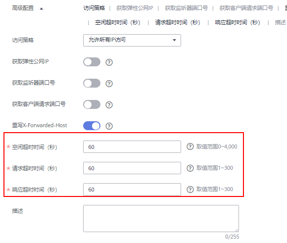

# 添加/修改监听器的超时时间

## 操作场景

弹性负载均衡支持配置和修改监听器的超时时间（**空闲超时时间**、**请求超时时间**、**响应超时时间**），方便用户根据自身业务情况，自定义调整超时时间。例如，HTTP/HTTPS协议客户端的请求文件比较大，可以增加请求超时时间，以便能够顺利完成文件的传输。

共享型负载均衡器支持修改TCP/HTTP/HTTPS协议的超时时间，但不支持修改UDP的超时时间。

独享型负载均衡支持修改TCP/UDP/HTTP/HTTPS协议的超时时间。

## 添加超时时间

1.  登录管理控制台。
2.  在管理控制台左上角单击图标，选择区域和项目。
3.  单击页面左上角的，选择“网络 \> 弹性负载均衡”。
4.  在“负载均衡器”界面，单击需要添加监听器的负载均衡名称。
5.  切换到“监听器”页签，单击“添加监听器”。
6.  在“添加监听器”页面，可以根据实际业务诉求修改超时时间。修改后，请单击“下一步”。

    **图 1**  添加超时时间  
    

1.  根据需要完成其他配置。
2.  确认配置后，单击“提交”。

## 修改超时时间

1.  登录管理控制台。
2.  在管理控制台左上角单击图标，选择区域和项目。
3.  单击页面左上角的，选择“网络 \> 弹性负载均衡”。
4.  在“负载均衡器”界面，单击需要修改监听器的负载均衡名称。
5.  切换到“监听器”页签：
    -   共享型负载均衡器，单击需要修改超时时间的目标监听器名称右侧的。
    -   独享型负载均衡器，单击需要修改超时时间的目标监听器名称右侧的按钮，选择“修改监听器”。

6.  在“修改监听器”页面，单击“高级配置”。
7.  修改“空闲超时时间”或“请求超时时间”或“响应超时时间”后，单击“下一步”。
8.  单击“完成”。

## 相关操作

监听器创建完成后，还需要添加后端服务器，具体操作请参考[添加或移除后端服务器（共享型）](添加或移除后端服务器（共享型）.md)。

