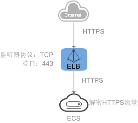

# 添加HTTPS监听器

## 操作场景

HTTPS协议适用于需要加密传输的应用。您可以添加一个HTTPS监听转发来自HTTPS协议的请求。ELB对于用户的HTTPS的请求进行解密，然后发送至后端服务器；后端服务器处理完请求后的返回包首先发送至ELB，由ELB进行加密后，再传回用户侧。

添加HTTPS监听器时，要求后端子网预留足够的IP地址，可以通过负载均衡器的“基本信息 \> 后端子网”添加多个后端子网来增加后端子网的IP地址。添加子网后，请取消对应子网的ACL配置，否则可能导致负载均衡访问异常。

如果您不希望负载均衡器对HTTPS流量进行解密，可以通过配置相同端口的TCP监听器将HTTPS流量透传到后端服务器。具体原理参见[TCP监听器将HTTPS流量透传到后端服务器](#section19187181715231)。

> **注意：** 
>-   独享型负载均衡前端协议为“HTTPS”时，后端协议可以选择“HTTP”或“HTTPS”。
>-   共享型负载均衡前端协议为“HTTPS”时，后端协议默认为“HTTP”，且不支持修改。
>-   如果您的独享型负载均衡实例类型为网络型（TCP/UDP），则无法创建HTTPS监听器。

## 添加独享型负载均衡HTTPS监听器

1.  登录管理控制台。
2.  在管理控制台左上角单击图标，选择区域和项目。
3.  单击页面左上角的，选择“网络 \> 弹性负载均衡”。
4.  在“负载均衡器”界面，单击需要添加监听器的负载均衡名称。
5.  切换到“监听器”页签，单击“添加监听器”，配置监听器。配置监听器参数参见[表1](#table16995152202318)。

    **表 1**  独享型负载均衡配置监听器参数说明

    
    <table><thead align="left"><tr id="row4995125218232"><th class="cellrowborder" valign="top" width="22.71%" id="mcps1.2.4.1.1">
参数

    </th>
    <th class="cellrowborder" valign="top" width="48.03%" id="mcps1.2.4.1.2">
说明

    </th>
    <th class="cellrowborder" valign="top" width="29.26%" id="mcps1.2.4.1.3">
示例

    </th>
    </tr>
    </thead>
    <tbody><tr id="row189951352112318"><td class="cellrowborder" valign="top" width="22.71%" headers="mcps1.2.4.1.1 ">
名称

    </td>
    <td class="cellrowborder" valign="top" width="48.03%" headers="mcps1.2.4.1.2 ">
监听器名称。

    </td>
    <td class="cellrowborder" valign="top" width="29.26%" headers="mcps1.2.4.1.3 ">
listener-pnqy

    </td>
    </tr>
    <tr id="row10996152192317"><td class="cellrowborder" valign="top" width="22.71%" headers="mcps1.2.4.1.1 ">
前端协议

    </td>
    <td class="cellrowborder" valign="top" width="48.03%" headers="mcps1.2.4.1.2 ">
客户端与负载均衡监听器建立流量分发连接的协议。

    
协议选择HTTPS。

    </td>
    <td class="cellrowborder" valign="top" width="29.26%" headers="mcps1.2.4.1.3 ">
HTTPS

    </td>
    </tr>
    <tr id="row246011404416"><td class="cellrowborder" valign="top" width="22.71%" headers="mcps1.2.4.1.1 ">
前端端口

    </td>
    <td class="cellrowborder" valign="top" width="48.03%" headers="mcps1.2.4.1.2 ">
客户端与负载均衡监听器建立流量分发连接的端口。

    
取值范围为：[1-65535]。

    </td>
    <td class="cellrowborder" valign="top" width="29.26%" headers="mcps1.2.4.1.3 ">
80

    </td>
    </tr>
    <tr id="row1134724483"><td class="cellrowborder" valign="top" width="22.71%" headers="mcps1.2.4.1.1 ">
SSL解析方式

    </td>
    <td class="cellrowborder" valign="top" width="48.03%" headers="mcps1.2.4.1.2 ">
确保服务安全，请选择客户端到服务器端认证方式。

    
可选择“单向认证”或“双向认证”。

    <ul id="ul105080268911"><li>如仅进行服务器端认证，请选择单向认证。</li><li>双向认证需要负载均衡实例与访问用户互相提供身份认证，从而允许通过认证的用户访问负载均衡实例，后端服务器无需额外配置双向认证。</li></ul>
    </td>
    <td class="cellrowborder" valign="top" width="29.26%" headers="mcps1.2.4.1.3 ">
单向认证

    </td>
    </tr>
    <tr id="row1973112511157"><td class="cellrowborder" valign="top" width="22.71%" headers="mcps1.2.4.1.1 ">
服务器证书

    </td>
    <td class="cellrowborder" valign="top" width="48.03%" headers="mcps1.2.4.1.2 ">
协议类型为HTTPS时，需绑定服务器证书。

    
服务器证书用于SSL握手协商，需提供证书内容和私钥。详见<a href="创建-修改-删除证书.md">创建/修改/删除证书</a>。

    </td>
    <td class="cellrowborder" valign="top" width="29.26%" headers="mcps1.2.4.1.3 ">
-

    </td>
    </tr>
    <tr id="row94033214135"><td class="cellrowborder" valign="top" width="22.71%" headers="mcps1.2.4.1.1 ">
CA证书

    </td>
    <td class="cellrowborder" valign="top" width="48.03%" headers="mcps1.2.4.1.2 ">
协议类型为HTTPS时，需绑定CA证书。

    
CA证书又称客户端CA公钥证书，用于验证客户端证书的签发者；在开启HTTPS双向认证功能时，只有当客户端能够出具指定CA签发的证书时，HTTPS连接才能成功。详见<a href="创建-修改-删除证书.md">创建/修改/删除证书</a>。

    </td>
    <td class="cellrowborder" valign="top" width="29.26%" headers="mcps1.2.4.1.3 ">
-

    </td>
    </tr>
    <tr id="row15603114051613"><td class="cellrowborder" valign="top" width="22.71%" headers="mcps1.2.4.1.1 ">
开启SNI

    </td>
    <td class="cellrowborder" valign="top" width="48.03%" headers="mcps1.2.4.1.2 ">
HTTPS协议的负载均衡可以选择是否开启SNI。

    
SNI是为了解决一个服务器使用多个域名和证书的TLS扩展。

    
开启SNI后，允许客户端在发起SSL握手请求时就提交请求的域名信息，ELB收到SSL请求后，会根据域名去查找证书，如果找到域名对应的证书，则返回该证书；如果没有找到域名对应的证书，则返回缺省证书。详见<a href="SNI证书-HTTPS监听器绑定多个证书（多域名访问）.md">SNI证书-HTTPS监听器绑定多个证书（多域名访问）</a>。

    </td>
    <td class="cellrowborder" valign="top" width="29.26%" headers="mcps1.2.4.1.3 ">
-

    </td>
    </tr>
    <tr id="row172281034102711"><td class="cellrowborder" valign="top" width="22.71%" headers="mcps1.2.4.1.1 ">
SNI证书

    </td>
    <td class="cellrowborder" valign="top" width="48.03%" headers="mcps1.2.4.1.2 ">
HTTPS协议的负载均衡设置开启SNI后需要选择域名对应的证书。

    
可选择已创建或者创建新的SNI证书。详见<a href="创建-修改-删除证书.md">创建/修改/删除证书</a>。

    </td>
    <td class="cellrowborder" valign="top" width="29.26%" headers="mcps1.2.4.1.3 ">
-

    </td>
    </tr>
    <tr id="row1099695282315"><td class="cellrowborder" colspan="3" valign="top" headers="mcps1.2.4.1.1 mcps1.2.4.1.2 mcps1.2.4.1.3 ">
<strong id="b09961252122313">高级配置</strong>

    </td>
    </tr>
    <tr id="row3996052142310"><td class="cellrowborder" valign="top" width="22.71%" headers="mcps1.2.4.1.1 ">
访问策略

    </td>
    <td class="cellrowborder" valign="top" width="48.03%" headers="mcps1.2.4.1.2 ">
支持通过白名单和黑名单进行访问控制，更多信息请参见<a href="访问控制策略.md">访问控制策略</a>：

    <ul id="ul161301312102917"><li>允许所有IP访问</li><li>黑名单</li><li>白名单</li></ul>
    </td>
    <td class="cellrowborder" valign="top" width="29.26%" headers="mcps1.2.4.1.3 ">
白名单

    </td>
    </tr>
    <tr id="row09972052202318"><td class="cellrowborder" valign="top" width="22.71%" headers="mcps1.2.4.1.1 ">
IP地址组

    </td>
    <td class="cellrowborder" valign="top" width="48.03%" headers="mcps1.2.4.1.2 ">
设置白名单或者黑名单时，必须选择一个IP地址组。如果还未创建IP地址组，需要先创建IP地址组，更多关于IP地址组的信息请参见<a href="IP地址组（黑名单-白名单）.md">IP地址组（黑名单/白名单）</a>。

    </td>
    <td class="cellrowborder" valign="top" width="29.26%" headers="mcps1.2.4.1.3 ">
ipGroup-b2

    </td>
    </tr>
    <tr id="row675174843717"><td class="cellrowborder" valign="top" width="22.71%" headers="mcps1.2.4.1.1 ">
HTTP/2

    </td>
    <td class="cellrowborder" valign="top" width="48.03%" headers="mcps1.2.4.1.2 ">
协议类型为HTTPS时，可选择是否支持该协议类型。详见<a href="HTTP-2.md">HTTP/2</a>。

    </td>
    <td class="cellrowborder" valign="top" width="29.26%" headers="mcps1.2.4.1.3 ">
-

    </td>
    </tr>
    <tr id="row1690014279316"><td class="cellrowborder" valign="top" width="22.71%" headers="mcps1.2.4.1.1 ">
安全策略

    </td>
    <td class="cellrowborder" valign="top" width="48.03%" headers="mcps1.2.4.1.2 ">
支持选择可用的安全策略，更多信息请参见<a href="TLS安全策略.md">安全策略</a>。

    </td>
    <td class="cellrowborder" valign="top" width="29.26%" headers="mcps1.2.4.1.3 ">
安全策略TLS-1-0

    </td>
    </tr>
    <tr id="row6518155312191"><td class="cellrowborder" valign="top" width="22.71%" headers="mcps1.2.4.1.1 ">
获取弹性公网IP

    </td>
    <td class="cellrowborder" valign="top" width="48.03%" headers="mcps1.2.4.1.2 ">
通过X-Forwarded-ELB-IP头字段获取ELB实例公网IP地址。

    
若您需要将ELB公网IP透传到后端，只需在创建HTTPS监听器时，打开该开关。

    </td>
    <td class="cellrowborder" valign="top" width="29.26%" headers="mcps1.2.4.1.3 ">
-

    </td>
    </tr>
    <tr id="row83181647102112"><td class="cellrowborder" valign="top" width="22.71%" headers="mcps1.2.4.1.1 ">
获取监听器端口号

    </td>
    <td class="cellrowborder" valign="top" width="48.03%" headers="mcps1.2.4.1.2 ">
通过X-Forwarded-Port头字段获取ELB实例监听器端口号。

    
若您需要将ELB实例监听器的端口号透传到后端，只需在创建HTTP监听器时，打开该开关。

    </td>
    <td class="cellrowborder" valign="top" width="29.26%" headers="mcps1.2.4.1.3 ">
-

    </td>
    </tr>
    <tr id="row1991125052116"><td class="cellrowborder" valign="top" width="22.71%" headers="mcps1.2.4.1.1 ">
获取客户端请求端口号

    </td>
    <td class="cellrowborder" valign="top" width="48.03%" headers="mcps1.2.4.1.2 ">
通过X-Forwarded-For-Port头字段获取客户端请求端口号。

    
若您需要将客户端请求的端口号透传到后端，只需在创建HTTP监听器时，打开该开关。

    </td>
    <td class="cellrowborder" valign="top" width="29.26%" headers="mcps1.2.4.1.3 ">
-

    </td>
    </tr>
    <tr id="row1039145842110"><td class="cellrowborder" valign="top" width="22.71%" headers="mcps1.2.4.1.1 ">
重写X-Forwarded-Host

    </td>
    <td class="cellrowborder" valign="top" width="48.03%" headers="mcps1.2.4.1.2 "><ul id="ul577365472915"><li>开关关闭：ELB透传客户端的X-Forwarded-Host。</li><li>开关开启：ELB以客户端请求头的Host重写X-Forwarded-Host向后端传输。</li></ul>
    </td>
    <td class="cellrowborder" valign="top" width="29.26%" headers="mcps1.2.4.1.3 ">
-

    </td>
    </tr>
    <tr id="row129973524234"><td class="cellrowborder" valign="top" width="22.71%" headers="mcps1.2.4.1.1 ">
空闲超时时间（秒）

    </td>
    <td class="cellrowborder" valign="top" width="48.03%" headers="mcps1.2.4.1.2 ">
如果在超时时间内一直没有访问请求，负载均衡会中断当前连接，直到下一次请求到来时再重新建立新的连接。

    
时间取值范围[0-4000]。

    </td>
    <td class="cellrowborder" valign="top" width="29.26%" headers="mcps1.2.4.1.3 ">
60

    </td>
    </tr>
    <tr id="row182286208237"><td class="cellrowborder" valign="top" width="22.71%" headers="mcps1.2.4.1.1 ">
请求超时时间（秒）

    </td>
    <td class="cellrowborder" valign="top" width="48.03%" headers="mcps1.2.4.1.2 ">
客户端向负载均衡发起请求，如果在超时时间内客户端没有完成整个请求的传输，负载均衡将放弃等待关闭连接。

    
时间取值范围[1-300]。

    </td>
    <td class="cellrowborder" valign="top" width="29.26%" headers="mcps1.2.4.1.3 ">
60

    </td>
    </tr>
    <tr id="row1545492422310"><td class="cellrowborder" valign="top" width="22.71%" headers="mcps1.2.4.1.1 ">
响应超时时间（秒）

    </td>
    <td class="cellrowborder" valign="top" width="48.03%" headers="mcps1.2.4.1.2 ">
负载均衡向后端服务器发起请求，如果超时时间内接收请求的后端服务器无响应，负载均衡会向其他后端服务器重试请求。如果重试期间后端服务器一直没有响应，则负载均衡会给客户端返回HTTP 504错误码。

    
时间取值范围[1-300]。

    
 说明： 

当开启了会话保持功能时，响应超时时间内如果对应的后端服务器无响应，则直接会返回HTTP 504错误码。

    

    </td>
    <td class="cellrowborder" valign="top" width="29.26%" headers="mcps1.2.4.1.3 ">
60

    </td>
    </tr>
    <tr id="row29970521235"><td class="cellrowborder" valign="top" width="22.71%" headers="mcps1.2.4.1.1 ">
描述

    </td>
    <td class="cellrowborder" valign="top" width="48.03%" headers="mcps1.2.4.1.2 ">
对于监听器描述。

    
字数范围：0/255。

    </td>
    <td class="cellrowborder" valign="top" width="29.26%" headers="mcps1.2.4.1.3 ">
-

    </td>
    </tr>
    </tbody>
    </table>

6.  单击“下一步：配置后端分配策略”。配置后端服务器组参数请参见[表2](#table299811529239)。

    **表 2**  独享型负载均衡配置后端服务器组参数说明

    
    <table><thead align="left"><tr id="row99989528236"><th class="cellrowborder" valign="top" width="23.419999999999998%" id="mcps1.2.4.1.1">
参数

    </th>
    <th class="cellrowborder" valign="top" width="50.43%" id="mcps1.2.4.1.2">
说明

    </th>
    <th class="cellrowborder" valign="top" width="26.150000000000002%" id="mcps1.2.4.1.3">
示例

    </th>
    </tr>
    </thead>
    <tbody><tr id="row1999995222315"><td class="cellrowborder" valign="top" width="23.419999999999998%" headers="mcps1.2.4.1.1 ">
后端服务器组

    </td>
    <td class="cellrowborder" valign="top" width="50.43%" headers="mcps1.2.4.1.2 ">
把具有相同特性的后端服务器放在一个组。

    <ul id="ul39994528231"><li>新创建</li><li>使用已有
 说明： 

使用已有后端服务器组时，请确保此后端服务器组未被使用。并且只能选择前端协议匹配的后端服务器组。例如前端协议是TCP时，后端协议只能是TCP。

    

    </li></ul>
    </td>
    <td class="cellrowborder" valign="top" width="26.150000000000002%" headers="mcps1.2.4.1.3 ">
新创建

    </td>
    </tr>
    <tr id="row20853182317"><td class="cellrowborder" valign="top" width="23.419999999999998%" headers="mcps1.2.4.1.1 ">
名称

    </td>
    <td class="cellrowborder" valign="top" width="50.43%" headers="mcps1.2.4.1.2 ">
后端服务器组名称。

    </td>
    <td class="cellrowborder" valign="top" width="26.150000000000002%" headers="mcps1.2.4.1.3 ">
server_group-sq4v

    </td>
    </tr>
    <tr id="row170953142319"><td class="cellrowborder" valign="top" width="23.419999999999998%" headers="mcps1.2.4.1.1 ">
后端协议

    </td>
    <td class="cellrowborder" valign="top" width="50.43%" headers="mcps1.2.4.1.2 ">
云服务器开通的协议。

    
前端协议为HTTPS时，后端协议支持修改，可修改为HTTP或HTTPS。

    </td>
    <td class="cellrowborder" valign="top" width="26.150000000000002%" headers="mcps1.2.4.1.3 ">
HTTP

    </td>
    </tr>
    <tr id="row17055311233"><td class="cellrowborder" valign="top" width="23.419999999999998%" headers="mcps1.2.4.1.1 ">
分配策略类型

    </td>
    <td class="cellrowborder" valign="top" width="50.43%" headers="mcps1.2.4.1.2 ">
负载均衡采用的算法。

    <ul id="ul8075372314"><li>加权轮询算法：根据后端服务器的权重，按顺序依次将请求分发给不同的服务器。它用相应的权重表示服务器的处理性能，按照权重的高低以及轮询方式将请求分配给各服务器，相同权重的服务器处理相同数目的连接数。</li><li>加权最少连接：最少连接是通过当前活跃的连接数来估计服务器负载情况的一种动态调度算法。加权最少连接就是在最少连接数的基础上，根据服务器的不同处理能力，给每个服务器分配不同的权重，使其能够接受相应权值数的服务请求。</li><li>源IP算法：将请求的源IP地址进行一致性Hash运算，得到一个具体的数值，同时对后端服务器进行编号，按照运算结果将请求分发到对应编号的服务器上。这可以使得对不同源IP的访问进行负载分发，同时使得同一个客户端IP的请求始终被派发至某特定的服务器。</li></ul>
    
 说明： 
<ul id="ul61125382312"><li>用户可以根据自身需求选择相应的算法来分配用户访问流量，提升负载均衡能力。</li><li>对于加权轮询算法和加权最少连接，当服务器的权重为“0”时，将不会被分发访问请求。</li></ul>
    

    </td>
    <td class="cellrowborder" valign="top" width="26.150000000000002%" headers="mcps1.2.4.1.3 ">
加权轮询算法

    </td>
    </tr>
    <tr id="row121653202313"><td class="cellrowborder" valign="top" width="23.419999999999998%" headers="mcps1.2.4.1.1 ">
会话保持

    </td>
    <td class="cellrowborder" valign="top" width="50.43%" headers="mcps1.2.4.1.2 ">
开启会话保持后，弹性负载均衡将属于同一个会话的请求都转发到同一个服务器进行处理。

    
 说明： 

当分配策略类型为“加权轮询算法”或"加权最少连接”时，可配置会话保持。

    

    </td>
    <td class="cellrowborder" valign="top" width="26.150000000000002%" headers="mcps1.2.4.1.3 ">
-

    </td>
    </tr>
    <tr id="row3114532233"><td class="cellrowborder" valign="top" width="23.419999999999998%" headers="mcps1.2.4.1.1 ">
会话保持类型

    </td>
    <td class="cellrowborder" valign="top" width="50.43%" headers="mcps1.2.4.1.2 ">
前端协议为HTTP或HTTPS时，支持负载均衡器cookie类型的会话保持。

    <ul id="ul4572413115310"><li><strong id="elb_ug_jt_0004_b253964721712">负载均衡器cookie：</strong>负载均衡器会根据客户端第一个请求生成一个cookie，后续所有包含这个cookie值的请求都会由同一个后端服务器处理。</li></ul>
    </td>
    <td class="cellrowborder" valign="top" width="26.150000000000002%" headers="mcps1.2.4.1.3 ">
负载均衡器cookie

    </td>
    </tr>
    <tr id="row1121853132319"><td class="cellrowborder" valign="top" width="23.419999999999998%" headers="mcps1.2.4.1.1 ">
会话保持时间（分钟）

    </td>
    <td class="cellrowborder" valign="top" width="50.43%" headers="mcps1.2.4.1.2 ">
当分配策略类型选择“加权轮询算法”或“加权最少连接”，会话保持开启后，需添加会话保持时间。

    <ul id="ul1821153202318"><li>四层会话保持的会话保持时间取值范围为[1，60]。</li><li>七层会话保持的会话保持时间取值范围为[1，1440]。</li></ul>
    </td>
    <td class="cellrowborder" valign="top" width="26.150000000000002%" headers="mcps1.2.4.1.3 ">
20

    </td>
    </tr>
    <tr id="row112115352317"><td class="cellrowborder" valign="top" width="23.419999999999998%" headers="mcps1.2.4.1.1 ">
描述

    </td>
    <td class="cellrowborder" valign="top" width="50.43%" headers="mcps1.2.4.1.2 ">
后端服务器组的描述。

    
字数范围：0/255。

    </td>
    <td class="cellrowborder" valign="top" width="26.150000000000002%" headers="mcps1.2.4.1.3 ">
-

    </td>
    </tr>
    </tbody>
    </table>

7.  单击“下一步：添加后端服务器”。添加后端服务器并配置健康检查。添加后端服务器详见[添加或移除后端服务器（独享型）](添加或移除后端服务器（独享型）.md)，配置健康检查参数请参见[表3](#table1022053182319)。

    **表 3**  独享型负载均衡配置健康检查参数说明

    
    <table><thead align="left"><tr id="row183253192312"><th class="cellrowborder" valign="top" width="23.419999999999998%" id="mcps1.2.4.1.1">
参数

    </th>
    <th class="cellrowborder" valign="top" width="52.470000000000006%" id="mcps1.2.4.1.2">
说明

    </th>
    <th class="cellrowborder" valign="top" width="24.11%" id="mcps1.2.4.1.3">
示例

    </th>
    </tr>
    </thead>
    <tbody><tr id="row193105314234"><td class="cellrowborder" valign="top" width="23.419999999999998%" headers="mcps1.2.4.1.1 ">
是否开启

    </td>
    <td class="cellrowborder" valign="top" width="52.470000000000006%" headers="mcps1.2.4.1.2 ">
开启或者关闭健康检查。

    </td>
    <td class="cellrowborder" valign="top" width="24.11%" headers="mcps1.2.4.1.3 ">
-

    </td>
    </tr>
    <tr id="row16645332313"><td class="cellrowborder" valign="top" width="23.419999999999998%" headers="mcps1.2.4.1.1 ">
协议

    </td>
    <td class="cellrowborder" valign="top" width="52.470000000000006%" headers="mcps1.2.4.1.2 ">
健康检查支持HTTP、TCP、HTTPS协议，设置后不可修改。

    </td>
    <td class="cellrowborder" valign="top" width="24.11%" headers="mcps1.2.4.1.3 ">
HTTP

    </td>
    </tr>
    <tr id="row127091533562"><td class="cellrowborder" valign="top" width="23.419999999999998%" headers="mcps1.2.4.1.1 ">
端口

    </td>
    <td class="cellrowborder" valign="top" width="52.470000000000006%" headers="mcps1.2.4.1.2 ">
健康检查端口号，取值范围[1，65535]，为可选参数。

    
 说明： 

未配置健康检查端口时，默认使用后端云服务器端口进行健康检查。配置后，使用配置的健康检查端口进行健康检查。

    

    </td>
    <td class="cellrowborder" valign="top" width="24.11%" headers="mcps1.2.4.1.3 ">
80

    </td>
    </tr>
    <tr id="row29001745121913"><td class="cellrowborder" valign="top" width="23.419999999999998%" headers="mcps1.2.4.1.1 ">
域名

    </td>
    <td class="cellrowborder" valign="top" width="52.470000000000006%" headers="mcps1.2.4.1.2 ">
健康检查的请求域名。

    
默认值为空，由数字、字母、‘-’、‘.’组成的字符串，只能以数字或字符开头。

    
只有健康检查协议为HTTP时，需要设置。

    </td>
    <td class="cellrowborder" valign="top" width="24.11%" headers="mcps1.2.4.1.3 ">
www.elb.com

    </td>
    </tr>
    <tr id="row3885362315"><td class="cellrowborder" colspan="3" valign="top" headers="mcps1.2.4.1.1 mcps1.2.4.1.2 mcps1.2.4.1.3 ">
<strong id="b17845313235">健康检查配置</strong>

    </td>
    </tr>
    <tr id="row15855342319"><td class="cellrowborder" valign="top" width="23.419999999999998%" headers="mcps1.2.4.1.1 ">
检查间隔（秒）

    </td>
    <td class="cellrowborder" valign="top" width="52.470000000000006%" headers="mcps1.2.4.1.2 ">
每次健康检查响应的最大间隔时间。

    
取值范围[1-50]。

    </td>
    <td class="cellrowborder" valign="top" width="24.11%" headers="mcps1.2.4.1.3 ">
5

    </td>
    </tr>
    <tr id="row1581153152313"><td class="cellrowborder" valign="top" width="23.419999999999998%" headers="mcps1.2.4.1.1 ">
超时时间（秒）

    </td>
    <td class="cellrowborder" valign="top" width="52.470000000000006%" headers="mcps1.2.4.1.2 ">
每次健康检查响应的最大超时时间。取值范围[1-50]。

    </td>
    <td class="cellrowborder" valign="top" width="24.11%" headers="mcps1.2.4.1.3 ">
3

    </td>
    </tr>
    <tr id="row167077358544"><td class="cellrowborder" valign="top" width="23.419999999999998%" headers="mcps1.2.4.1.1 ">
检查路径

    </td>
    <td class="cellrowborder" valign="top" width="52.470000000000006%" headers="mcps1.2.4.1.2 ">
指定健康检查的URL地址。当“协议”为HTTP时生效。检查路径只能以/开头，长度范围[1-80]。

    
支持使用英文字母、数字和‘-’、‘/’、‘.’、‘%’、‘&amp;’以及特殊字符_~';@$*+,=!:()。

    
 说明： 

例如：

    
访问链接为：http://www.example.com/chat/try/，则检查路径填写“/chat/try/”。

    
访问链接为：http://192.168.63.187:9096/chat/index.html，则检查路径填写“/chat/index.html”。

    

    </td>
    <td class="cellrowborder" valign="top" width="24.11%" headers="mcps1.2.4.1.3 ">
/index.html

    </td>
    </tr>
    <tr id="row3915314238"><td class="cellrowborder" valign="top" width="23.419999999999998%" headers="mcps1.2.4.1.1 ">
最大重试次数

    </td>
    <td class="cellrowborder" valign="top" width="52.470000000000006%" headers="mcps1.2.4.1.2 ">
健康检查最大的重试次数，取值范围[1-10]。

    </td>
    <td class="cellrowborder" valign="top" width="24.11%" headers="mcps1.2.4.1.3 ">
3

    </td>
    </tr>
    <tr id="row8454134210540"><td class="cellrowborder" valign="top" width="23.419999999999998%" headers="mcps1.2.4.1.1 ">
HTTP状态码

    </td>
    <td class="cellrowborder" valign="top" width="52.470000000000006%" headers="mcps1.2.4.1.2 ">
自定义健康检查返回的状态码。当“协议”为HTTP或HTTPS时生效。

    
可输入200-599范围内不重复的单个数字或正序的数字区间。多个HTTP状态码使用逗号隔开，最多支持5个。

    
 说明： 

如果您要使用该特性，请进入至ELB服务控制台后，单击页面左下角的“体验新版”。目前新版控制台在公测中，待公测结束后即可正常使用。

    

    </td>
    <td class="cellrowborder" valign="top" width="24.11%" headers="mcps1.2.4.1.3 ">
200

    </td>
    </tr>
    </tbody>
    </table>

8.  单击“下一步：确认配置”。
9.  确认配置无误后，单击“提交”。

## 添加共享型负载均衡HTTPS监听器

1.  登录管理控制台。
2.  在管理控制台左上角单击图标，选择区域和项目。
3.  单击页面左上角的，选择“网络 \> 弹性负载均衡”。
4.  在“负载均衡器”界面，单击需要添加监听器的负载均衡名称。
5.  切换到“监听器”页签，单击“添加监听器”，配置监听器。配置监听器参数参见[表4](#table1093233819544)。

    **表 4** 共享型负载均衡配置监听器参数说明

    
    <table><thead align="left"><tr id="row693273814544"><th class="cellrowborder" valign="top" width="26.1%" id="mcps1.2.4.1.1">
参数

    </th>
    <th class="cellrowborder" valign="top" width="44.73%" id="mcps1.2.4.1.2">
说明

    </th>
    <th class="cellrowborder" valign="top" width="29.17%" id="mcps1.2.4.1.3">
示例

    </th>
    </tr>
    </thead>
    <tbody><tr id="row12932163805416"><td class="cellrowborder" valign="top" width="26.1%" headers="mcps1.2.4.1.1 ">
名称

    </td>
    <td class="cellrowborder" valign="top" width="44.73%" headers="mcps1.2.4.1.2 ">
监听器名称。

    </td>
    <td class="cellrowborder" valign="top" width="29.17%" headers="mcps1.2.4.1.3 ">
listener-pnqy

    </td>
    </tr>
    <tr id="row1893263811549"><td class="cellrowborder" valign="top" width="26.1%" headers="mcps1.2.4.1.1 ">
前端协议

    </td>
    <td class="cellrowborder" valign="top" width="44.73%" headers="mcps1.2.4.1.2 ">
客户端与负载均衡监听器建立流量分发连接的协议。

    
协议选择HTTPS。

    </td>
    <td class="cellrowborder" valign="top" width="29.17%" headers="mcps1.2.4.1.3 ">
HTTPS

    </td>
    </tr>
    <tr id="row72895361694"><td class="cellrowborder" valign="top" width="26.1%" headers="mcps1.2.4.1.1 ">
前端端口

    </td>
    <td class="cellrowborder" valign="top" width="44.73%" headers="mcps1.2.4.1.2 ">
客户端与负载均衡监听器建立流量分发连接的端口。

    
取值范围为：[1-65535]。

    </td>
    <td class="cellrowborder" valign="top" width="29.17%" headers="mcps1.2.4.1.3 ">
80

    </td>
    </tr>
    <tr id="row1689092712107"><td class="cellrowborder" valign="top" width="26.1%" headers="mcps1.2.4.1.1 ">
SSL解析方式

    </td>
    <td class="cellrowborder" valign="top" width="44.73%" headers="mcps1.2.4.1.2 ">
确保服务安全，请选择客户端到服务器端认证方式。

    
可选择“单向认证”或“双向认证”。

    <ul id="ul12533193201014"><li>如仅进行服务器端认证，请选择单向认证。</li><li>双向认证需要负载均衡实例与访问用户互相提供身份认证，从而允许通过认证的用户访问负载均衡实例，后端服务器无需额外配置双向认证。</li></ul>
    </td>
    <td class="cellrowborder" valign="top" width="29.17%" headers="mcps1.2.4.1.3 ">
单向认证

    </td>
    </tr>
    <tr id="row1893353816546"><td class="cellrowborder" valign="top" width="26.1%" headers="mcps1.2.4.1.1 ">
服务器证书

    </td>
    <td class="cellrowborder" valign="top" width="44.73%" headers="mcps1.2.4.1.2 ">
协议类型为HTTPS时，需绑定服务器证书。

    
服务器证书用于SSL握手协商，需提供证书内容和私钥。详见<a href="创建-修改-删除证书.md">创建/修改/删除证书</a>。

    </td>
    <td class="cellrowborder" valign="top" width="29.17%" headers="mcps1.2.4.1.3 ">
-

    </td>
    </tr>
    <tr id="row1393313835418"><td class="cellrowborder" valign="top" width="26.1%" headers="mcps1.2.4.1.1 ">
开启SNI

    </td>
    <td class="cellrowborder" valign="top" width="44.73%" headers="mcps1.2.4.1.2 ">
HTTPS协议的负载均衡可以选择是否开启SNI。

    
SNI是为了解决一个服务器使用多个域名和证书的TLS扩展。

    
开启SNI后，允许客户端在发起SSL握手请求时就提交请求的域名信息，ELB收到SSL请求后，会根据域名去查找证书，如果找到域名对应的证书，则返回该证书；如果没有找到域名对应的证书，则返回缺省证书。详见<a href="SNI证书-HTTPS监听器绑定多个证书（多域名访问）.md">SNI证书-HTTPS监听器绑定多个证书（多域名访问）</a>。

    </td>
    <td class="cellrowborder" valign="top" width="29.17%" headers="mcps1.2.4.1.3 ">
-

    </td>
    </tr>
    <tr id="row12933123812541"><td class="cellrowborder" valign="top" width="26.1%" headers="mcps1.2.4.1.1 ">
SNI证书

    </td>
    <td class="cellrowborder" valign="top" width="44.73%" headers="mcps1.2.4.1.2 ">
HTTPS协议的负载均衡设置开启SNI后需要选择域名对应的证书。

    
可选择已创建或者创建新的SNI证书。详见<a href="创建-修改-删除证书.md">创建/修改/删除证书</a>。

    </td>
    <td class="cellrowborder" valign="top" width="29.17%" headers="mcps1.2.4.1.3 ">
-

    </td>
    </tr>
    <tr id="row1933173818545"><td class="cellrowborder" colspan="3" valign="top" headers="mcps1.2.4.1.1 mcps1.2.4.1.2 mcps1.2.4.1.3 ">
<strong id="b1193314387546">高级配置</strong>

    </td>
    </tr>
    <tr id="row7933193875417"><td class="cellrowborder" valign="top" width="26.1%" headers="mcps1.2.4.1.1 ">
访问策略

    </td>
    <td class="cellrowborder" valign="top" width="44.73%" headers="mcps1.2.4.1.2 ">
支持通过白名单和黑名单进行访问控制，更多信息请参见<a href="访问控制策略.md">访问控制策略</a>：

    <ul id="ul101761652153710"><li>允许所有IP访问</li><li>黑名单</li><li>白名单</li></ul>
    </td>
    <td class="cellrowborder" valign="top" width="29.17%" headers="mcps1.2.4.1.3 ">
白名单

    </td>
    </tr>
    <tr id="row1793473885415"><td class="cellrowborder" valign="top" width="26.1%" headers="mcps1.2.4.1.1 ">
IP地址组

    </td>
    <td class="cellrowborder" valign="top" width="44.73%" headers="mcps1.2.4.1.2 ">
设置白名单或者黑名单时，必须选择一个IP地址组。如果还未创建IP地址组，需要先创建IP地址组，更多关于IP地址组的信息请参见<a href="IP地址组（黑名单-白名单）.md">IP地址组（黑名单/白名单）</a>。

    </td>
    <td class="cellrowborder" valign="top" width="29.17%" headers="mcps1.2.4.1.3 ">
ipGroup-b2

    </td>
    </tr>
    <tr id="row093418387549"><td class="cellrowborder" valign="top" width="26.1%" headers="mcps1.2.4.1.1 ">
HTTP/2

    </td>
    <td class="cellrowborder" valign="top" width="44.73%" headers="mcps1.2.4.1.2 ">
协议类型为HTTPS时，可选择是否支持该协议类型。详见<a href="HTTP-2.md">HTTP/2</a>。

    </td>
    <td class="cellrowborder" valign="top" width="29.17%" headers="mcps1.2.4.1.3 ">
-

    </td>
    </tr>
    <tr id="row893413814545"><td class="cellrowborder" valign="top" width="26.1%" headers="mcps1.2.4.1.1 ">
安全策略

    </td>
    <td class="cellrowborder" valign="top" width="44.73%" headers="mcps1.2.4.1.2 ">
支持选择可用的安全策略，更多信息请参见<a href="TLS安全策略.md">安全策略</a>。

    </td>
    <td class="cellrowborder" valign="top" width="29.17%" headers="mcps1.2.4.1.3 ">
安全策略TLS-1-2

    </td>
    </tr>
    <tr id="row393463811541"><td class="cellrowborder" valign="top" width="26.1%" headers="mcps1.2.4.1.1 ">
获取弹性公网IP

    </td>
    <td class="cellrowborder" valign="top" width="44.73%" headers="mcps1.2.4.1.2 ">
通过X-Forwarded-ELB-IP头字段获取ELB实例公网IP地址。

    
若您需要将ELB公网IP透传到后端，只需在创建HTTP监听器时，打开该开关。

    </td>
    <td class="cellrowborder" valign="top" width="29.17%" headers="mcps1.2.4.1.3 ">
-

    </td>
    </tr>
    <tr id="row169351138125413"><td class="cellrowborder" valign="top" width="26.1%" headers="mcps1.2.4.1.1 ">
空闲超时时间（秒）

    </td>
    <td class="cellrowborder" valign="top" width="44.73%" headers="mcps1.2.4.1.2 ">
如果在超时时间内一直没有访问请求，负载均衡会中断当前连接，直到下一次请求到来时再重新建立新的连接。

    
时间取值范围[0-4000]。

    </td>
    <td class="cellrowborder" valign="top" width="29.17%" headers="mcps1.2.4.1.3 ">
60

    </td>
    </tr>
    <tr id="row99362038195410"><td class="cellrowborder" valign="top" width="26.1%" headers="mcps1.2.4.1.1 ">
请求超时时间（秒）

    </td>
    <td class="cellrowborder" valign="top" width="44.73%" headers="mcps1.2.4.1.2 ">
客户端向负载均衡发起请求，如果在超时时间内客户端没有完成整个请求的传输，负载均衡将放弃等待关闭连接。

    
时间取值范围[1-300]。

    </td>
    <td class="cellrowborder" valign="top" width="29.17%" headers="mcps1.2.4.1.3 ">
60

    </td>
    </tr>
    <tr id="row993614382549"><td class="cellrowborder" valign="top" width="26.1%" headers="mcps1.2.4.1.1 ">
响应超时时间（秒）

    </td>
    <td class="cellrowborder" valign="top" width="44.73%" headers="mcps1.2.4.1.2 ">
负载均衡向后端服务器发起请求，如果超时时间内接收请求的后端服务器无响应，负载均衡会向其他后端服务器重试请求。如果重试期间后端服务器一直没有响应，则负载均衡会给客户端返回HTTP 504错误码。

    
时间取值范围[1-300]。

    
 说明： 

当开启了会话保持功能时，响应超时时间内如果对应的后端服务器无响应，则直接会返回HTTP 504错误码。

    

    </td>
    <td class="cellrowborder" valign="top" width="29.17%" headers="mcps1.2.4.1.3 ">
60

    </td>
    </tr>
    <tr id="row169361038175416"><td class="cellrowborder" valign="top" width="26.1%" headers="mcps1.2.4.1.1 ">
描述

    </td>
    <td class="cellrowborder" valign="top" width="44.73%" headers="mcps1.2.4.1.2 ">
对于监听器描述。

    
字数范围：0/255。

    </td>
    <td class="cellrowborder" valign="top" width="29.17%" headers="mcps1.2.4.1.3 ">
-

    </td>
    </tr>
    </tbody>
    </table>

6.  单击“下一步：配置后端分配策略”。配置后端服务器组参数请参见[表5](#table3561446373)。

    **表 5** 共享型负载均衡配置后端服务器组参数说明

    
    <table><thead align="left"><tr id="row11555104193715"><th class="cellrowborder" valign="top" width="23.419999999999998%" id="mcps1.2.4.1.1">
参数

    </th>
    <th class="cellrowborder" valign="top" width="50.43%" id="mcps1.2.4.1.2">
说明

    </th>
    <th class="cellrowborder" valign="top" width="26.150000000000002%" id="mcps1.2.4.1.3">
示例

    </th>
    </tr>
    </thead>
    <tbody><tr id="row95561142372"><td class="cellrowborder" valign="top" width="23.419999999999998%" headers="mcps1.2.4.1.1 ">
后端服务器组

    </td>
    <td class="cellrowborder" valign="top" width="50.43%" headers="mcps1.2.4.1.2 ">
把具有相同特性的后端服务器放在一个组。

    <ul id="ul35562047371"><li>新创建</li><li>使用已有
 说明： 

使用已有后端服务器组时，请确保此后端服务器组未被使用。并且只能选择前端协议匹配的后端服务器组。例如前端协议是TCP时，后端协议只能是TCP。

    

    </li></ul>
    </td>
    <td class="cellrowborder" valign="top" width="26.150000000000002%" headers="mcps1.2.4.1.3 ">
新创建

    </td>
    </tr>
    <tr id="row1955634173711"><td class="cellrowborder" valign="top" width="23.419999999999998%" headers="mcps1.2.4.1.1 ">
名称

    </td>
    <td class="cellrowborder" valign="top" width="50.43%" headers="mcps1.2.4.1.2 ">
后端服务器组名称。

    </td>
    <td class="cellrowborder" valign="top" width="26.150000000000002%" headers="mcps1.2.4.1.3 ">
server_group-sq4v

    </td>
    </tr>
    <tr id="row3556114153716"><td class="cellrowborder" valign="top" width="23.419999999999998%" headers="mcps1.2.4.1.1 ">
后端协议

    </td>
    <td class="cellrowborder" valign="top" width="50.43%" headers="mcps1.2.4.1.2 ">
云服务器开通的协议。

    
前端协议为HTTPS时，后端协议默认为HTTP，不支持修改。

    </td>
    <td class="cellrowborder" valign="top" width="26.150000000000002%" headers="mcps1.2.4.1.3 ">
HTTP

    </td>
    </tr>
    <tr id="row555915403715"><td class="cellrowborder" valign="top" width="23.419999999999998%" headers="mcps1.2.4.1.1 ">
分配策略类型

    </td>
    <td class="cellrowborder" valign="top" width="50.43%" headers="mcps1.2.4.1.2 ">
负载均衡采用的算法。

    <ul id="ul95599453720"><li>加权轮询算法：根据后端服务器的权重，按顺序依次将请求分发给不同的服务器。它用相应的权重表示服务器的处理性能，按照权重的高低以及轮询方式将请求分配给各服务器，相同权重的服务器处理相同数目的连接数。</li><li>加权最少连接：最少连接是通过当前活跃的连接数来估计服务器负载情况的一种动态调度算法。加权最少连接就是在最少连接数的基础上，根据服务器的不同处理能力，给每个服务器分配不同的权重，使其能够接受相应权值数的服务请求。</li><li>源IP算法：将请求的源IP地址进行一致性Hash运算，得到一个具体的数值，同时对后端服务器进行编号，按照运算结果将请求分发到对应编号的服务器上。这可以使得对不同源IP的访问进行负载分发，同时使得同一个客户端IP的请求始终被派发至某特定的服务器。</li></ul>
    
 说明： 
<ul id="ul77115484370"><li>用户可以根据自身需求选择相应的算法来分配用户访问流量，提升负载均衡能力。</li><li>对于加权轮询算法和加权最少连接，当服务器的权重为“0”时，将不会被分发访问请求。</li></ul>
    

    </td>
    <td class="cellrowborder" valign="top" width="26.150000000000002%" headers="mcps1.2.4.1.3 ">
加权轮询算法

    </td>
    </tr>
    <tr id="row25605412371"><td class="cellrowborder" valign="top" width="23.419999999999998%" headers="mcps1.2.4.1.1 ">
会话保持

    </td>
    <td class="cellrowborder" valign="top" width="50.43%" headers="mcps1.2.4.1.2 ">
开启会话保持后，弹性负载均衡将属于同一个会话的请求都转发到同一个服务器进行处理。

    
 说明： 

当分配策略类型为“加权轮询算法”或"加权最少连接”时，可配置会话保持。

    

    </td>
    <td class="cellrowborder" valign="top" width="26.150000000000002%" headers="mcps1.2.4.1.3 ">
-

    </td>
    </tr>
    <tr id="row8560204133710"><td class="cellrowborder" valign="top" width="23.419999999999998%" headers="mcps1.2.4.1.1 ">
会话保持类型

    </td>
    <td class="cellrowborder" valign="top" width="50.43%" headers="mcps1.2.4.1.2 ">
共享型负载均衡，HTTP和HTTPS协议支持负载均衡器cookie、应用程序cookie类型。

    <ul id="ul1232481161411"><li><strong id="elb_ug_jt_0004_b253964721712_1">负载均衡器cookie：</strong>负载均衡器会根据客户端第一个请求生成一个cookie，后续所有包含这个cookie值的请求都会由同一个后端服务器处理。</li><li><strong id="elb_ug_jt_0004_b151925118179">应用程序cookie</strong>：该选项依赖于后端应用。后端应用生成一个cookie值，后续所有包含这个cookie值的请求都会由同一个后端服务器处理。</li></ul>
    </td>
    <td class="cellrowborder" valign="top" width="26.150000000000002%" headers="mcps1.2.4.1.3 ">
负载均衡cookie

    </td>
    </tr>
    <tr id="row108783471163"><td class="cellrowborder" valign="top" width="23.419999999999998%" headers="mcps1.2.4.1.1 ">
cookie名称

    </td>
    <td class="cellrowborder" valign="top" width="50.43%" headers="mcps1.2.4.1.2 ">
当会话保持选择应用程序cookie时，需要填写cookie名称。

    </td>
    <td class="cellrowborder" valign="top" width="26.150000000000002%" headers="mcps1.2.4.1.3 ">
cookieName-qsps

    </td>
    </tr>
    <tr id="row16561745372"><td class="cellrowborder" valign="top" width="23.419999999999998%" headers="mcps1.2.4.1.1 ">
会话保持时间（分钟）

    </td>
    <td class="cellrowborder" valign="top" width="50.43%" headers="mcps1.2.4.1.2 ">
当分配策略类型选择“加权轮询算法”或“加权最少连接”，会话保持开启后，需添加会话保持时间。

    <ul id="ul1386252534410"><li>四层会话保持的会话保持时间取值范围为[1，60]。</li><li>七层会话保持的会话保持时间取值范围为[1，1440]。</li></ul>
    </td>
    <td class="cellrowborder" valign="top" width="26.150000000000002%" headers="mcps1.2.4.1.3 ">
20

    </td>
    </tr>
    <tr id="row656113463715"><td class="cellrowborder" valign="top" width="23.419999999999998%" headers="mcps1.2.4.1.1 ">
描述

    </td>
    <td class="cellrowborder" valign="top" width="50.43%" headers="mcps1.2.4.1.2 ">
后端服务器组的描述。

    
字数范围：0/255。

    </td>
    <td class="cellrowborder" valign="top" width="26.150000000000002%" headers="mcps1.2.4.1.3 ">
-

    </td>
    </tr>
    </tbody>
    </table>

7.  单击“下一步：添加后端服务器”。添加后端服务器并配置健康检查。添加后端服务器详见[添加或移除后端服务器（共享型）](添加或移除后端服务器（共享型）.md)，配置健康检查参数请参见[表6](#table95680412371)。

    **表 6** 共享型负载均衡配置健康检查参数说明

    
    <table><thead align="left"><tr id="row1256210411378"><th class="cellrowborder" valign="top" width="23.419999999999998%" id="mcps1.2.4.1.1">
参数

    </th>
    <th class="cellrowborder" valign="top" width="46.7%" id="mcps1.2.4.1.2">
说明

    </th>
    <th class="cellrowborder" valign="top" width="29.880000000000003%" id="mcps1.2.4.1.3">
示例

    </th>
    </tr>
    </thead>
    <tbody><tr id="row456214163715"><td class="cellrowborder" valign="top" width="23.419999999999998%" headers="mcps1.2.4.1.1 ">
是否开启

    </td>
    <td class="cellrowborder" valign="top" width="46.7%" headers="mcps1.2.4.1.2 ">
开启或者关闭健康检查。

    </td>
    <td class="cellrowborder" valign="top" width="29.880000000000003%" headers="mcps1.2.4.1.3 ">
-

    </td>
    </tr>
    <tr id="row1556318453710"><td class="cellrowborder" valign="top" width="23.419999999999998%" headers="mcps1.2.4.1.1 ">
协议

    </td>
    <td class="cellrowborder" valign="top" width="46.7%" headers="mcps1.2.4.1.2 ">
健康检查支持TCP、HTTP协议，设置后不可修改。

    </td>
    <td class="cellrowborder" valign="top" width="29.880000000000003%" headers="mcps1.2.4.1.3 ">
HTTP

    </td>
    </tr>
    <tr id="row639273671211"><td class="cellrowborder" valign="top" width="23.419999999999998%" headers="mcps1.2.4.1.1 ">
域名

    </td>
    <td class="cellrowborder" valign="top" width="46.7%" headers="mcps1.2.4.1.2 ">
健康检查的请求域名。

    
默认值为空，由数字、字母、‘-’、‘.’组成的字符串，只能以数字或字符开头。

    
只有健康检查协议为HTTP时，需要设置。

    </td>
    <td class="cellrowborder" valign="top" width="29.880000000000003%" headers="mcps1.2.4.1.3 ">
www.elb.com

    </td>
    </tr>
    <tr id="row1756314153720"><td class="cellrowborder" valign="top" width="23.419999999999998%" headers="mcps1.2.4.1.1 ">
端口

    </td>
    <td class="cellrowborder" valign="top" width="46.7%" headers="mcps1.2.4.1.2 ">
健康检查端口号，取值范围[1，65535]，为可选参数。

    
 说明： 

未配置健康检查端口时，默认使用后端云服务器端口进行健康检查。配置后，使用配置的健康检查端口进行健康检查。

    

    </td>
    <td class="cellrowborder" valign="top" width="29.880000000000003%" headers="mcps1.2.4.1.3 ">
80

    </td>
    </tr>
    <tr id="row3365201011337"><td class="cellrowborder" colspan="3" valign="top" headers="mcps1.2.4.1.1 mcps1.2.4.1.2 mcps1.2.4.1.3 ">
<strong id="b842691814334">健康检查配置</strong>

    </td>
    </tr>
    <tr id="row456394163714"><td class="cellrowborder" valign="top" width="23.419999999999998%" headers="mcps1.2.4.1.1 ">
检查间隔（秒）

    </td>
    <td class="cellrowborder" valign="top" width="46.7%" headers="mcps1.2.4.1.2 ">
每次健康检查响应的最大间隔时间。

    
取值范围[1-50]。

    </td>
    <td class="cellrowborder" valign="top" width="29.880000000000003%" headers="mcps1.2.4.1.3 ">
5

    </td>
    </tr>
    <tr id="row205644443718"><td class="cellrowborder" valign="top" width="23.419999999999998%" headers="mcps1.2.4.1.1 ">
超时时间（秒）

    </td>
    <td class="cellrowborder" valign="top" width="46.7%" headers="mcps1.2.4.1.2 ">
每次健康检查响应的最大超时时间。取值范围[1-50]。

    </td>
    <td class="cellrowborder" valign="top" width="29.880000000000003%" headers="mcps1.2.4.1.3 ">
3

    </td>
    </tr>
    <tr id="row7791163020103"><td class="cellrowborder" valign="top" width="23.419999999999998%" headers="mcps1.2.4.1.1 ">
检查路径

    </td>
    <td class="cellrowborder" valign="top" width="46.7%" headers="mcps1.2.4.1.2 ">
指定健康检查的URL地址。当“协议”为HTTP时生效。检查路径只能以/开头，长度范围[1-80]。

    
支持使用英文字母、数字和‘-’、‘/’、‘.’、‘%’、‘&amp;’以及特殊字符_~';@$*+,=!:()。

    
 说明： 

例如：

    
访问链接为：http://www.example.com/chat/try/，则检查路径填写“/chat/try/”。

    
访问链接为：http://192.168.63.187:9096/chat/index.html，则检查路径填写“/chat/index.html”。

    

    </td>
    <td class="cellrowborder" valign="top" width="29.880000000000003%" headers="mcps1.2.4.1.3 ">
/index.html

    </td>
    </tr>
    <tr id="row16567144143718"><td class="cellrowborder" valign="top" width="23.419999999999998%" headers="mcps1.2.4.1.1 ">
最大重试次数

    </td>
    <td class="cellrowborder" valign="top" width="46.7%" headers="mcps1.2.4.1.2 ">
健康检查最大的重试次数，取值范围[1-10]。

    </td>
    <td class="cellrowborder" valign="top" width="29.880000000000003%" headers="mcps1.2.4.1.3 ">
3

    </td>
    </tr>
    </tbody>
    </table>

8.  单击“下一步：确认配置”。
9.  确认配置无误后，单击“提交”。
10. 单击“完成”。

## TCP监听器将HTTPS流量透传到后端服务器

如果您不希望负载均衡器对HTTPS流量进行解密，可以通过配置相同端口的TCP监听器将HTTPS流量透传到后端服务器。并且在实例的安全组配置相同端口的TCP入方向规则，以允许相同端口上来自负载均衡器的入站流量。

如下图所示，TCP监听器如何将端口为443的HTTPS流量进行无解密透传到后端服务器。

**图 1**  TCP透传HTTPS流量  

