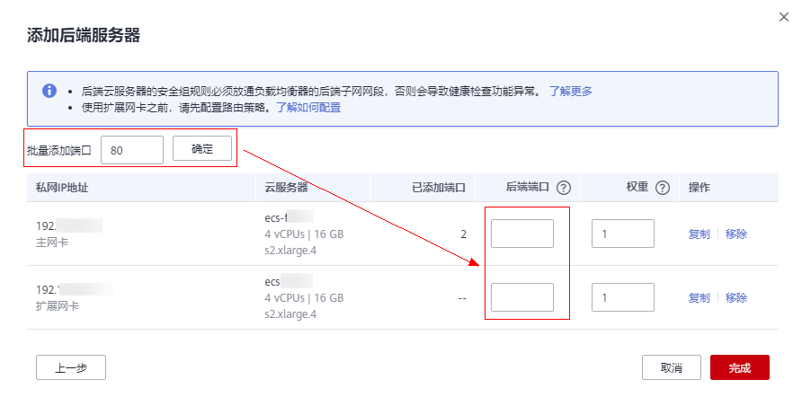
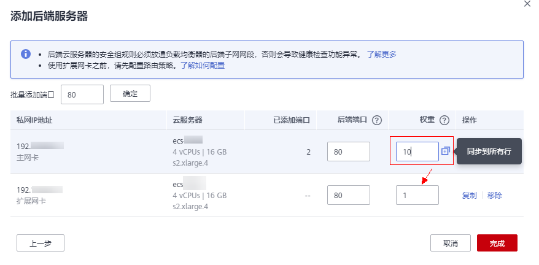

# 添加或移除后端服务器（共享型）

## 操作场景

在使用负载均衡服务时，确保至少有一台后端服务器在正常运行，可以接收负载均衡转发的客户端请求。如果请求的需求流量上升，用户需要向负载均衡器添加更多后端服务器处理需求。

移除负载均衡器绑定的后端服务器，后端服务器将不再收到负载均衡器转发的需求，但不会对服务器本身产生任何影响，只是解除了后端服务器和负载均衡器的关联关系。您可以在业务增长或者需要增强可靠性时再次将它添加至后端服务器组中。

如果负载均衡器与某个弹性伸缩组关联，则该弹性伸缩组中的实例会自动添加至负载均衡后端实例，从弹性伸缩组移除的服务器实例会自动从负载均衡后端服务器中删除。

> **说明：** 
>支持同VPC跨子网添加后端服务器。

## 添加后端服务器

1.  登录管理控制台。
2.  在管理控制台左上角单击图标，选择区域和项目。
3.  单击页面左上角的，选择“网络 \> 弹性负载均衡”。
4.  在“负载均衡器”界面，单击需要添加后端服务器的负载均衡名称。
5.  切换到“后端服务器组”页签，单击目标后端服务器组名称。
6.  在目标后端服务器组的基本信息页面，单击“添加”。选择后端云服务器所在的子网，勾选需要添加的后端服务器，单击“下一步”。

    > **说明：** 
    >-   如果服务器有多张网卡时，只能选择主网卡所在的子网，通过主网卡添加后端服务器。
    >-   不支持通过虚拟IP添加后端服务器。

7.  设置业务端口和服务器的权重，单击“完成”。

    > **说明：** 
    >在“添加端口”处依次填写每台后端服务器的业务端口。
    >如果多台后端服务器的业务端口相同，可以在“批量添加端口”处批量填写业务端口并单击“完成”。
    >如果多台后端服务器的权重相同，可以批量设置服务器权重。

    **图 1**  批量添加端口  
    

    **图 2**  批量设置权重  
    

## 移除后端服务器

1.  登录管理控制台。
2.  在管理控制台左上角单击图标，选择区域和项目。
3.  单击页面左上角的，选择“网络 \> 弹性负载均衡”。
4.  在“负载均衡器”界面，单击需要移除后端服务器的负载均衡名称。
5.  切换到“后端服务器组”页签，单击需移除的服务器所在后端服务器组的名称。
6.  在该后端服务器组的基本信息页面，勾选需移除的后端服务器，单击服务器列表上方的“移除”。
7.  在“移除后端服务器”对话框中单击“是”。

## 添加后端服务器组

1.  登录管理控制台。
2.  在管理控制台左上角单击图标，选择区域和项目。
3.  单击页面左上角的，选择“网络 \> 弹性负载均衡”。
4.  在“负载均衡器”界面，单击需要添加后端服务器组的负载均衡名称。
5.  切换到“后端服务器组”页签，单击“添加后端服务器组”。
6.  在弹出的“添加后端服务器组”对话框中配置相关参数。

    参数配置请参见[表1](#table299811529239)和[表2](#table1022053182319)。

    **表 1** 共享型负载均衡配置后端服务器组参数说明

    
    <table><thead align="left"><tr id="row99989528236"><th class="cellrowborder" valign="top" width="23.419999999999998%" id="mcps1.2.4.1.1">
参数

    </th>
    <th class="cellrowborder" valign="top" width="50.43%" id="mcps1.2.4.1.2">
说明

    </th>
    <th class="cellrowborder" valign="top" width="26.150000000000002%" id="mcps1.2.4.1.3">
示例

    </th>
    </tr>
    </thead>
    <tbody><tr id="row20853182317"><td class="cellrowborder" valign="top" width="23.419999999999998%" headers="mcps1.2.4.1.1 ">
名称

    </td>
    <td class="cellrowborder" valign="top" width="50.43%" headers="mcps1.2.4.1.2 ">
后端服务器组名称。

    </td>
    <td class="cellrowborder" valign="top" width="26.150000000000002%" headers="mcps1.2.4.1.3 ">
server_group-sq4v

    </td>
    </tr>
    <tr id="row170953142319"><td class="cellrowborder" valign="top" width="23.419999999999998%" headers="mcps1.2.4.1.1 ">
后端协议

    </td>
    <td class="cellrowborder" valign="top" width="50.43%" headers="mcps1.2.4.1.2 ">
云服务器开通的协议。

    
支持选择TCP、UDP、HTTP协议。

    </td>
    <td class="cellrowborder" valign="top" width="26.150000000000002%" headers="mcps1.2.4.1.3 ">
HTTP

    </td>
    </tr>
    <tr id="row17055311233"><td class="cellrowborder" valign="top" width="23.419999999999998%" headers="mcps1.2.4.1.1 ">
分配策略类型

    </td>
    <td class="cellrowborder" valign="top" width="50.43%" headers="mcps1.2.4.1.2 ">
负载均衡采用的算法。

    <ul id="ul8075372314"><li>加权轮询算法：根据后端服务器的权重，按顺序依次将请求分发给不同的服务器。它用相应的权重表示服务器的处理性能，按照权重的高低以及轮询方式将请求分配给各服务器，相同权重的服务器处理相同数目的连接数。</li><li>加权最少连接：最少连接是通过当前活跃的连接数来估计服务器负载情况的一种动态调度算法。加权最少连接就是在最少连接数的基础上，根据服务器的不同处理能力，给每个服务器分配不同的权重，使其能够接受相应权值数的服务请求。</li><li>源IP算法：将请求的源IP地址进行一致性Hash运算，得到一个具体的数值，同时对后端服务器进行编号，按照运算结果将请求分发到对应编号的服务器上。这可以使得对不同源IP的访问进行负载分发，同时使得同一个客户端IP的请求始终被派发至某特定的服务器。</li></ul>
    
 说明： 
<ul id="ul61125382312"><li>用户可以根据自身需求选择相应的算法来分配用户访问流量，提升负载均衡能力。</li><li>对于加权轮询算法和加权最少连接，当服务器的权重为“0”时，将不会被分发访问请求。</li></ul>
    

    </td>
    <td class="cellrowborder" valign="top" width="26.150000000000002%" headers="mcps1.2.4.1.3 ">
加权轮询算法

    </td>
    </tr>
    <tr id="row121653202313"><td class="cellrowborder" valign="top" width="23.419999999999998%" headers="mcps1.2.4.1.1 ">
会话保持

    </td>
    <td class="cellrowborder" valign="top" width="50.43%" headers="mcps1.2.4.1.2 ">
开启会话保持后，弹性负载均衡将属于同一个会话的请求都转发到同一个服务器进行处理。

    
 说明： 

当分配策略类型为“加权轮询算法”或"加权最少连接”时，可配置会话保持。

    

    </td>
    <td class="cellrowborder" valign="top" width="26.150000000000002%" headers="mcps1.2.4.1.3 ">
-

    </td>
    </tr>
    <tr id="row3114532233"><td class="cellrowborder" valign="top" width="23.419999999999998%" headers="mcps1.2.4.1.1 ">
会话保持类型

    </td>
    <td class="cellrowborder" valign="top" width="50.43%" headers="mcps1.2.4.1.2 ">
当会话保持开启后，需选择会话保持类型：

    <ul id="ul1644211881416"><li><strong id="b54429841412">源IP地址：</strong>基于源IP地址的简单会话保持，将请求的源IP地址作为散列键（HashKey），从静态分配的散列表中找出对应的服务器。即来自同一IP地址的访问请求会转发到同一台后端服务器上进行处理。</li><li><strong id="elb_ug_jt_0004_b253964721712">负载均衡器cookie：</strong>负载均衡器会根据客户端第一个请求生成一个cookie，后续所有包含这个cookie值的请求都会由同一个后端服务器处理。</li><li><strong id="elb_ug_jt_0004_b151925118179">应用程序cookie</strong>：该选项依赖于后端应用。后端应用生成一个cookie值，后续所有包含这个cookie值的请求都会由同一个后端服务器处理。</li></ul>
    
 说明： 
<ul id="elb_ug_jt_0011_ul67056312135"><li>四层会话保持（使用的是TCP/UDP协议）仅支持源IP地址类型。</li><li>七层会话保持（使用的是HTTP/HTTS协议）支持负载均衡器cookie和应用程序 cookie类型。用户可根据自身需求选择相应的会话保持类型来分配用户访问流量，提升负载均衡能力。</li></ul>
    

    </td>
    <td class="cellrowborder" valign="top" width="26.150000000000002%" headers="mcps1.2.4.1.3 ">
负载均衡器cookie

    </td>
    </tr>
    <tr id="row92891118165010"><td class="cellrowborder" valign="top" width="23.419999999999998%" headers="mcps1.2.4.1.1 ">
cookie名称

    </td>
    <td class="cellrowborder" valign="top" width="50.43%" headers="mcps1.2.4.1.2 ">
当会话保持选择应用程序cookie时，需要填写cookie名称。

    </td>
    <td class="cellrowborder" valign="top" width="26.150000000000002%" headers="mcps1.2.4.1.3 ">
cookieName-qsps

    </td>
    </tr>
    <tr id="row1121853132319"><td class="cellrowborder" valign="top" width="23.419999999999998%" headers="mcps1.2.4.1.1 ">
会话保持时间（分钟）

    </td>
    <td class="cellrowborder" valign="top" width="50.43%" headers="mcps1.2.4.1.2 ">
当会话保持开启时，需添加会话保持时间。

    <ul id="ul3211134318123"><li>四层会话保持：<ul id="ul0211843171214"><li>默认时间：20分钟；</li><li>最长时间：1小时</li><li>取值范围：1-60分钟</li></ul>
    </li><li>七层会话保持：<ul id="ul1021211434125"><li>默认时间：20分钟；</li><li>最长时间：24小时</li><li>取值范围：1-1440分钟</li></ul>
    </li></ul>
    
 说明： 

当会话保持类型为“应用程序cookie”时，不支持设置会话保持时间。

    

    </td>
    <td class="cellrowborder" valign="top" width="26.150000000000002%" headers="mcps1.2.4.1.3 ">
20

    </td>
    </tr>
    <tr id="row112115352317"><td class="cellrowborder" valign="top" width="23.419999999999998%" headers="mcps1.2.4.1.1 ">
描述

    </td>
    <td class="cellrowborder" valign="top" width="50.43%" headers="mcps1.2.4.1.2 ">
后端服务器组的描述。

    
字数范围：0/255。

    </td>
    <td class="cellrowborder" valign="top" width="26.150000000000002%" headers="mcps1.2.4.1.3 ">
-

    </td>
    </tr>
    </tbody>
    </table>

    **表 2** 共享型负载均衡配置健康检查参数说明

    
    <table><thead align="left"><tr id="row183253192312"><th class="cellrowborder" valign="top" width="23.419999999999998%" id="mcps1.2.4.1.1">
参数

    </th>
    <th class="cellrowborder" valign="top" width="52.470000000000006%" id="mcps1.2.4.1.2">
说明

    </th>
    <th class="cellrowborder" valign="top" width="24.11%" id="mcps1.2.4.1.3">
示例

    </th>
    </tr>
    </thead>
    <tbody><tr id="row193105314234"><td class="cellrowborder" valign="top" width="23.419999999999998%" headers="mcps1.2.4.1.1 ">
是否开启

    </td>
    <td class="cellrowborder" valign="top" width="52.470000000000006%" headers="mcps1.2.4.1.2 ">
开启或者关闭健康检查。

    </td>
    <td class="cellrowborder" valign="top" width="24.11%" headers="mcps1.2.4.1.3 ">
-

    </td>
    </tr>
    <tr id="row16645332313"><td class="cellrowborder" valign="top" width="23.419999999999998%" headers="mcps1.2.4.1.1 ">
协议

    </td>
    <td class="cellrowborder" valign="top" width="52.470000000000006%" headers="mcps1.2.4.1.2 "><ul id="ul1667622755610"><li>当前端协议选择TCP，HTTP或者HTTPS，健康检查支持TCP和HTTP方式，设置后不可修改。</li><li>当前端协议选择UDP，健康检查协议默认为UDP。</li></ul>
    </td>
    <td class="cellrowborder" valign="top" width="24.11%" headers="mcps1.2.4.1.3 ">
HTTP

    </td>
    </tr>
    <tr id="row5816465414"><td class="cellrowborder" valign="top" width="23.419999999999998%" headers="mcps1.2.4.1.1 ">
域名

    </td>
    <td class="cellrowborder" valign="top" width="52.470000000000006%" headers="mcps1.2.4.1.2 ">
健康检查的请求域名。

    
默认值为空，由数字、字母、‘-’、‘.’组成的字符串，只能以数字或字符开头。

    
只有健康检查协议为HTTP时，需要设置。

    </td>
    <td class="cellrowborder" valign="top" width="24.11%" headers="mcps1.2.4.1.3 ">
www.elb.com

    </td>
    </tr>
    <tr id="row127091533562"><td class="cellrowborder" valign="top" width="23.419999999999998%" headers="mcps1.2.4.1.1 ">
端口

    </td>
    <td class="cellrowborder" valign="top" width="52.470000000000006%" headers="mcps1.2.4.1.2 ">
健康检查端口号，取值范围[1，65535]，为可选参数。

    
 说明： 

未配置健康检查端口时，默认使用后端服务器端口进行健康检查。配置后，使用配置的健康检查端口进行健康检查。

    

    </td>
    <td class="cellrowborder" valign="top" width="24.11%" headers="mcps1.2.4.1.3 ">
80

    </td>
    </tr>
    <tr id="row3885362315"><td class="cellrowborder" colspan="3" valign="top" headers="mcps1.2.4.1.1 mcps1.2.4.1.2 mcps1.2.4.1.3 ">
<strong id="b17845313235">高级配置</strong>

    </td>
    </tr>
    <tr id="row15855342319"><td class="cellrowborder" valign="top" width="23.419999999999998%" headers="mcps1.2.4.1.1 ">
检查间隔（秒）

    </td>
    <td class="cellrowborder" valign="top" width="52.470000000000006%" headers="mcps1.2.4.1.2 ">
每次健康检查响应的最大间隔时间。

    
取值范围[1-50]。

    </td>
    <td class="cellrowborder" valign="top" width="24.11%" headers="mcps1.2.4.1.3 ">
5

    </td>
    </tr>
    <tr id="row1581153152313"><td class="cellrowborder" valign="top" width="23.419999999999998%" headers="mcps1.2.4.1.1 ">
超时时间（秒）

    </td>
    <td class="cellrowborder" valign="top" width="52.470000000000006%" headers="mcps1.2.4.1.2 ">
每次健康检查响应的最大超时时间。取值范围[1-50]。

    </td>
    <td class="cellrowborder" valign="top" width="24.11%" headers="mcps1.2.4.1.3 ">
3

    </td>
    </tr>
    <tr id="row167077358544"><td class="cellrowborder" valign="top" width="23.419999999999998%" headers="mcps1.2.4.1.1 ">
检查路径

    </td>
    <td class="cellrowborder" valign="top" width="52.470000000000006%" headers="mcps1.2.4.1.2 ">
指定健康检查的URL地址。当“协议”为HTTP时生效。检查路径只能以/开头，长度范围[1-80]。

    
支持使用英文字母、数字和‘-’、‘/’、‘.’、‘%’、‘&amp;’以及特殊字符_~';@$*+,=!:()。

    </td>
    <td class="cellrowborder" valign="top" width="24.11%" headers="mcps1.2.4.1.3 ">
/index.html

    </td>
    </tr>
    <tr id="row3915314238"><td class="cellrowborder" valign="top" width="23.419999999999998%" headers="mcps1.2.4.1.1 ">
最大重试次数

    </td>
    <td class="cellrowborder" valign="top" width="52.470000000000006%" headers="mcps1.2.4.1.2 ">
健康检查最大的重试次数，取值范围[1-10]。

    </td>
    <td class="cellrowborder" valign="top" width="24.11%" headers="mcps1.2.4.1.3 ">
3

    </td>
    </tr>
    </tbody>
    </table>

7.  单击“确定”。

## 修改后端服务器组

1.  登录管理控制台。
2.  在管理控制台左上角单击图标，选择区域和项目。
3.  单击页面左上角的，选择“网络 \> 弹性负载均衡”。
4.  在“负载均衡器”界面，单击需要修改的后端服务器组的负载均衡名称。
5.  切换到“后端服务器组”页签，单击需要修改的后端服务器组名称右侧的。
6.  修改参数，单击“确定”。

## 删除后端服务器组

1.  登录管理控制台。
2.  在管理控制台左上角单击图标，选择区域和项目。
3.  单击页面左上角的，选择“网络 \> 弹性负载均衡”。
4.  在“负载均衡器”界面，单击需要删除的后端服务器组的负载均衡名称。
5.  切换到“后端服务器组”页签，单击需要删除的后端服务器组名称右侧的。
6.  单击“是”。

## 相关操作

-   [如何检查后端云服务器服务状态？](https://support.huaweicloud.com/elb_faq/elb_faq_0041.html)
-   [如何检查后端云服务器网络配置？](https://support.huaweicloud.com/elb_faq/elb_faq_0040.html)

