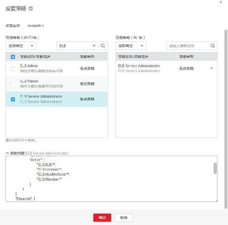

# 策略语法：RBAC<a name="zh-cn_topic_0171594500"></a>

## 策略结构<a name="section894813454472"></a>

策略结构包括：策略版本号（Version）、策略授权语句（Statement）和策略依赖（Depends）。

## 策略语法<a name="section24064814341"></a>

如下以ELB服务的“ELB Administraor”为例，说明RBAC策略语法。



```
{ 
        "Version": "1.0", 
        "Statement": [ 
                { 
                        "Effect": "Allow", 
                        "Action": [ 
                                "ELB:ELB:*", 
                                "ELB:Listener:*", 
                                "ELB:Healthcheck:*", 
                                "ELB:Member:*" 
                        ] 
                } 
        ], 
        "Depends": [ 
                { 
                       "catalog": "OBS", 
                        "display_name": "Tenant Administrator" 
                }, 
                { 
                        "catalog": "VPC", 
                        "display_name": "VPC Administrator" 
                }, 
                { 
                        "catalog": "CES", 
                        "display_name": "CES Administrator" 
                }, 
                { 
                        "catalog": "BASE", 
                        "display_name": "Server Administrator" 
                }, 
                { 
                        "catalog": "BASE", 
                        "display_name": "Tenant Guest" 
                } 
        ]}
```

**表 1**  参数说明

<a name="table1985932693720"></a>
<table><thead align="left"><tr id="row1786052612373"><th class="cellrowborder" colspan="2" valign="top" id="mcps1.2.5.1.1"><p id="p1964935313381"><a name="p1964935313381"></a><a name="p1964935313381"></a>参数</p>
<p id="p1220763853916"><a name="p1220763853916"></a><a name="p1220763853916"></a></p>
</th>
<th class="cellrowborder" valign="top" id="mcps1.2.5.1.2"><p id="p364955313811"><a name="p364955313811"></a><a name="p364955313811"></a>含义</p>
</th>
<th class="cellrowborder" valign="top" id="mcps1.2.5.1.3"><p id="p1649653153816"><a name="p1649653153816"></a><a name="p1649653153816"></a>值</p>
</th>
</tr>
</thead>
<tbody><tr id="row14860132610373"><td class="cellrowborder" colspan="2" valign="top" headers="mcps1.2.5.1.1 "><p id="p825210012398"><a name="p825210012398"></a><a name="p825210012398"></a>Version</p>
<p id="p7207183853918"><a name="p7207183853918"></a><a name="p7207183853918"></a></p>
</td>
<td class="cellrowborder" valign="top" headers="mcps1.2.5.1.2 "><p id="p925210015393"><a name="p925210015393"></a><a name="p925210015393"></a>策略的版本</p>
</td>
<td class="cellrowborder" valign="top" headers="mcps1.2.5.1.3 "><p id="p62521906391"><a name="p62521906391"></a><a name="p62521906391"></a>固定为“1.0”</p>
</td>
</tr>
<tr id="row7860126113711"><td class="cellrowborder" rowspan="2" valign="top" width="10.747850429914017%" headers="mcps1.2.5.1.1 "><p id="p11666132323912"><a name="p11666132323912"></a><a name="p11666132323912"></a>Statement</p>
</td>
<td class="cellrowborder" valign="top" width="10.927814437112577%" headers="mcps1.2.5.1.1 "><p id="p1494512470393"><a name="p1494512470393"></a><a name="p1494512470393"></a>Action</p>
</td>
<td class="cellrowborder" valign="top" width="32.24355128974205%" headers="mcps1.2.5.1.2 "><p id="p1458339173916"><a name="p1458339173916"></a><a name="p1458339173916"></a>定义对ELB的具体操作。</p>
</td>
<td class="cellrowborder" valign="top" width="46.08078384323135%" headers="mcps1.2.5.1.3 "><p id="p195838920396"><a name="p195838920396"></a><a name="p195838920396"></a>格式为：服务名:资源类型:操作</p>
<p id="p1458329123914"><a name="p1458329123914"></a><a name="p1458329123914"></a>"elb:*:*"，表示对ELB的所有操作，其中ELB为服务名称；“*”为通配符，表示对所有的资源类型可以执行所有操作。</p>
</td>
</tr>
<tr id="row2860426143714"><td class="cellrowborder" valign="top" headers="mcps1.2.5.1.1 "><p id="p109451478394"><a name="p109451478394"></a><a name="p109451478394"></a>Effect</p>
</td>
<td class="cellrowborder" valign="top" headers="mcps1.2.5.1.1 "><p id="p2029818203914"><a name="p2029818203914"></a><a name="p2029818203914"></a>定义Action中所包含的具体操作是否允许执行。</p>
</td>
<td class="cellrowborder" valign="top" headers="mcps1.2.5.1.2 "><a name="ul629418203919"></a><a name="ul629418203919"></a><ul id="ul629418203919"><li>Allow：允许执行。</li><li>Deny：不允许执行。</li></ul>
</td>
</tr>
<tr id="row294016299408"><td class="cellrowborder" rowspan="2" valign="top" width="10.747850429914017%" headers="mcps1.2.5.1.1 "><p id="p1442865218401"><a name="p1442865218401"></a><a name="p1442865218401"></a>Depends</p>
</td>
<td class="cellrowborder" valign="top" width="10.927814437112577%" headers="mcps1.2.5.1.1 "><p id="p1112043234013"><a name="p1112043234013"></a><a name="p1112043234013"></a>catalog</p>
</td>
<td class="cellrowborder" valign="top" width="32.24355128974205%" headers="mcps1.2.5.1.2 "><p id="p5120193244012"><a name="p5120193244012"></a><a name="p5120193244012"></a>依赖的策略的所属服务。</p>
</td>
<td class="cellrowborder" valign="top" width="46.08078384323135%" headers="mcps1.2.5.1.3 "><p id="p1120432204016"><a name="p1120432204016"></a><a name="p1120432204016"></a>服务名称</p>
<p id="p19120193244016"><a name="p19120193244016"></a><a name="p19120193244016"></a>例如：BASE</p>
</td>
</tr>
<tr id="row42501442124013"><td class="cellrowborder" valign="top" headers="mcps1.2.5.1.1 "><p id="p10710184417405"><a name="p10710184417405"></a><a name="p10710184417405"></a>display_name</p>
</td>
<td class="cellrowborder" valign="top" headers="mcps1.2.5.1.1 "><p id="p3710204413404"><a name="p3710204413404"></a><a name="p3710204413404"></a>依赖的策略的名称。</p>
</td>
<td class="cellrowborder" valign="top" headers="mcps1.2.5.1.2 "><p id="p271064424010"><a name="p271064424010"></a><a name="p271064424010"></a>权限名称</p>
<p id="p197108440403"><a name="p197108440403"></a><a name="p197108440403"></a>例如：Tenant Administrator</p>
</td>
</tr>
</tbody>
</table>

