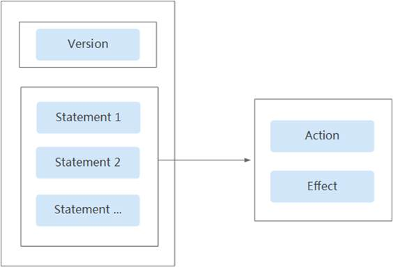
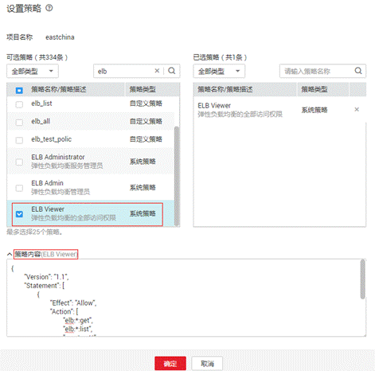

# 策略语法：细粒度策略<a name="zh-cn_topic_0171274925"></a>

## 策略结构<a name="section20984256114816"></a>

策略结构包括：Version（策略版本号）和Statement（策略权限语句），其中Statement可以有多个，表示不同的授权项。

**图 1**  策略结构<a name="fig32964578481"></a>  


## 策略语法<a name="section181195744819"></a>

在IAM左侧导航窗格中，单击“策略”，单击策略名称，可以查看策略的详细内容，以“ELB Viewer”为例，说明细粒度策略的语法。



```
{ 
        "Version": "1.1", 
        "Statement": [ 
                { 
                        "Effect": "Allow", 
                        "Action": [ 
                                "elb:*:get", 
                                "elb:*:list", 
                                "vpc:*:get*", 
                                "vpc:*:list*", 
                                "ecs:*:get*", 
                                "ecs:*:list*" 
                        ] 
                } 
        ] 
}
```

-   Version：标识策略的版本号，主要用于区分Role-Based Access Control（RBAC）策略和细粒度策略。
    -   1.0：RBAC策略。RBAC策略是将服务作为一个整体进行授权，授权后，用户可以拥有这个服务的所有权限。
    -   1.1：细粒度策略。相比RBAC策略，细粒度策略基于服务的API接口进行权限拆分，授权更加精细。授权后，用户可以对这个服务执行特定的操作。细粒度策略包括系统预置和用户自定义两种：

-   Statement：策略授权语句，描述策略的详细信息，包含Effect（作用）和Action（授权项）。
    -   Effect（作用）

        作用包含两种：Allow（允许）和Deny（Deny），系统预置策略仅包含允许的授权语句，自定义策略中可以同时包含允许和拒绝的授权语句，当策略中既有允许又有拒绝的授权语句时，遵循Deny优先的原则。

    -   Action（授权项）

        对资源的具体操作权限，格式为：服务名:资源类型:操作，支持单个或多个操作权限，支持通配符号\*，通配符号表示所有。

        示例：

        "elb:\*:get\*"，其中elb为服务名，\*为资源类型，get\*为操作，该授权项表示ELB所有的资源类型的查询权限。


## 多个授权项策略<a name="section1691457194818"></a>

一个自定义策略中可以包含多个授权项，且除了可以包含本服务的授权项外，还可以包含其他服务的授权项，可以包含的其他服务必须跟本服务同属性，即都是项目级服务或都是全局级服务。多个授权语句策略描述如下：

```
{  
    "Version": "1.1",  
    "Statement": [  
        {  
            "Effect": "Allow",  
            "Action": [  
                "ecs:cloudServers:resize",  
                "ecs:cloudServers:delete",  
                "ecs:cloudServers:rebuild"， 
                "elb:loadbalancers:create"， 
                "elb:loadbalancers:delete"  
            ]  
        },  
        {  
            "Effect": "Allow",  
            "Action": [  
                "ims:images:list",  
                "ims:serverImages:create"  
            ]  
        }  
    ]  
}
```

## 拒绝策略<a name="section693185754810"></a>

拒绝策略需要同时配合其他策略使用，否则没有实际作用。用户被授予的策略中，一个授权项的作用如果同时存在Alow和Deny，则遵循Deny优先。

如果管理员给用户授予ELB Admin的系统策略，但不希望用户拥有ELB admin中定义的删除负载均衡权限（elb:cloudServers:delete），可以创建一条相同Action的自定义策略，并将自定义策略的Effect设置为Deny，然后将ELB Admin和拒绝策略同时授予用户，根据Deny优先原则，则用户可以对ELB执行除了删除云服务器外的所有操作。以下策略样例表示：拒绝用户删除负载均衡器。

```
{  
      "Version": "1.1",  
      "Statement": [  
            {  
          "Effect": "Deny",  
                  "Action": [  
                        "elb:loadbalancers:delete"  
                  "Effect": "Allow",  
                  "Action": [  
                        "elb:loadbalancers:delete"  
                  ]  
            }  
      ]  
}
```

## 检查规则<a name="section110612578482"></a>

用户在发起访问请求时，系统根据用户被授予的访问策略中的action进行鉴权判断。检查规则如下：

**图 2**  系统鉴权逻辑图<a name="fig1920410184220"></a>  


> **说明：**   
>每条策略做评估时， Action之间是或\(or\)的关系。  

1.  用户访问系统，发起操作请求。
2.  系统在用户被授予的策略中寻找请求对应的action，优先寻找Deny指令。如果找到一个适用的Deny指令，系统将返回Deny决定。
3.  如果没有找到Deny指令，系统将寻找适用于请求的任何Allow指令。如果找到一个Allow指令，系统将返回Allow决定。
4.  如果找不到Allow指令，最终决定为Deny，鉴权结束。

