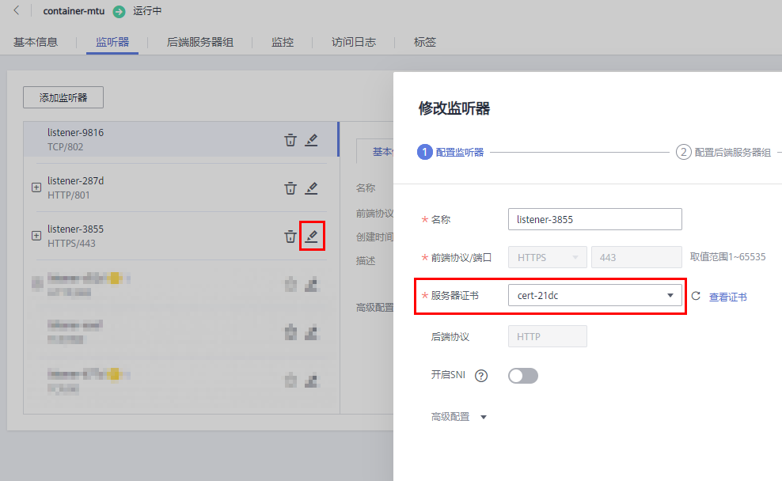

# 绑定/更换证书

## 操作场景

为了支持HTTPS数据传输加密认证，在创建HTTPS协议监听的时候需绑定证书，您可以参考本章节绑定证书。如果弹性负载均衡实例使用的证书过期或者其它原因需要更换，您可以参考本章节更换证书。

如果还有其他的服务也使用了待更换的证书，例如Web应用防火墙服务。请在所有服务上完成更换证书的操作，以免证书更换不全面而导致业务不可用。

> **说明：** 
>-   只有HTTPS协议的监听器才支持绑定/更换证书，TCP/UDP/HTTP协议的监听器不支持绑定/更换证书。
>-   ELB不会自动选择未过期的证书，如果您有证书过期了，需要手动更换或者删除证书。
>-   弹性负载均衡的证书和私钥的更换对业务没有影响。
>-   切换证书后立即生效，已经建立的连接会继续使用老证书，新建立的连接将会使用新的证书。

## 前提条件

已经在弹性负载均衡的“证书管理”页面创建待更换的新证书，如果还未创建，请先[创建证书](创建-修改-删除证书.md#section26868475171830)。

## 绑定证书

通过添加HTTPS监听器来绑定证书。详见[添加HTTPS监听器](添加HTTPS监听器.md)。

## 更换证书

1.  登录管理控制台。
2.  在管理控制台左上角单击图标，选择区域和项目。
3.  单击页面左上角的，选择“网络 \> 弹性负载均衡”。
4.  在“负载均衡器”界面，单击需要修改HTTPS监听器的负载均衡名称。
5.  切换到“监听器”页签：

    -   共享型负载均衡器，单击需要修改的HTTPS监听器名称右侧的。
    -   独享型负载均衡器，单击需要修改的HTTPS监听器名称右侧的按钮，选择“修改监听器”。

    **图 1**  修改监听器  
    

6.  “服务器证书”选择需要更换的证书，单击“下一步”。
7.  在“配置后端服务器组”对话框中，单击右下角的“完成”。

