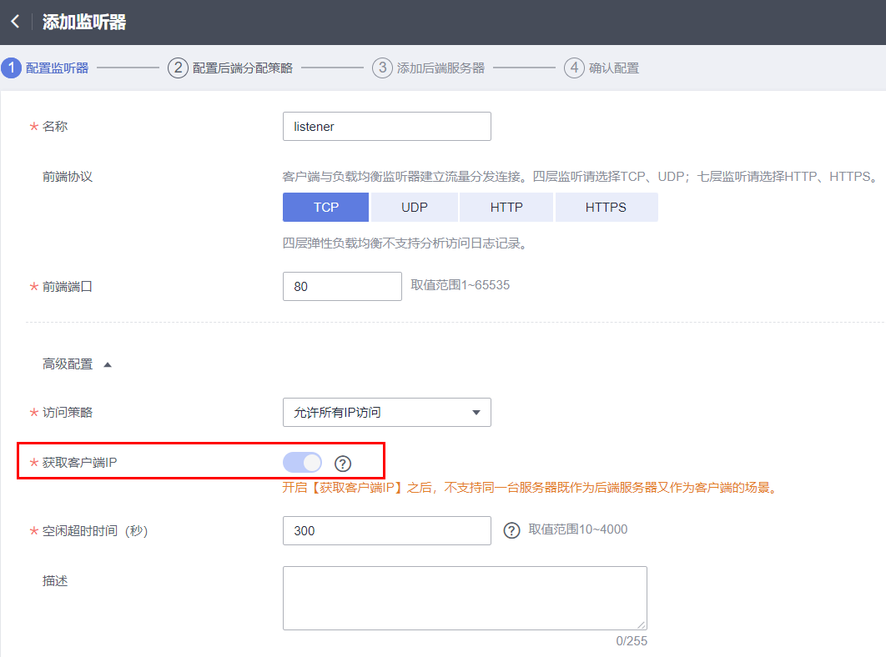

# 获取客户端IP（源地址透传）

## 操作场景

一般情况下，ELB会使用100.125网段的IP和后端服务器进行通信。如果您想要获取客户端的真实IP，您可以开启“获取客户端IP”功能，此时，ELB和后端服务器之间直接使用真实的IP进行通信。

> **说明：** 
>-   共享型负载均衡四层（TCP/UDP）监听器支持开启“获取客户端IP”功能。
>-   独享型负载均衡四层（TCP/UDP）监听器默认开启“获取客户端IP”功能，且不支持关闭。
>-   针对四层（TCP）监听器，还可以通过配置TOA插件来获取客户端IP。配置TOA插件请参考[TOA插件配置](https://support.huaweicloud.com/usermanual-elb/zh_cn_elb_06_0001.html)。
>-   对于七层（HTTP/HTTPS）监听器，如果想获取客户端IP，可参考[七层服务获取客户端IP](https://support.huaweicloud.com/elb_faq/elb_faq_0090.html#section1)。

## 约束与限制

开启/关闭“获取客户端IP”的过程中，如果监听器已经添加了后端服务器，则访问监听器的流量会中断，中断时间为10秒（后端服务器组配置的健康检查间隔\*2）。

## 开启“获取客户端IP”

> **注意：** 
>-   XEN类型的弹性服务器不支持此功能，具体规格类型，请参考[规格清单](https://support.huaweicloud.com/productdesc-ecs/zh-cn_topic_0159822360.html)。
>-   裸金属服务器（BMS）不支持此功能。
>-   开启此功能后，执行后端服务器迁移任务时，可能出现流量中断（例如单向下载、推送类型的流量）。所以后端服务器迁移完成后，需要通过报文重传来恢复流量。
>-   监听器开启此功能后，后端服务器不能作为客户端访问此监听器。
>-   如果监听器之前已经添加了后端服务器、并且开启了健康检查功能，开启“获取客户端IP”功能会重新上线后端服务器，新建流量会有1-2个健康检查间隔的中断。

1.  开启监听器的“获取客户端IP”功能。
    1.  登录管理控制台。
    2.  在管理控制台左上角单击图标，选择区域和项目。
    3.  选择“服务列表 \>  网络  \> 弹性负载均衡”。
    4.  在“负载均衡器”界面，单击需要操作的负载均衡名称。
    5.  切换到“监听器”页签。
        -   新增场景：单击“添加监听器”。
        -   修改场景：单击需要修改的监听器名称右侧的。

    6.  开启“获取客户端IP”开关。

        **图 1**  开启开关  
        

2.  设置后端服务器的安全组、网络ACL、操作系统和软件的安全规则，使客户端的IP地址能够访问后端服务器。

    > **注意：** 
    >-   共享型实例四层监听器开启“获取客户端IP”功能后，后端服务器安全组规则和网络ACL规则均无需放通100.125.0.0/16网段及客户端IP地址。
    >-   独享型负载均衡四层监听器未开启“跨VPC后端”功能时，后端服务器安全组规则和网络ACL规则均无需放通ELB所在的VPC网段。

    > **说明：** 
    >开启“获取客户端IP”之后，不支持同一台服务器既作为后端服务器又作为客户端的场景。如果后端服务器和客户端使用同一台服务器，且开启“获取客户端IP”，则后端服务器会根据报文源IP为本地IP判定该报文为本机发出的报文，无法将应答报文返回给ELB，最终导致回程流量不通。
    >您可以使用[• 方式二（TCP协议）：配置TOA插件获取](https://support.huaweicloud.com/elb_faq/elb_faq_0090.html#section2)获取源IP。

## 关闭“获取客户端IP”

1.  登录管理控制台。
2.  在管理控制台左上角单击图标，选择区域和项目。
3.  单击页面左上角的，选择“网络 \> 弹性负载均衡”。
4.  在“负载均衡器”界面，单击需要修改监听器的负载均衡名称。
5.  切换到“监听器”页签：

    共享型负载均衡器，单击需要修改的监听器名称右侧的。

6.  关闭“获取客户端IP”开关。
7.  确认相关信息，单击“完成”。

