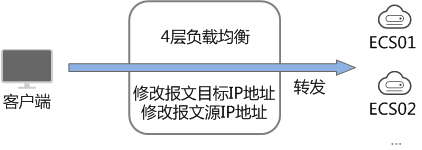
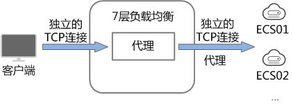

# 规划和准备

在使用负载均衡前，需要根据业务规划待创建负载均衡器的区域、类型、协议以及后端服务器等。

## 规划实例区域

负载均衡器选择区域时需要注意以下事项：

-   选择距离业务目标客户距离最近的区域，可以减少网络时延以及提高下载速度。
-   共享型负载均衡不支持跨区域关联后端服务器，因此在创建共享型负载均衡时，需选择与后端服务器相同的区域。
-   独享型负载均衡可通过以下方式实现跨区域、跨VPC添加后端服务器：
    -   通过使用云连接服务实现跨区域间通信，详见[《云连接用户指南》](https://support.huaweicloud.com/qs-cc/cc_02_0201.html)。
    -   通过ELB的跨VPC后端功能实现跨VPC添加后端服务器，详见[《弹性负载均衡用户指南》](https://support.huaweicloud.com/usermanual-elb/elb_ug_hd_0005.html)。

## 规划实例可用区

独享型负载均衡支持多可用区，选择的每个可用区都会创建相应的负载均衡实例。

这些可用区的负载均衡实例间采用双活或者多活模式，遵循就近原则进行业务流量分摊。例如：分发到可用区1后端服务器的流量，是由可用区1的负载均衡实例或者靠近可用区1的实例进行分发。

选择与后端服务器相同的可用区，可以减少网络时延以及提高访问速度。

如果**业务需要考虑容灾能力**，建议采取以下两种方式创建负载均衡实例：

-   **单实例多可用区（可用区容灾）**

    对于业务量没有超过独享型负载均衡最大规格（大型 II）限制的，可以创建一个负载均衡实例，并选择多个可用区，这样单个可用区的负载均衡实例故障不会影响所有业务，多个可用区之间可以实现业务容灾。

-   **多实例多可用区（实例容灾+可用区容灾）**

    对于超高业务量，超过独享型负载均衡最大规格（大型 II）限制的，可以创建多个负载均衡实例，并且每个负载均衡实例选择多个可用区，这样单个负载均衡实例故障不会影响所有业务，多个负载均衡实例和多个可用区之间均可以实现业务容灾。

> **说明：** 
>-   对于**公网访问**，会根据源IP的不同将流量分配到创建的多个AZ中的ELB上。
>-   对于**内网访问**：
>    -   当从**创建ELB的AZ**访问时，流量将被分配到本AZ中的ELB上，当本AZ的ELB不可用时，容灾到创建的其他AZ的ELB上；
>    -   当从**未创建ELB的AZ**访问时，会根据源IP的不同将流量分配到创建的多个AZ中的ELB上。

## 选择网络类型

**独享型负载均衡网络类型可以选择IPv4公网、IPv4私网和IPv6。**

-   如果选择了IPv4公网，负载均衡实例会分配到一个IPv4的公网IP地址，可以处理来自Internet上IPv4公网的访问请求。
-   如果选择了IPv4私网，负载均衡实例会分配到一个IPv4的私网IP地址，可以处理来自VPC内部IPv4私网的访问请求。
-   如果选择了IPv6，负载均衡实例就会分配到一个IPv6的IP地址，可以处理来自VPC内部IPv6私网的访问请求，如果同时购买了公网带宽，则可以同时来自VPC内部IPv6私网的访问请求和来自Internet上IPv6公网的访问请求。

**共享型实例网络类型可以选择公网或者私网。**

-   如果需要使用负载均衡分发来自Internet公网的访问请求，需要创建公网负载均衡器。公网负载均衡实例可以同时处理来自VPC内网的访问请求。

    创建公网负载均衡器会绑定一个EIP，用来接收来自Internet公网的访问请求。

-   如果只需要使用负载均衡分发来自VPC内网的访问请求，选择创建私网负载均衡器。

    私网负载均衡器仅分配一个私网IP，仅能用来接收来自同个VPC内的访问请求。

## 选择实例规格

独享型负载均衡可以独享已购买创建的实例资源，同时分别提供了六种L4的实例规格和六种L7的实例规格。L4规格的实例只支持四层协议TCP/UDP的转发能力，L7规格的实例只支持七层协议HTTP/HTTPS的转发能力。具体的规格需要评估实际的业务量，根据业务实际需要购买相应规格的实例。业务量的评估可以参考以下几个原则：

-   如果是L4规格，建议重点关注长连接的并发连接数，实例规格的“最大连接数”应作为关键参考指标。需要根据实际的业务场景，预估一个负载均衡实例需要承载的最大连接数，并选择相应的规格。
-   如果是L7规格，实例规格的“每秒查询数 \(QPS\)”应作为关键参考指标，该指标决定了一个七层应用系统的业务吞吐量。需要根据实际的业务场景，预估一个负载均衡实例需要承载的QPS，并选择相应的规格。
-   在使用过程中可以结合负载均衡实例的监控指标，查看实际业务量的峰值、趋势和规律，对实例规格进行更精确的选择。

## 选择协议类型

提供基于四层协议和七层协议的负载均衡，在负载均衡器中通过加监听器选择相应的协议。

-   使用四层协议的负载均衡，监听器收到访问请求后，将请求直接转发给后端服务器。转发过程仅修改报文中目标IP地址和源IP地址，将目标地址改为后端云服务器的IP地址，源地址改为负载均衡器的IP地址。四层协议连接的建立，即三次握手是客户端和后端服务器直接建立的，负载均衡只是进行了数据的转发。

    **图 1**  四层负载均衡  
    

-   使用七层协议的负载均衡，也称为“内容交换”。监听器收到访问请求后，需要识别并通过HTTP/HTTPS协议报文头中的相关字段，进行数据的转发。监听器收到访问请求后，先代理后端服务器和客户端建立连接（三次握手），接收客户端发送的包含应用层内容的报文，然后根据报文中的特定字段和流量分配策略判断需要转发的后端服务器。此场景中，负载均衡类似一个代理服务器，分别和客户端以及后端服务器建立连接。

    **图 2**  七层负载均衡  
    

## 后端服务器

在使用负载均衡器前，需要先创建ECS实例或者BMS实例并部署相关业务应用，然后将ECS实例或者BMS实例添加到负载均衡器的后端服务器组来处理转发的客户端访问请求。创建后端服务器时，请注意以下事项：

-   确保后端服务器实例的所属地域和负载均衡器的所属地域相同。
-   建议您选择相同操作系统的后端服务器实例作为后端服务器，以便后续管理和维护。

