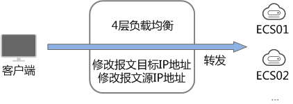
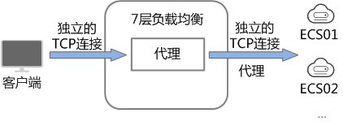

# 规划和准备

在使用负载均衡前，需要根据业务规划待创建负载均衡器的区域、类型、协议以及后端服务器等。

## 区域

负载均衡器选择区域时需要注意以下事项：

-   选择距离业务目标客户距离最近的区域，可以减少网络时延以及提高下载速度。
-   选择与后端服务器相同的区域，负载均衡不支持跨区域部署。

## 网络类型（公网或私网）

负载均衡器分为公网负载均衡器和私网负载均衡器。

-   如果需要使用负载均衡分发来自Internet公网的访问请求，需要创建公网负载均衡器。

    创建公网负载均衡器会绑定一个EIP，用来接收来自Internet公网的访问请求。

    公网负载均衡器，还需要选择实例的计费方式：

    -   按流量计费：指定带宽上限，按实际使用的上行流量计费，与使用时间无关。适用于波峰波谷效应明显的业务。
    -   按带宽计费：指定带宽上限，按使用时间计费，与使用的流量无关。适用于带宽较为平稳的业务。

-   如果需要使用负载均衡分发来自VPC内网的访问请求，选择创建私网负载均衡器。

    私网负载均衡器仅分配一个私网IP，仅能用来接收来自同个VPC内的访问请求。

## 选择协议类型

提供基于四层协议和七层协议的负载均衡，在负载均衡器中通过加监听器选择相应的协议。

-   使用四层协议的负载均衡，监听器收到访问请求后，将请求直接转发给后端服务器。转发过程仅修改报文中目标IP地址和源IP地址，将目标地址改为后端云服务器的IP地址，源地址改为负载均衡器的IP地址。四层协议连接的建立，既三次握手是客户端和后端服务器直接建立的，负载均衡只是进行了数据的转发。

    

-   使用七层协议的负载均衡，也称为“内容交换”。监听器收到访问请求后，需要识别并通过HTTP/HTTPS协议报文头中的相关字段，进行数据的转发。监听器收到访问请求后，先代理后端服务器和客户端建立连接（三次握手），接收客户端发送的包含应用层内容的报文，然后根据报文中的特定字段和流量分配策略判断需要转发的后端服务器。此场景中，负载均衡类似一个代理服务器，分别和客户端以及后端服务器建立连接。

    

## 后端服务器

在使用负载均衡器前，需要先创建ECS实例或者BMS实例并部署相关业务应用，然后将ECS实例或者BMS实例添加到负载均衡器的后端服务器组来处理转发的客户端访问请求。创建后端服务器时，请注意以下事项：

-   确保后端服务器实例的所属地域和负载均衡器的所属地域相同。
-   建议您选择相同操作系统的后端服务器实例作为后端服务器，以便后续管理和维护。

