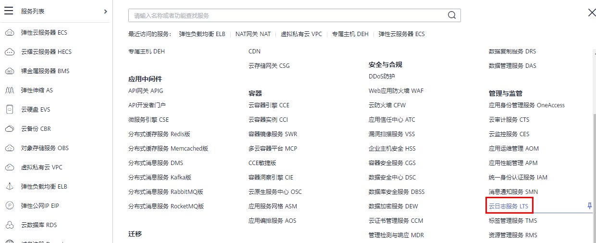
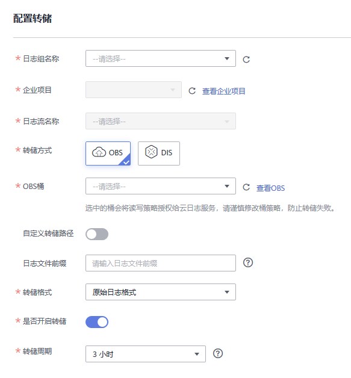

# 访问日志<a name="zh-cn_topic_0150301848"></a>

## 操作场景<a name="section175377416919"></a>

负载均衡的访问日志功能支持查看和分析对七层负载均衡HTTP和HTTPS进行请求的详细访问日志记录，包括请求时间、客户端IP地址、请求路径和服务器响应等。配置访问日志时需要您对接云日志服务，并且已经创建需要关联的云日志组和日志流。

七层独享型负载均衡和七层共享型负载均衡支持此功能，四层独享型负载均衡和四层共享型负载均衡不支持。

> **说明：** 
>当前支持访问日志的区域有：华北-北京一、华北-北京四、华东-上海一、华东-上海二、华南-广州、华南-广州-友好用户环境、西南-贵阳一、中国-香港、亚太-新加坡。

## 配置云日志服务<a name="section1898171461018"></a>

为了能够在云日志服务上面看到弹性负载均衡的日志，需要配置云日志服务。关于云日志服务的详细配置和操作方法，请参见[《云日志服务用户指南》](https://support.huaweicloud.com/productdesc-lts/lts-03201.html)

1.  在“云日志服务”界面创建日志组。
    1.  登录管理控制台。
    2.  在管理控制台左上角单击图标，选择区域和项目。
    3.  选择“服务列表 \> 管理与监管 \> 云日志服务”。

        **图 1**  进入云日志服务<a name="fig17992057165310"></a>  
        

    1.  单击左侧导航栏“日志管理”。
    2.  单击 “创建日志组”，在弹出框内，输入日志组名称。

    1.  单击“确定”，创建完成。

2.  在“云日志服务”界面创建日志流。
    1.  选择已创建的日志组名称，进入该日志组页面。
    2.  单击“创建日志流”，在弹出框内，输入日志流名称。

    1.  单击“确定”，创建完成。


## 配置ELB访问日志<a name="section3851165013476"></a>

在“弹性负载均衡”界面配置访问日志。


1.  单击页面左上角的，选择“网络 \> 弹性负载均衡”。
2.  在“负载均衡器”界面，单击需要配置访问日志的负载均衡器名称。
3.  在该负载均衡器界面的“访问日志”页签，单击“配置访问日志”。

    **图 2**  配置ELB访问日志<a name="fig14289233550"></a>  
    

    **图 3**  配置访问日志<a name="fig19816141175517"></a>  
    


1.  开启日志记录，选择您在云日志服务中创建的日志组和日志流。
2.  单击“确定”，配置完成。

## 查看访问日志<a name="section15761255155814"></a>

当您配置了访问日志，可以查看访问日志的详细信息。

查看方式以下两种：

-   通过“弹性负载均衡”控制台，进入访问日志界面，即可查看访问日志。
-   （推荐）通过“云日志服务”控制台，进入日志主题界面，选择相应日志主题名称，单击“实时日志”，即可查看访问日志。

日志显示格式如下，日志字段说明如[表1](#table1575152384911)所示。不支持修改日志格式。

```
$msec $access_log_topic_id [$time_iso8601] $log_ver $remote_addr:$remote_port $status "$request_method $scheme://$host$router_request_uri $server_protocol" $request_length $bytes_sent $body_bytes_sent $request_time "$upstream_status" "$upstream_connect_time" "$upstream_header_time" "$upstream_response_time" "$upstream_addr" "$http_user_agent" "$http_referer" "$http_x_forwarded_for" $lb_name $listener_name $listener_id
$pool_name "$member_name" $tenant_id $eip_address:$eip_port "$upstream_addr_priv" $certificate_id $ssl_protocol $ssl_cipher $sni_domain_name $tcpinfo_rtt $self_defined_header
```

**表 1**  字段说明

<a name="table1575152384911"></a>
<table><thead align="left"><tr id="row87511523134919"><th class="cellrowborder" valign="top" width="20.84%" id="mcps1.2.5.1.1"><p id="p2751202354916"><a name="p2751202354916"></a><a name="p2751202354916"></a>参数</p>
</th>
<th class="cellrowborder" valign="top" width="27.939999999999998%" id="mcps1.2.5.1.2"><p id="p13751923204915"><a name="p13751923204915"></a><a name="p13751923204915"></a>描述</p>
</th>
<th class="cellrowborder" valign="top" width="24.91%" id="mcps1.2.5.1.3"><p id="p1914121311568"><a name="p1914121311568"></a><a name="p1914121311568"></a>取值说明</p>
</th>
<th class="cellrowborder" valign="top" width="26.31%" id="mcps1.2.5.1.4"><p id="p634441912562"><a name="p634441912562"></a><a name="p634441912562"></a>取值示例</p>
</th>
</tr>
</thead>
<tbody><tr id="row1875112344916"><td class="cellrowborder" valign="top" width="20.84%" headers="mcps1.2.5.1.1 "><p id="p257303213216"><a name="p257303213216"></a><a name="p257303213216"></a>msec</p>
</td>
<td class="cellrowborder" valign="top" width="27.939999999999998%" headers="mcps1.2.5.1.2 "><p id="p75731932172114"><a name="p75731932172114"></a><a name="p75731932172114"></a>以秒为单位的时间，日志写入时的分辨率为毫秒。</p>
</td>
<td class="cellrowborder" valign="top" width="24.91%" headers="mcps1.2.5.1.3 "><p id="p9915161311561"><a name="p9915161311561"></a><a name="p9915161311561"></a>浮点型数据</p>
</td>
<td class="cellrowborder" valign="top" width="26.31%" headers="mcps1.2.5.1.4 "><p id="p419410121614"><a name="p419410121614"></a><a name="p419410121614"></a>1530153091.868</p>
</td>
</tr>
<tr id="row975162318498"><td class="cellrowborder" valign="top" width="20.84%" headers="mcps1.2.5.1.1 "><p id="p155731032182118"><a name="p155731032182118"></a><a name="p155731032182118"></a>access_log_topic_id</p>
</td>
<td class="cellrowborder" valign="top" width="27.939999999999998%" headers="mcps1.2.5.1.2 "><p id="p35737322212"><a name="p35737322212"></a><a name="p35737322212"></a>访问日志流ID。</p>
</td>
<td class="cellrowborder" valign="top" width="24.91%" headers="mcps1.2.5.1.3 "><p id="p8915141318566"><a name="p8915141318566"></a><a name="p8915141318566"></a>uuid</p>
</td>
<td class="cellrowborder" valign="top" width="26.31%" headers="mcps1.2.5.1.4 "><p id="p0344121905615"><a name="p0344121905615"></a><a name="p0344121905615"></a>04465dfa-640f-4567-8b58-45c9f8bbc23f</p>
</td>
</tr>
<tr id="row575344622016"><td class="cellrowborder" valign="top" width="20.84%" headers="mcps1.2.5.1.1 "><p id="p12573203262114"><a name="p12573203262114"></a><a name="p12573203262114"></a>time_iso8601</p>
</td>
<td class="cellrowborder" valign="top" width="27.939999999999998%" headers="mcps1.2.5.1.2 "><p id="p1257383272118"><a name="p1257383272118"></a><a name="p1257383272118"></a>日志写入时的时间，采用ISO 8601标准格式本地时间。</p>
</td>
<td class="cellrowborder" valign="top" width="24.91%" headers="mcps1.2.5.1.3 "><p id="p19915151395610"><a name="p19915151395610"></a><a name="p19915151395610"></a>-</p>
</td>
<td class="cellrowborder" valign="top" width="26.31%" headers="mcps1.2.5.1.4 "><p id="p2034418194567"><a name="p2034418194567"></a><a name="p2034418194567"></a>2018-06-28T10:31:31+08:00</p>
</td>
</tr>
<tr id="row17200011131114"><td class="cellrowborder" valign="top" width="20.84%" headers="mcps1.2.5.1.1 "><p id="p757343215210"><a name="p757343215210"></a><a name="p757343215210"></a>log_ver</p>
</td>
<td class="cellrowborder" valign="top" width="27.939999999999998%" headers="mcps1.2.5.1.2 "><p id="p17573123220215"><a name="p17573123220215"></a><a name="p17573123220215"></a>ELB服务日志版本号。</p>
</td>
<td class="cellrowborder" valign="top" width="24.91%" headers="mcps1.2.5.1.3 "><p id="p1431062518329"><a name="p1431062518329"></a><a name="p1431062518329"></a>固定值：elb_01</p>
</td>
<td class="cellrowborder" valign="top" width="26.31%" headers="mcps1.2.5.1.4 "><p id="p105382037126"><a name="p105382037126"></a><a name="p105382037126"></a>elb_01</p>
</td>
</tr>
<tr id="row1175102311491"><td class="cellrowborder" valign="top" width="20.84%" headers="mcps1.2.5.1.1 "><p id="p6573133292117"><a name="p6573133292117"></a><a name="p6573133292117"></a>remote_addr: remote_port</p>
</td>
<td class="cellrowborder" valign="top" width="27.939999999999998%" headers="mcps1.2.5.1.2 "><p id="p19573203282116"><a name="p19573203282116"></a><a name="p19573203282116"></a>客户端IP地址：客户端端口。</p>
</td>
<td class="cellrowborder" valign="top" width="24.91%" headers="mcps1.2.5.1.3 "><p id="p18915201345611"><a name="p18915201345611"></a><a name="p18915201345611"></a>记录客户端IP地址和客户端端口号。</p>
</td>
<td class="cellrowborder" valign="top" width="26.31%" headers="mcps1.2.5.1.4 "><p id="p1667055352313"><a name="p1667055352313"></a><a name="p1667055352313"></a>10.184.30.170:59605</p>
</td>
</tr>
<tr id="row075192314913"><td class="cellrowborder" valign="top" width="20.84%" headers="mcps1.2.5.1.1 "><p id="p857313215211"><a name="p857313215211"></a><a name="p857313215211"></a>status</p>
</td>
<td class="cellrowborder" valign="top" width="27.939999999999998%" headers="mcps1.2.5.1.2 "><p id="p135731732142117"><a name="p135731732142117"></a><a name="p135731732142117"></a>ELB响应的状态码。</p>
</td>
<td class="cellrowborder" valign="top" width="24.91%" headers="mcps1.2.5.1.3 "><p id="p29151913165616"><a name="p29151913165616"></a><a name="p29151913165616"></a>记录请求状态码。</p>
</td>
<td class="cellrowborder" valign="top" width="26.31%" headers="mcps1.2.5.1.4 "><p id="p203441419185612"><a name="p203441419185612"></a><a name="p203441419185612"></a>200</p>
</td>
</tr>
<tr id="row1875120237492"><td class="cellrowborder" valign="top" width="20.84%" headers="mcps1.2.5.1.1 "><p id="p4573143220213"><a name="p4573143220213"></a><a name="p4573143220213"></a>request_method scheme://host request_uri server_protocol</p>
</td>
<td class="cellrowborder" valign="top" width="27.939999999999998%" headers="mcps1.2.5.1.2 "><p id="p3573143282115"><a name="p3573143282115"></a><a name="p3573143282115"></a>请求方法。请求方式：//主机名：请求URI 请求协议。</p>
</td>
<td class="cellrowborder" valign="top" width="24.91%" headers="mcps1.2.5.1.3 "><a name="ul1147331191513"></a><a name="ul1147331191513"></a><ul id="ul1147331191513"><li>request_method：请求方法。</li><li>scheme: http或https。</li><li>host: 主机名，可能为域名或者IP。</li><li>request_uri：<p id="p19427105201517"><a name="p19427105201517"></a><a name="p19427105201517"></a>浏览器发起的不做任何修改的原生URI。不包括协议及主机名。</p>
</li></ul>
</td>
<td class="cellrowborder" valign="top" width="26.31%" headers="mcps1.2.5.1.4 "><p id="p7344201918561"><a name="p7344201918561"></a><a name="p7344201918561"></a>POST https://setting1.hicloud.com/AccountServer/IUserInfoMng/stAuth?Version=26400&amp;cVersion=ID_SDK_2.6.4.300</p>
</td>
</tr>
<tr id="row119543065718"><td class="cellrowborder" valign="top" width="20.84%" headers="mcps1.2.5.1.1 "><p id="p157383213215"><a name="p157383213215"></a><a name="p157383213215"></a>request_length</p>
</td>
<td class="cellrowborder" valign="top" width="27.939999999999998%" headers="mcps1.2.5.1.2 "><p id="p16573532152116"><a name="p16573532152116"></a><a name="p16573532152116"></a>从客户端收到的请求长度（包括请求header和请求body）。</p>
</td>
<td class="cellrowborder" valign="top" width="24.91%" headers="mcps1.2.5.1.3 "><p id="p187511887912"><a name="p187511887912"></a><a name="p187511887912"></a>整型数据</p>
</td>
<td class="cellrowborder" valign="top" width="26.31%" headers="mcps1.2.5.1.4 "><p id="p47514818918"><a name="p47514818918"></a><a name="p47514818918"></a>295</p>
</td>
</tr>
<tr id="row1637615349570"><td class="cellrowborder" valign="top" width="20.84%" headers="mcps1.2.5.1.1 "><p id="p12573932172118"><a name="p12573932172118"></a><a name="p12573932172118"></a>bytes_sent</p>
</td>
<td class="cellrowborder" valign="top" width="27.939999999999998%" headers="mcps1.2.5.1.2 "><p id="p1957318327216"><a name="p1957318327216"></a><a name="p1957318327216"></a>发送到客户端的字节数 。</p>
</td>
<td class="cellrowborder" valign="top" width="24.91%" headers="mcps1.2.5.1.3 "><p id="p197511982912"><a name="p197511982912"></a><a name="p197511982912"></a>整型数据</p>
</td>
<td class="cellrowborder" valign="top" width="26.31%" headers="mcps1.2.5.1.4 "><p id="p47511816916"><a name="p47511816916"></a><a name="p47511816916"></a>58470080</p>
</td>
</tr>
<tr id="row18603348572"><td class="cellrowborder" valign="top" width="20.84%" headers="mcps1.2.5.1.1 "><p id="p175731032142112"><a name="p175731032142112"></a><a name="p175731032142112"></a>body_bytes_sent</p>
</td>
<td class="cellrowborder" valign="top" width="27.939999999999998%" headers="mcps1.2.5.1.2 "><p id="p95731832182112"><a name="p95731832182112"></a><a name="p95731832182112"></a>发送到客户端的字节数（不包括响应头）。</p>
</td>
<td class="cellrowborder" valign="top" width="24.91%" headers="mcps1.2.5.1.3 "><p id="p17511181911"><a name="p17511181911"></a><a name="p17511181911"></a>整型数据</p>
</td>
<td class="cellrowborder" valign="top" width="26.31%" headers="mcps1.2.5.1.4 "><p id="p1875118096"><a name="p1875118096"></a><a name="p1875118096"></a>58469792</p>
</td>
</tr>
<tr id="row83273514576"><td class="cellrowborder" valign="top" width="20.84%" headers="mcps1.2.5.1.1 "><p id="p957312329215"><a name="p957312329215"></a><a name="p957312329215"></a>request_time</p>
</td>
<td class="cellrowborder" valign="top" width="27.939999999999998%" headers="mcps1.2.5.1.2 "><p id="p157313282116"><a name="p157313282116"></a><a name="p157313282116"></a>请求处理时间，即ELB收到第一个客户端请求报文到ELB发送完响应报文的时间间隔（单位：秒）。</p>
</td>
<td class="cellrowborder" valign="top" width="24.91%" headers="mcps1.2.5.1.3 "><p id="p1975116820916"><a name="p1975116820916"></a><a name="p1975116820916"></a>浮点型数据</p>
</td>
<td class="cellrowborder" valign="top" width="26.31%" headers="mcps1.2.5.1.4 "><p id="p87510819912"><a name="p87510819912"></a><a name="p87510819912"></a>499.769</p>
</td>
</tr>
<tr id="row19235193513573"><td class="cellrowborder" valign="top" width="20.84%" headers="mcps1.2.5.1.1 "><p id="p1757403232110"><a name="p1757403232110"></a><a name="p1757403232110"></a>upstream_status</p>
</td>
<td class="cellrowborder" valign="top" width="27.939999999999998%" headers="mcps1.2.5.1.2 "><p id="p15741432182110"><a name="p15741432182110"></a><a name="p15741432182110"></a>从上游服务器获得的响应状态码，当ELB代理进行请求重试时会包含多个响应的状态码，当请求未被正确转发到后端服务器时此字段为 -。</p>
</td>
<td class="cellrowborder" valign="top" width="24.91%" headers="mcps1.2.5.1.3 "><p id="p6751086918"><a name="p6751086918"></a><a name="p6751086918"></a>后端返回给ELB的状态码</p>
</td>
<td class="cellrowborder" valign="top" width="26.31%" headers="mcps1.2.5.1.4 "><p id="p117511813910"><a name="p117511813910"></a><a name="p117511813910"></a>200  或者 "-, 200"，或者"502, 502 : 200"，或者"502 : "</p>
</td>
</tr>
<tr id="row12438123514576"><td class="cellrowborder" valign="top" width="20.84%" headers="mcps1.2.5.1.1 "><p id="p3574113232113"><a name="p3574113232113"></a><a name="p3574113232113"></a>upstream_connect_time</p>
</td>
<td class="cellrowborder" valign="top" width="27.939999999999998%" headers="mcps1.2.5.1.2 "><p id="p1557417323214"><a name="p1557417323214"></a><a name="p1557417323214"></a>与上游服务器建立连接所花费的时间，时间以秒为单位，分辨率为毫秒。当ELB代理进行请求重试时会包含多个连接的时间，当请求未被正确转发到后端服务器时此字段为 -。</p>
</td>
<td class="cellrowborder" valign="top" width="24.91%" headers="mcps1.2.5.1.3 "><p id="p13751389914"><a name="p13751389914"></a><a name="p13751389914"></a>浮点型数据</p>
</td>
<td class="cellrowborder" valign="top" width="26.31%" headers="mcps1.2.5.1.4 "><p id="p575112819917"><a name="p575112819917"></a><a name="p575112819917"></a>0.008 或者 "-, 0.008" ，或者"0.008, 0.005 : 0.004"，或者"0.008 : "</p>
</td>
</tr>
<tr id="row96101035135712"><td class="cellrowborder" valign="top" width="20.84%" headers="mcps1.2.5.1.1 "><p id="p157473202117"><a name="p157473202117"></a><a name="p157473202117"></a>upstream_header_time</p>
</td>
<td class="cellrowborder" valign="top" width="27.939999999999998%" headers="mcps1.2.5.1.2 "><p id="p19574103214215"><a name="p19574103214215"></a><a name="p19574103214215"></a>从上游服务器接收响应头所花费的时间，时间以秒为单位，分辨率为毫秒。当ELB代理进行请求重试时会包含多个响应时间，当请求未被正确转发到后端服务器时此字段为 -。</p>
</td>
<td class="cellrowborder" valign="top" width="24.91%" headers="mcps1.2.5.1.3 "><p id="p3751181094"><a name="p3751181094"></a><a name="p3751181094"></a>浮点型数据</p>
</td>
<td class="cellrowborder" valign="top" width="26.31%" headers="mcps1.2.5.1.4 "><p id="p12752382913"><a name="p12752382913"></a><a name="p12752382913"></a>0.008 或者 "-, 0.008"  ，或者"0.008, 0.005 : 0.004"，或者"0.008 : "</p>
</td>
</tr>
<tr id="row1281493565718"><td class="cellrowborder" valign="top" width="20.84%" headers="mcps1.2.5.1.1 "><p id="p145741732142117"><a name="p145741732142117"></a><a name="p145741732142117"></a>upstream_response_time</p>
</td>
<td class="cellrowborder" valign="top" width="27.939999999999998%" headers="mcps1.2.5.1.2 "><p id="p1057433212110"><a name="p1057433212110"></a><a name="p1057433212110"></a>从上游服务器接收响应所花费的时间，时间以秒为单位，分辨率为毫秒。当ELB代理进行请求重试时会包含多个响应时间，当请求未被正确转发到后端服务器时此字段为 -。</p>
</td>
<td class="cellrowborder" valign="top" width="24.91%" headers="mcps1.2.5.1.3 "><p id="p37521481094"><a name="p37521481094"></a><a name="p37521481094"></a>浮点型数据</p>
</td>
<td class="cellrowborder" valign="top" width="26.31%" headers="mcps1.2.5.1.4 "><p id="p20752785914"><a name="p20752785914"></a><a name="p20752785914"></a>0.008 或者 "-, 0.008"  ，或者"0.008, 0.005 : 0.004"，或者"0.008 : "</p>
</td>
</tr>
<tr id="row99859359578"><td class="cellrowborder" valign="top" width="20.84%" headers="mcps1.2.5.1.1 "><p id="p1157463262113"><a name="p1157463262113"></a><a name="p1157463262113"></a>upstream_addr</p>
</td>
<td class="cellrowborder" valign="top" width="27.939999999999998%" headers="mcps1.2.5.1.2 "><p id="p6574632182115"><a name="p6574632182115"></a><a name="p6574632182115"></a>后端服务器在ELB服务内部IP地址和端口（客户可忽略）。</p>
</td>
<td class="cellrowborder" valign="top" width="24.91%" headers="mcps1.2.5.1.3 "><p id="p177524815912"><a name="p177524815912"></a><a name="p177524815912"></a>IP地址+端口号</p>
</td>
<td class="cellrowborder" valign="top" width="26.31%" headers="mcps1.2.5.1.4 "><p id="p47521083911"><a name="p47521083911"></a><a name="p47521083911"></a>100.64.1.246:80(可能有多个值，每个值都是ip:port或者-，用逗号空格或者空格冒号空格隔开)</p>
</td>
</tr>
<tr id="row1829812364571"><td class="cellrowborder" valign="top" width="20.84%" headers="mcps1.2.5.1.1 "><p id="p457423212115"><a name="p457423212115"></a><a name="p457423212115"></a>http_user_agent</p>
</td>
<td class="cellrowborder" valign="top" width="27.939999999999998%" headers="mcps1.2.5.1.2 "><p id="p175741132162114"><a name="p175741132162114"></a><a name="p175741132162114"></a>ELB收到请求头中的http_user_agent内容，表示客户端的系统型号、浏览器信息等。</p>
</td>
<td class="cellrowborder" valign="top" width="24.91%" headers="mcps1.2.5.1.3 "><p id="p2752138899"><a name="p2752138899"></a><a name="p2752138899"></a>记录浏览器的相关信息</p>
</td>
<td class="cellrowborder" valign="top" width="26.31%" headers="mcps1.2.5.1.4 "><p id="p7752118495"><a name="p7752118495"></a><a name="p7752118495"></a>Mozilla/5.0 (Windows NT 6.1; WOW64) AppleWebKit/537.36 (KHTML, like Gecko) Chrome/67.0.3396.99 Safari/537.36</p>
</td>
</tr>
<tr id="row953243615572"><td class="cellrowborder" valign="top" width="20.84%" headers="mcps1.2.5.1.1 "><p id="p105741232142119"><a name="p105741232142119"></a><a name="p105741232142119"></a>http_referer</p>
</td>
<td class="cellrowborder" valign="top" width="27.939999999999998%" headers="mcps1.2.5.1.2 "><p id="p6574133252111"><a name="p6574133252111"></a><a name="p6574133252111"></a>ELB收到请求头中的http_referer内容，表示该请求所在的页面链接。</p>
</td>
<td class="cellrowborder" valign="top" width="24.91%" headers="mcps1.2.5.1.3 "><p id="p875298593"><a name="p875298593"></a><a name="p875298593"></a>页面链接请求</p>
</td>
<td class="cellrowborder" valign="top" width="26.31%" headers="mcps1.2.5.1.4 "><p id="p4752158396"><a name="p4752158396"></a><a name="p4752158396"></a>http://10.154.197.90/</p>
</td>
</tr>
<tr id="row1673533614572"><td class="cellrowborder" valign="top" width="20.84%" headers="mcps1.2.5.1.1 "><p id="p857553220216"><a name="p857553220216"></a><a name="p857553220216"></a>http_x_forwarded_for</p>
</td>
<td class="cellrowborder" valign="top" width="27.939999999999998%" headers="mcps1.2.5.1.2 "><p id="p1257503252111"><a name="p1257503252111"></a><a name="p1257503252111"></a>ELB收到请求头中的http_x_forwarded_for内容，表示请求经过的代理服务器IP地址。</p>
</td>
<td class="cellrowborder" valign="top" width="24.91%" headers="mcps1.2.5.1.3 "><p id="p075268198"><a name="p075268198"></a><a name="p075268198"></a>IP地址</p>
</td>
<td class="cellrowborder" valign="top" width="26.31%" headers="mcps1.2.5.1.4 "><p id="p775213813915"><a name="p775213813915"></a><a name="p775213813915"></a>10.154.197.90</p>
</td>
</tr>
<tr id="row12927125128"><td class="cellrowborder" valign="top" width="20.84%" headers="mcps1.2.5.1.1 "><p id="p1457515326218"><a name="p1457515326218"></a><a name="p1457515326218"></a>lb_name</p>
</td>
<td class="cellrowborder" valign="top" width="27.939999999999998%" headers="mcps1.2.5.1.2 "><p id="p7575113214216"><a name="p7575113214216"></a><a name="p7575113214216"></a>负载均衡器的名称（格式为“loadbalancer_” + “负载均衡器ID”）。</p>
</td>
<td class="cellrowborder" valign="top" width="24.91%" headers="mcps1.2.5.1.3 "><p id="p20752488918"><a name="p20752488918"></a><a name="p20752488918"></a>字符串</p>
</td>
<td class="cellrowborder" valign="top" width="26.31%" headers="mcps1.2.5.1.4 "><p id="p1575268792"><a name="p1575268792"></a><a name="p1575268792"></a>loadbalancer_789424af-3fd2-4292-8c62-2a2dd7005175</p>
</td>
</tr>
<tr id="row184571926225"><td class="cellrowborder" valign="top" width="20.84%" headers="mcps1.2.5.1.1 "><p id="p557563214218"><a name="p557563214218"></a><a name="p557563214218"></a>listener_name</p>
</td>
<td class="cellrowborder" valign="top" width="27.939999999999998%" headers="mcps1.2.5.1.2 "><p id="p657516327214"><a name="p657516327214"></a><a name="p657516327214"></a>监听器的名称（格式为“listener_” + “监听器ID”）。</p>
</td>
<td class="cellrowborder" valign="top" width="24.91%" headers="mcps1.2.5.1.3 "><p id="p15752198597"><a name="p15752198597"></a><a name="p15752198597"></a>字符串</p>
</td>
<td class="cellrowborder" valign="top" width="26.31%" headers="mcps1.2.5.1.4 "><p id="p17752281393"><a name="p17752281393"></a><a name="p17752281393"></a>listener_fde03b66-f960-440e-954a-0be8b2b75093</p>
</td>
</tr>
<tr id="row2019214294215"><td class="cellrowborder" valign="top" width="20.84%" headers="mcps1.2.5.1.1 "><p id="p257593212211"><a name="p257593212211"></a><a name="p257593212211"></a>listener_id</p>
</td>
<td class="cellrowborder" valign="top" width="27.939999999999998%" headers="mcps1.2.5.1.2 "><p id="p145751932162116"><a name="p145751932162116"></a><a name="p145751932162116"></a>监听器在ELB服务内部的ID（客户可忽略）。</p>
</td>
<td class="cellrowborder" valign="top" width="24.91%" headers="mcps1.2.5.1.3 "><p id="p17752781391"><a name="p17752781391"></a><a name="p17752781391"></a>字符串</p>
</td>
<td class="cellrowborder" valign="top" width="26.31%" headers="mcps1.2.5.1.4 "><p id="p1875215813917"><a name="p1875215813917"></a><a name="p1875215813917"></a>-</p>
</td>
</tr>
<tr id="row92078621515"><td class="cellrowborder" valign="top" width="20.84%" headers="mcps1.2.5.1.1 "><p id="p8575932162113"><a name="p8575932162113"></a><a name="p8575932162113"></a>pool_name</p>
</td>
<td class="cellrowborder" valign="top" width="27.939999999999998%" headers="mcps1.2.5.1.2 "><p id="p757514327216"><a name="p757514327216"></a><a name="p757514327216"></a>后端服务器组名称（格式为“pool_” + “后端服务器组ID”）。</p>
</td>
<td class="cellrowborder" valign="top" width="24.91%" headers="mcps1.2.5.1.3 "><p id="p137521589911"><a name="p137521589911"></a><a name="p137521589911"></a>字符串</p>
</td>
<td class="cellrowborder" valign="top" width="26.31%" headers="mcps1.2.5.1.4 "><p id="p147521981191"><a name="p147521981191"></a><a name="p147521981191"></a>pool_066a5dc5-a3e4-4ea1-99f1-2a5716b681f6</p>
</td>
</tr>
<tr id="row889411386150"><td class="cellrowborder" valign="top" width="20.84%" headers="mcps1.2.5.1.1 "><p id="p19575173292113"><a name="p19575173292113"></a><a name="p19575173292113"></a>member_name</p>
</td>
<td class="cellrowborder" valign="top" width="27.939999999999998%" headers="mcps1.2.5.1.2 "><p id="p95751332192114"><a name="p95751332192114"></a><a name="p95751332192114"></a>后端服务器的名称（格式为“member_” + “服务器ID”，尚未支持）。可能有多个值，每个值都是member_id或者-，用逗号空格隔开。</p>
</td>
<td class="cellrowborder" valign="top" width="24.91%" headers="mcps1.2.5.1.3 "><p id="p17753981293"><a name="p17753981293"></a><a name="p17753981293"></a>字符串</p>
</td>
<td class="cellrowborder" valign="top" width="26.31%" headers="mcps1.2.5.1.4 "><p id="p12753108395"><a name="p12753108395"></a><a name="p12753108395"></a>member_47b07465-075a-4d2f-8ce9-0b9f39bff160(可能有多个值，每个值都是member_id或者-，用逗号空格隔开)</p>
</td>
</tr>
<tr id="row1824185218150"><td class="cellrowborder" valign="top" width="20.84%" headers="mcps1.2.5.1.1 "><p id="p15575732192115"><a name="p15575732192115"></a><a name="p15575732192115"></a>tenant_id</p>
</td>
<td class="cellrowborder" valign="top" width="27.939999999999998%" headers="mcps1.2.5.1.2 "><p id="p85751032172114"><a name="p85751032172114"></a><a name="p85751032172114"></a>租户ID。</p>
</td>
<td class="cellrowborder" valign="top" width="24.91%" headers="mcps1.2.5.1.3 "><p id="p87531580913"><a name="p87531580913"></a><a name="p87531580913"></a>字符串</p>
</td>
<td class="cellrowborder" valign="top" width="26.31%" headers="mcps1.2.5.1.4 "><p id="p8753381198"><a name="p8753381198"></a><a name="p8753381198"></a>04dd36f921000fe20f95c00bba986340</p>
</td>
</tr>
<tr id="row19415437159"><td class="cellrowborder" valign="top" width="20.84%" headers="mcps1.2.5.1.1 "><p id="p357673215210"><a name="p357673215210"></a><a name="p357673215210"></a>eip_address:eip_port</p>
</td>
<td class="cellrowborder" valign="top" width="27.939999999999998%" headers="mcps1.2.5.1.2 "><p id="p35764328216"><a name="p35764328216"></a><a name="p35764328216"></a>弹性IP地址和监听器监听的端口号。</p>
</td>
<td class="cellrowborder" valign="top" width="24.91%" headers="mcps1.2.5.1.3 "><p id="p17531685914"><a name="p17531685914"></a><a name="p17531685914"></a>弹性IP地址和监听器监听的端口号。</p>
</td>
<td class="cellrowborder" valign="top" width="26.31%" headers="mcps1.2.5.1.4 "><p id="p375318594"><a name="p375318594"></a><a name="p375318594"></a>4.17.12.248:443</p>
</td>
</tr>
<tr id="row28775781512"><td class="cellrowborder" valign="top" width="20.84%" headers="mcps1.2.5.1.1 "><p id="p19576132172111"><a name="p19576132172111"></a><a name="p19576132172111"></a>upstream_addr_priv</p>
</td>
<td class="cellrowborder" valign="top" width="27.939999999999998%" headers="mcps1.2.5.1.2 "><p id="p7576332172117"><a name="p7576332172117"></a><a name="p7576332172117"></a>后端主机的IP地址和端口号。可能有多个值，每个值都是ip:port或者-，用逗号空格隔开。</p>
</td>
<td class="cellrowborder" valign="top" width="24.91%" headers="mcps1.2.5.1.3 "><p id="p16753481916"><a name="p16753481916"></a><a name="p16753481916"></a>IP地址+端口号</p>
</td>
<td class="cellrowborder" valign="top" width="26.31%" headers="mcps1.2.5.1.4 "><p id="p14753689914"><a name="p14753689914"></a><a name="p14753689914"></a>-， 192.168.1.2:8080（可能有多个值，每个值都是ip:port或者-,用逗号空格隔开）</p>
</td>
</tr>
<tr id="row5493341121510"><td class="cellrowborder" valign="top" width="20.84%" headers="mcps1.2.5.1.1 "><p id="p20576143218212"><a name="p20576143218212"></a><a name="p20576143218212"></a>certificate_id</p>
</td>
<td class="cellrowborder" valign="top" width="27.939999999999998%" headers="mcps1.2.5.1.2 "><p id="p125768324214"><a name="p125768324214"></a><a name="p125768324214"></a>[HTTPS监听器]SSL连接建立时使用的证书ID（尚未支持）。</p>
</td>
<td class="cellrowborder" valign="top" width="24.91%" headers="mcps1.2.5.1.3 "><p id="p207531189913"><a name="p207531189913"></a><a name="p207531189913"></a>字符串</p>
</td>
<td class="cellrowborder" valign="top" width="26.31%" headers="mcps1.2.5.1.4 "><p id="p117531387913"><a name="p117531387913"></a><a name="p117531387913"></a>17b03b19-b2cc-454e-921b-4d187cce31dc</p>
</td>
</tr>
<tr id="row125011836141511"><td class="cellrowborder" valign="top" width="20.84%" headers="mcps1.2.5.1.1 "><p id="p35761328219"><a name="p35761328219"></a><a name="p35761328219"></a>ssl_protocol</p>
</td>
<td class="cellrowborder" valign="top" width="27.939999999999998%" headers="mcps1.2.5.1.2 "><p id="p105771132192120"><a name="p105771132192120"></a><a name="p105771132192120"></a>[HTTPS监听器]SSL连接建立使用的协议，非HTTPS监听器，此字段为 -。</p>
</td>
<td class="cellrowborder" valign="top" width="24.91%" headers="mcps1.2.5.1.3 "><p id="p5753283916"><a name="p5753283916"></a><a name="p5753283916"></a>字符串</p>
</td>
<td class="cellrowborder" valign="top" width="26.31%" headers="mcps1.2.5.1.4 "><p id="p187531583919"><a name="p187531583919"></a><a name="p187531583919"></a>TLS 1.2</p>
</td>
</tr>
<tr id="row19292183414155"><td class="cellrowborder" valign="top" width="20.84%" headers="mcps1.2.5.1.1 "><p id="p14577193211211"><a name="p14577193211211"></a><a name="p14577193211211"></a>ssl_cipher</p>
</td>
<td class="cellrowborder" valign="top" width="27.939999999999998%" headers="mcps1.2.5.1.2 "><p id="p1857813329217"><a name="p1857813329217"></a><a name="p1857813329217"></a>[HTTPS监听器]SSL连接建立使用的加密套件，非HTTPS监听器，此字段为 -。</p>
</td>
<td class="cellrowborder" valign="top" width="24.91%" headers="mcps1.2.5.1.3 "><p id="p67538812914"><a name="p67538812914"></a><a name="p67538812914"></a>字符串</p>
</td>
<td class="cellrowborder" valign="top" width="26.31%" headers="mcps1.2.5.1.4 "><p id="p187531981999"><a name="p187531981999"></a><a name="p187531981999"></a>ECDHE-RSA-AES256-GCM-SHA384</p>
</td>
</tr>
<tr id="row63405921514"><td class="cellrowborder" valign="top" width="20.84%" headers="mcps1.2.5.1.1 "><p id="p9578143242118"><a name="p9578143242118"></a><a name="p9578143242118"></a>sni_domain_name</p>
</td>
<td class="cellrowborder" valign="top" width="27.939999999999998%" headers="mcps1.2.5.1.2 "><p id="p7578632132116"><a name="p7578632132116"></a><a name="p7578632132116"></a>[HTTPS监听器]SSL握手时客户端提供的SNI域名，非HTTPS监听器，此字段为 -。</p>
</td>
<td class="cellrowborder" valign="top" width="24.91%" headers="mcps1.2.5.1.3 "><p id="p0753581920"><a name="p0753581920"></a><a name="p0753581920"></a>字符串</p>
</td>
<td class="cellrowborder" valign="top" width="26.31%" headers="mcps1.2.5.1.4 "><p id="p177531781892"><a name="p177531781892"></a><a name="p177531781892"></a>www.test.com</p>
</td>
</tr>
<tr id="row131161427161519"><td class="cellrowborder" valign="top" width="20.84%" headers="mcps1.2.5.1.1 "><p id="p1157803214213"><a name="p1157803214213"></a><a name="p1157803214213"></a>tcpinfo_rtt</p>
</td>
<td class="cellrowborder" valign="top" width="27.939999999999998%" headers="mcps1.2.5.1.2 "><p id="p2578832102111"><a name="p2578832102111"></a><a name="p2578832102111"></a>ELB与客户端之间的tcp rtt时间，单位：微秒。</p>
</td>
<td class="cellrowborder" valign="top" width="24.91%" headers="mcps1.2.5.1.3 "><p id="p18753181399"><a name="p18753181399"></a><a name="p18753181399"></a>整型数据</p>
</td>
<td class="cellrowborder" valign="top" width="26.31%" headers="mcps1.2.5.1.4 "><p id="p1875310816914"><a name="p1875310816914"></a><a name="p1875310816914"></a>39032</p>
</td>
</tr>
<tr id="row1152123592718"><td class="cellrowborder" valign="top" width="20.84%" headers="mcps1.2.5.1.1 "><p id="p6531735192716"><a name="p6531735192716"></a><a name="p6531735192716"></a>self_defined_header</p>
</td>
<td class="cellrowborder" valign="top" width="27.939999999999998%" headers="mcps1.2.5.1.2 "><p id="p1753735152719"><a name="p1753735152719"></a><a name="p1753735152719"></a>该字段为保留字段，默认为“-”。</p>
</td>
<td class="cellrowborder" valign="top" width="24.91%" headers="mcps1.2.5.1.3 "><p id="p2053113516271"><a name="p2053113516271"></a><a name="p2053113516271"></a>字符串</p>
</td>
<td class="cellrowborder" valign="top" width="26.31%" headers="mcps1.2.5.1.4 "><p id="p135313512711"><a name="p135313512711"></a><a name="p135313512711"></a>-</p>
</td>
</tr>
</tbody>
</table>

## 日志示例<a name="section1972318105613"></a>

```
1644819836.370 eb11c5a9-93a7-4c48-80fc-03f61f638595 [2022-02-14T14:23:56+08:00] elb_01 192.168.1.1:888 200 "POST https://www.test.com/example/HTTP/1.1" 1411 251 3 0.011 "200" "0.000" "0.011" "0.011" "100.64.0.129:8080" "okhttp/3.13.1" "-" "-" loadbalancer_295a7eee-9999-46ed-9fad-32a62ff0a687 listener_20679192-8888-4e62-a814-a2f870f62148 3333fd44fe3b42cbaa1dc2c641994d90 pool_89547549-6666-446e-9dbc-e3a551034c46 "-" f2bc165ad9b4483a9b17762da851bbbb 121.64.212.1:443 "10.1.1.2:8080" - TLSv1.2 ECDHE-RSA-AES256-GCM-SHA384 www.test.com 56704 -
```

以上日志示例对应的字段如下：

**表 2**  日志示例对应的字段

<a name="table756674016316"></a>
<table><thead align="left"><tr id="row65661540113112"><th class="cellrowborder" valign="top" width="53.66%" id="mcps1.2.3.1.1"><p id="p18566124043117"><a name="p18566124043117"></a><a name="p18566124043117"></a>参数</p>
</th>
<th class="cellrowborder" valign="top" width="46.339999999999996%" id="mcps1.2.3.1.2"><p id="p5566114063111"><a name="p5566114063111"></a><a name="p5566114063111"></a>示例</p>
</th>
</tr>
</thead>
<tbody><tr id="row18566164014315"><td class="cellrowborder" valign="top" width="53.66%" headers="mcps1.2.3.1.1 "><p id="p2567124010310"><a name="p2567124010310"></a><a name="p2567124010310"></a>msec</p>
</td>
<td class="cellrowborder" valign="top" width="46.339999999999996%" headers="mcps1.2.3.1.2 "><p id="p18758132520325"><a name="p18758132520325"></a><a name="p18758132520325"></a>1644819836.370</p>
</td>
</tr>
<tr id="row1956719401319"><td class="cellrowborder" valign="top" width="53.66%" headers="mcps1.2.3.1.1 "><p id="p75673408315"><a name="p75673408315"></a><a name="p75673408315"></a>access_log_topic_id</p>
</td>
<td class="cellrowborder" valign="top" width="46.339999999999996%" headers="mcps1.2.3.1.2 "><p id="p3757325193214"><a name="p3757325193214"></a><a name="p3757325193214"></a>eb11c5a9-93a7-4c48-80fc-03f61f638595</p>
</td>
</tr>
<tr id="row7567164003119"><td class="cellrowborder" valign="top" width="53.66%" headers="mcps1.2.3.1.1 "><p id="p185671440103111"><a name="p185671440103111"></a><a name="p185671440103111"></a>time_iso8601</p>
</td>
<td class="cellrowborder" valign="top" width="46.339999999999996%" headers="mcps1.2.3.1.2 "><p id="p17756625173213"><a name="p17756625173213"></a><a name="p17756625173213"></a>[2022-02-14T14:23:56+08:00]</p>
</td>
</tr>
<tr id="row17567134010317"><td class="cellrowborder" valign="top" width="53.66%" headers="mcps1.2.3.1.1 "><p id="p1056734015317"><a name="p1056734015317"></a><a name="p1056734015317"></a>log_ver</p>
</td>
<td class="cellrowborder" valign="top" width="46.339999999999996%" headers="mcps1.2.3.1.2 "><p id="p1275513259325"><a name="p1275513259325"></a><a name="p1275513259325"></a>elb_01</p>
</td>
</tr>
<tr id="row1656864063114"><td class="cellrowborder" valign="top" width="53.66%" headers="mcps1.2.3.1.1 "><p id="p1156814063113"><a name="p1156814063113"></a><a name="p1156814063113"></a>remote_addr: remote_port</p>
</td>
<td class="cellrowborder" valign="top" width="46.339999999999996%" headers="mcps1.2.3.1.2 "><p id="p1475519257322"><a name="p1475519257322"></a><a name="p1475519257322"></a>192.168.1.1:888</p>
</td>
</tr>
<tr id="row19568204017316"><td class="cellrowborder" valign="top" width="53.66%" headers="mcps1.2.3.1.1 "><p id="p155681400317"><a name="p155681400317"></a><a name="p155681400317"></a>status</p>
</td>
<td class="cellrowborder" valign="top" width="46.339999999999996%" headers="mcps1.2.3.1.2 "><p id="p10754102593212"><a name="p10754102593212"></a><a name="p10754102593212"></a>200</p>
</td>
</tr>
<tr id="row125681940103112"><td class="cellrowborder" valign="top" width="53.66%" headers="mcps1.2.3.1.1 "><p id="p15684404316"><a name="p15684404316"></a><a name="p15684404316"></a>request_method scheme://host request_uri server_protocol</p>
</td>
<td class="cellrowborder" valign="top" width="46.339999999999996%" headers="mcps1.2.3.1.2 "><p id="p475302543210"><a name="p475302543210"></a><a name="p475302543210"></a>"POST https://www.test.com/example/1 HTTP/1.1"</p>
</td>
</tr>
<tr id="row1756824093116"><td class="cellrowborder" valign="top" width="53.66%" headers="mcps1.2.3.1.1 "><p id="p1056817407311"><a name="p1056817407311"></a><a name="p1056817407311"></a>request_length</p>
</td>
<td class="cellrowborder" valign="top" width="46.339999999999996%" headers="mcps1.2.3.1.2 "><p id="p1575116255320"><a name="p1575116255320"></a><a name="p1575116255320"></a>1411</p>
</td>
</tr>
<tr id="row5568204011311"><td class="cellrowborder" valign="top" width="53.66%" headers="mcps1.2.3.1.1 "><p id="p2569104017316"><a name="p2569104017316"></a><a name="p2569104017316"></a>bytes_sent</p>
</td>
<td class="cellrowborder" valign="top" width="46.339999999999996%" headers="mcps1.2.3.1.2 "><p id="p16750925193218"><a name="p16750925193218"></a><a name="p16750925193218"></a>251</p>
</td>
</tr>
<tr id="row17569940103119"><td class="cellrowborder" valign="top" width="53.66%" headers="mcps1.2.3.1.1 "><p id="p7569144011312"><a name="p7569144011312"></a><a name="p7569144011312"></a>body_bytes_sent</p>
</td>
<td class="cellrowborder" valign="top" width="46.339999999999996%" headers="mcps1.2.3.1.2 "><p id="p20749192515326"><a name="p20749192515326"></a><a name="p20749192515326"></a>3</p>
</td>
</tr>
<tr id="row156904023117"><td class="cellrowborder" valign="top" width="53.66%" headers="mcps1.2.3.1.1 "><p id="p19569144019318"><a name="p19569144019318"></a><a name="p19569144019318"></a>request_time</p>
</td>
<td class="cellrowborder" valign="top" width="46.339999999999996%" headers="mcps1.2.3.1.2 "><p id="p174862553216"><a name="p174862553216"></a><a name="p174862553216"></a>0.011</p>
</td>
</tr>
<tr id="row15694407319"><td class="cellrowborder" valign="top" width="53.66%" headers="mcps1.2.3.1.1 "><p id="p1756944053116"><a name="p1756944053116"></a><a name="p1756944053116"></a>upstream_status</p>
</td>
<td class="cellrowborder" valign="top" width="46.339999999999996%" headers="mcps1.2.3.1.2 "><p id="p674716254324"><a name="p674716254324"></a><a name="p674716254324"></a>"200"</p>
</td>
</tr>
<tr id="row8569134011318"><td class="cellrowborder" valign="top" width="53.66%" headers="mcps1.2.3.1.1 "><p id="p125691440113112"><a name="p125691440113112"></a><a name="p125691440113112"></a>upstream_connect_time</p>
</td>
<td class="cellrowborder" valign="top" width="46.339999999999996%" headers="mcps1.2.3.1.2 "><p id="p474632510327"><a name="p474632510327"></a><a name="p474632510327"></a>"0.000"</p>
</td>
</tr>
<tr id="row65691040133120"><td class="cellrowborder" valign="top" width="53.66%" headers="mcps1.2.3.1.1 "><p id="p125697401314"><a name="p125697401314"></a><a name="p125697401314"></a>upstream_header_time</p>
</td>
<td class="cellrowborder" valign="top" width="46.339999999999996%" headers="mcps1.2.3.1.2 "><p id="p774692515322"><a name="p774692515322"></a><a name="p774692515322"></a>"0.011"</p>
</td>
</tr>
<tr id="row11570114012314"><td class="cellrowborder" valign="top" width="53.66%" headers="mcps1.2.3.1.1 "><p id="p17570164018311"><a name="p17570164018311"></a><a name="p17570164018311"></a>upstream_response_time</p>
</td>
<td class="cellrowborder" valign="top" width="46.339999999999996%" headers="mcps1.2.3.1.2 "><p id="p674552514325"><a name="p674552514325"></a><a name="p674552514325"></a>"0.011"</p>
</td>
</tr>
<tr id="row1957094019312"><td class="cellrowborder" valign="top" width="53.66%" headers="mcps1.2.3.1.1 "><p id="p105701940133114"><a name="p105701940133114"></a><a name="p105701940133114"></a>upstream_addr</p>
</td>
<td class="cellrowborder" valign="top" width="46.339999999999996%" headers="mcps1.2.3.1.2 "><p id="p1474415255324"><a name="p1474415255324"></a><a name="p1474415255324"></a>"100.64.0.129:8080"</p>
</td>
</tr>
<tr id="row205708409319"><td class="cellrowborder" valign="top" width="53.66%" headers="mcps1.2.3.1.1 "><p id="p9570174053113"><a name="p9570174053113"></a><a name="p9570174053113"></a>http_user_agent</p>
</td>
<td class="cellrowborder" valign="top" width="46.339999999999996%" headers="mcps1.2.3.1.2 "><p id="p1174320252325"><a name="p1174320252325"></a><a name="p1174320252325"></a>"okhttp/3.13.1"</p>
</td>
</tr>
<tr id="row9570124012312"><td class="cellrowborder" valign="top" width="53.66%" headers="mcps1.2.3.1.1 "><p id="p25707407315"><a name="p25707407315"></a><a name="p25707407315"></a>http_referer</p>
</td>
<td class="cellrowborder" valign="top" width="46.339999999999996%" headers="mcps1.2.3.1.2 "><p id="p474222563216"><a name="p474222563216"></a><a name="p474222563216"></a>"-"</p>
</td>
</tr>
<tr id="row1657034011316"><td class="cellrowborder" valign="top" width="53.66%" headers="mcps1.2.3.1.1 "><p id="p7570154043115"><a name="p7570154043115"></a><a name="p7570154043115"></a>http_x_forwarded_for</p>
</td>
<td class="cellrowborder" valign="top" width="46.339999999999996%" headers="mcps1.2.3.1.2 "><p id="p19741102511323"><a name="p19741102511323"></a><a name="p19741102511323"></a>"-"</p>
</td>
</tr>
<tr id="row957174033118"><td class="cellrowborder" valign="top" width="53.66%" headers="mcps1.2.3.1.1 "><p id="p957184013114"><a name="p957184013114"></a><a name="p957184013114"></a>lb_name</p>
</td>
<td class="cellrowborder" valign="top" width="46.339999999999996%" headers="mcps1.2.3.1.2 "><p id="p6739152563210"><a name="p6739152563210"></a><a name="p6739152563210"></a>loadbalancer_295a7eee-9999-46ed-9fad-32a62ff0a687</p>
</td>
</tr>
<tr id="row165711240163115"><td class="cellrowborder" valign="top" width="53.66%" headers="mcps1.2.3.1.1 "><p id="p857134093115"><a name="p857134093115"></a><a name="p857134093115"></a>listener_name</p>
</td>
<td class="cellrowborder" valign="top" width="46.339999999999996%" headers="mcps1.2.3.1.2 "><p id="p273852512329"><a name="p273852512329"></a><a name="p273852512329"></a>listener_20679192-8888-4e62-a814-a2f870f62148</p>
</td>
</tr>
<tr id="row557184043114"><td class="cellrowborder" valign="top" width="53.66%" headers="mcps1.2.3.1.1 "><p id="p6571440123114"><a name="p6571440123114"></a><a name="p6571440123114"></a>listener_id</p>
</td>
<td class="cellrowborder" valign="top" width="46.339999999999996%" headers="mcps1.2.3.1.2 "><p id="p17372025153211"><a name="p17372025153211"></a><a name="p17372025153211"></a>3333fd44fe3b42cbaa1dc2c641994d90</p>
</td>
</tr>
<tr id="row95711840103112"><td class="cellrowborder" valign="top" width="53.66%" headers="mcps1.2.3.1.1 "><p id="p257104018311"><a name="p257104018311"></a><a name="p257104018311"></a>pool_name</p>
</td>
<td class="cellrowborder" valign="top" width="46.339999999999996%" headers="mcps1.2.3.1.2 "><p id="p1773512513325"><a name="p1773512513325"></a><a name="p1773512513325"></a>pool_89547549-6666-446e-9dbc-e3a551034c46</p>
</td>
</tr>
<tr id="row8571240173115"><td class="cellrowborder" valign="top" width="53.66%" headers="mcps1.2.3.1.1 "><p id="p357112407317"><a name="p357112407317"></a><a name="p357112407317"></a>member_name</p>
</td>
<td class="cellrowborder" valign="top" width="46.339999999999996%" headers="mcps1.2.3.1.2 "><p id="p19734182514324"><a name="p19734182514324"></a><a name="p19734182514324"></a>"-"</p>
</td>
</tr>
<tr id="row9572640153113"><td class="cellrowborder" valign="top" width="53.66%" headers="mcps1.2.3.1.1 "><p id="p957213409318"><a name="p957213409318"></a><a name="p957213409318"></a>tenant_id</p>
</td>
<td class="cellrowborder" valign="top" width="46.339999999999996%" headers="mcps1.2.3.1.2 "><p id="p1373342593214"><a name="p1373342593214"></a><a name="p1373342593214"></a>f2bc165ad9b4483a9b17762da851bbbb</p>
</td>
</tr>
<tr id="row357214408313"><td class="cellrowborder" valign="top" width="53.66%" headers="mcps1.2.3.1.1 "><p id="p9572134012310"><a name="p9572134012310"></a><a name="p9572134012310"></a>eip_address:eip_port</p>
</td>
<td class="cellrowborder" valign="top" width="46.339999999999996%" headers="mcps1.2.3.1.2 "><p id="p1573292523210"><a name="p1573292523210"></a><a name="p1573292523210"></a>121.64.212.1:443</p>
</td>
</tr>
<tr id="row1057294023119"><td class="cellrowborder" valign="top" width="53.66%" headers="mcps1.2.3.1.1 "><p id="p165721540203116"><a name="p165721540203116"></a><a name="p165721540203116"></a>upstream_addr_priv</p>
</td>
<td class="cellrowborder" valign="top" width="46.339999999999996%" headers="mcps1.2.3.1.2 "><p id="p173215259321"><a name="p173215259321"></a><a name="p173215259321"></a>"10.1.1.2:8080"</p>
</td>
</tr>
<tr id="row195721840183118"><td class="cellrowborder" valign="top" width="53.66%" headers="mcps1.2.3.1.1 "><p id="p9572194016319"><a name="p9572194016319"></a><a name="p9572194016319"></a>certificate_id</p>
</td>
<td class="cellrowborder" valign="top" width="46.339999999999996%" headers="mcps1.2.3.1.2 "><p id="p14731142533213"><a name="p14731142533213"></a><a name="p14731142533213"></a>-</p>
</td>
</tr>
<tr id="row3572134020315"><td class="cellrowborder" valign="top" width="53.66%" headers="mcps1.2.3.1.1 "><p id="p6572040183112"><a name="p6572040183112"></a><a name="p6572040183112"></a>ssl_protocol</p>
</td>
<td class="cellrowborder" valign="top" width="46.339999999999996%" headers="mcps1.2.3.1.2 "><p id="p12730202513218"><a name="p12730202513218"></a><a name="p12730202513218"></a>TLSv1.2</p>
</td>
</tr>
<tr id="row157319402313"><td class="cellrowborder" valign="top" width="53.66%" headers="mcps1.2.3.1.1 "><p id="p1057318409318"><a name="p1057318409318"></a><a name="p1057318409318"></a>ssl_cipher</p>
</td>
<td class="cellrowborder" valign="top" width="46.339999999999996%" headers="mcps1.2.3.1.2 "><p id="p47291525183220"><a name="p47291525183220"></a><a name="p47291525183220"></a>ECDHE-RSA-AES256-GCM-SHA384</p>
</td>
</tr>
<tr id="row15573134016315"><td class="cellrowborder" valign="top" width="53.66%" headers="mcps1.2.3.1.1 "><p id="p1557334063117"><a name="p1557334063117"></a><a name="p1557334063117"></a>sni_domain_name</p>
</td>
<td class="cellrowborder" valign="top" width="46.339999999999996%" headers="mcps1.2.3.1.2 "><p id="p47281525123218"><a name="p47281525123218"></a><a name="p47281525123218"></a>www.test.com</p>
</td>
</tr>
<tr id="row857374019313"><td class="cellrowborder" valign="top" width="53.66%" headers="mcps1.2.3.1.1 "><p id="p175733409313"><a name="p175733409313"></a><a name="p175733409313"></a>tcpinfo_rtt</p>
</td>
<td class="cellrowborder" valign="top" width="46.339999999999996%" headers="mcps1.2.3.1.2 "><p id="p97269254322"><a name="p97269254322"></a><a name="p97269254322"></a>56704</p>
</td>
</tr>
<tr id="row16644463300"><td class="cellrowborder" valign="top" width="53.66%" headers="mcps1.2.3.1.1 "><p id="p18651746133016"><a name="p18651746133016"></a><a name="p18651746133016"></a>self_defined_header</p>
</td>
<td class="cellrowborder" valign="top" width="46.339999999999996%" headers="mcps1.2.3.1.2 "><p id="p56544618305"><a name="p56544618305"></a><a name="p56544618305"></a>-</p>
</td>
</tr>
</tbody>
</table>

日志分析：

在\[2022-02-14T14:23:56+08:00\]时，ELB接收到客户端地址和端口（192.168.1.1:888）发起的“POST /HTTP/1.1”请求，ELB将请求转发给后端服务器（100.64.0.129:8080），后端服务器响应状态码200，ELB最终向客户端响应状态码200。

分析结果：

后端服务器正常响应请求。

## 配置日志转储<a name="section145527315112"></a>

如果您希望将日志转储进行二次分析，您可以参考本章设置日志转储。

1.  选择“服务列表 \> 云日志服务”。
2.  单击“日志转储”。

    **图 4**  配置日志转储<a name="fig1568019113563"></a>  
    

3.  根据实际情况设置转储方式和其他配置项，具体操作请参见[《云日志服务用户指南》](https://support.huaweicloud.com/productdesc-lts/lts-03201.html)。

