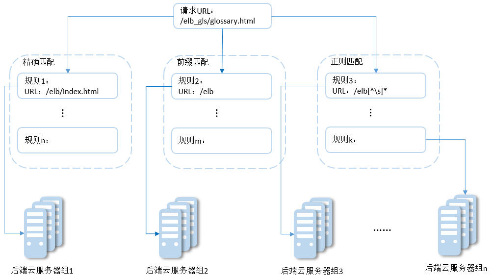

# 转发策略（共享型）

## 操作场景

您可以通过给共享型负载均衡添加转发策略，将来自不同域名或者不同URL的请求转发到不同的后端服务器组处理。

例如：您可以通过添加转发策略，将视频、图片、音频、文本等请求分别转发到不同的后端服务器组上去处理，便于灵活的分流业务，合理的分配资源。

转发策略由**转发规则**和**动作**两部分组成：

-   支持的转发规则有：**域名**、**URL**。
-   支持的动作类型有：**转发至后端服务器组**。

## 约束与限制

-   此功能目前仅支持协议类型为HTTP、HTTPS的监听器。
-   配置转发策略时，请注意以下事项：
    -   每个URL路径需要存于后端服务器（即必须是后端服务器上真实存在的路径），否则访问后端服务器时，后端服务器会返回404。
    -   不能配置转发策略完全一样的两条路径。
    -   因为正则匹配采用顺序匹配的方式，只要任意规则匹配成功就结束匹配。所以配置“URL匹配规则”为“正则匹配”的多个匹配规则时，规则之间不能重叠。

-   在添加了转发策略后，负载均衡器将按以下规则转发前端请求：
    -   如果能匹配到监听器的转发策略，则按该转发策略将请求转发到对应的后端服务器组。
    -   如果不能匹配到监听器的转发策略，则按照默认转发策略将请求转发到监听器默认的后端服务器组（创建监听器时配置的后端服务器组）。

> **注意：** 
>如果创建了相同的转发策略（出现转发策略冲突），则会出现转发策略故障，此时即使把前面创建的转发策略删除，后面的转发策略依然会显示故障。将出现冲突的转发策略都删除后重新添加，即可恢复正常。

## 添加转发策略

1.  登录管理控制台。
2.  在管理控制台左上角单击图标，选择区域和项目。
3.  单击页面左上角的，选择“网络 \> 弹性负载均衡”。
4.  在“负载均衡器”界面，单击需要添加转发策略的负载均衡器名称。
5.  切换到监听器页签，单击目标监听器名称。
6.  单击“转发策略”右侧的“添加”按钮。
7.  在“添加转发策略”弹框中参考[表1](#table10859681016)配置参数。
8.  配置完成，单击“确定”。

    也可在负载均衡器页面单击目标监听器名称，跳转至监听器页面，添加转发策略。

**表 1**  添加转发策略的参数

<table><thead align="left"><tr id="row109196141011"><th class="cellrowborder" valign="top" width="9.959999999999999%" id="mcps1.2.5.1.1">
配置类型

</th>
<th class="cellrowborder" valign="top" width="19.7%" id="mcps1.2.5.1.2">
参数

</th>
<th class="cellrowborder" valign="top" width="39.51%" id="mcps1.2.5.1.3">
说明

</th>
<th class="cellrowborder" valign="top" width="30.830000000000002%" id="mcps1.2.5.1.4">
样例

</th>
</tr>
</thead>
<tbody><tr id="row141006651018"><td class="cellrowborder" rowspan="5" valign="top" width="9.959999999999999%" headers="mcps1.2.5.1.1 ">
配置转发策略

</td>
<td class="cellrowborder" valign="top" width="19.7%" headers="mcps1.2.5.1.2 ">
名称

</td>
<td class="cellrowborder" valign="top" width="39.51%" headers="mcps1.2.5.1.3 ">
转发策略的名称。

</td>
<td class="cellrowborder" valign="top" width="30.830000000000002%" headers="mcps1.2.5.1.4 ">
forwarding_policy-q582

</td>
</tr>
<tr id="row15105761109"><td class="cellrowborder" valign="top" headers="mcps1.2.5.1.1 ">
域名

</td>
<td class="cellrowborder" valign="top" headers="mcps1.2.5.1.2 ">
触发转发的域名，仅支持精确域名。注意，域名或者URL至少要指定一个。

</td>
<td class="cellrowborder" valign="top" headers="mcps1.2.5.1.3 ">
www.test.com

</td>
</tr>
<tr id="row11113116161018"><td class="cellrowborder" valign="top" headers="mcps1.2.5.1.1 ">
URL匹配规则

</td>
<td class="cellrowborder" valign="top" headers="mcps1.2.5.1.2 "><ul id="ul141168619107"><li>精确匹配
请求的URL和设定URL完全一致。

</li><li>前缀匹配
请求的URL匹配以设定URL开头的URL。

</li><li>正则匹配
请求的URL和设定的URL正则表达式匹配。
 说明： 
<ul id="ul1916119392479"><li>匹配的优先级为：精确匹配 &gt; 前缀匹配 &gt; 正则匹配</li><li>前缀匹配遵循“最长字符串匹配”原则，例如存在/elb和/elbvip两个规则，访问的URL为/elbvipplus，则会优先匹配/elbvip这个规则。</li></ul>

</li></ul>
</td>
<td class="cellrowborder" valign="top" headers="mcps1.2.5.1.3 ">
精确匹配

</td>
</tr>
<tr id="row4184174112152"><td class="cellrowborder" valign="top" headers="mcps1.2.5.1.1 ">
URL

</td>
<td class="cellrowborder" valign="top" headers="mcps1.2.5.1.2 ">
触发转发的URL。

</td>
<td class="cellrowborder" valign="top" headers="mcps1.2.5.1.3 ">
/login.php

</td>
</tr>
<tr id="row151292617103"><td class="cellrowborder" valign="top" headers="mcps1.2.5.1.1 ">
描述

</td>
<td class="cellrowborder" valign="top" headers="mcps1.2.5.1.2 ">
转发策略的描述。

</td>
<td class="cellrowborder" valign="top" headers="mcps1.2.5.1.3 ">
-

</td>
</tr>
<tr id="row2079614577109"><td class="cellrowborder" valign="top" width="9.959999999999999%" headers="mcps1.2.5.1.1 ">
添加后端服务器组

</td>
<td class="cellrowborder" valign="top" width="19.7%" headers="mcps1.2.5.1.2 ">
后端服务器组

</td>
<td class="cellrowborder" valign="top" width="39.51%" headers="mcps1.2.5.1.3 ">
可选择“新创建”或“使用已有”。

选择“新创建”，可参考<a href="添加或移除后端服务器（共享型）.md#table299811529239">表1</a>和<a href="添加或移除后端服务器（共享型）.md#table1022053182319">表2</a>进行参数配置。

选择“使用已有”，为转发策略选择已有的后端服务器组即可。

</td>
<td class="cellrowborder" valign="top" width="30.830000000000002%" headers="mcps1.2.5.1.4 ">
新创建

</td>
</tr>
</tbody>
</table>

## URL匹配示例

如[表2](#table5831113119590)所示，是一个URL匹配示例，转发情况如[图1](#fig87121434403)所示。

**表 2**  URL匹配示例

<table><thead align="left"><tr id="row4697541666"><th class="cellrowborder" valign="top" id="mcps1.2.7.1.1">
模式

</th>
<th class="cellrowborder" valign="top" id="mcps1.2.7.1.2">
请求URL

</th>
<th class="cellrowborder" colspan="4" valign="top" id="mcps1.2.7.1.3">
设定URL

</th>
</tr>
</thead>
<tbody><tr id="row1289643195912"><td class="cellrowborder" valign="top" width="15.933186637327465%" headers="mcps1.2.7.1.1 ">
-

</td>
<td class="cellrowborder" valign="top" width="18.81376275255051%" headers="mcps1.2.7.1.2 ">
-

</td>
<td class="cellrowborder" valign="top" width="16.313262652530504%" headers="mcps1.2.7.1.3 ">
/elb/index.html

</td>
<td class="cellrowborder" valign="top" width="16.313262652530504%" headers="mcps1.2.7.1.3 ">
/elb

</td>
<td class="cellrowborder" valign="top" width="16.313262652530504%" headers="mcps1.2.7.1.3 ">
/elb[^\s]*

</td>
<td class="cellrowborder" valign="top" width="16.313262652530504%" headers="mcps1.2.7.1.3 ">
/index.html

</td>
</tr>
<tr id="row2896103116597"><td class="cellrowborder" valign="top" width="15.933186637327465%" headers="mcps1.2.7.1.1 ">
精确匹配

</td>
<td class="cellrowborder" rowspan="3" valign="top" width="18.81376275255051%" headers="mcps1.2.7.1.2 ">
/elb/index.html

</td>
<td class="cellrowborder" valign="top" width="16.313262652530504%" headers="mcps1.2.7.1.3 ">
√

</td>
<td class="cellrowborder" valign="top" width="16.313262652530504%" headers="mcps1.2.7.1.3 ">
-

</td>
<td class="cellrowborder" valign="top" width="16.313262652530504%" headers="mcps1.2.7.1.3 ">
-

</td>
<td class="cellrowborder" valign="top" width="16.313262652530504%" headers="mcps1.2.7.1.3 ">
-

</td>
</tr>
<tr id="row198979312599"><td class="cellrowborder" valign="top" headers="mcps1.2.7.1.1 ">
前缀匹配

</td>
<td class="cellrowborder" valign="top" headers="mcps1.2.7.1.2 ">
√

</td>
<td class="cellrowborder" valign="top" headers="mcps1.2.7.1.3 ">
√

</td>
<td class="cellrowborder" valign="top" headers="mcps1.2.7.1.3 ">
-

</td>
<td class="cellrowborder" valign="top" headers="mcps1.2.7.1.3 ">
-

</td>
</tr>
<tr id="row18971031195914"><td class="cellrowborder" valign="top" headers="mcps1.2.7.1.1 ">
正则匹配

</td>
<td class="cellrowborder" valign="top" headers="mcps1.2.7.1.2 ">
√

</td>
<td class="cellrowborder" valign="top" headers="mcps1.2.7.1.3 ">
-

</td>
<td class="cellrowborder" valign="top" headers="mcps1.2.7.1.3 ">
√

</td>
<td class="cellrowborder" valign="top" headers="mcps1.2.7.1.3 ">
-

</td>
</tr>
</tbody>
</table>

**图 1**  转发示例  

以上图为例

请求的URL：/elb\_gls/glossary.html先在精确匹配规则中查找，如果没有找到精确匹配的规则，则继续在前缀匹配规则中查找，找到匹配的规则2，将该请求转发到规则2对应的后端服务器组2。此时虽然请求URL和正则匹配规则中的规则3相匹配，但由于前缀匹配的优先级比较高，所以最终将请求转发至后端服务器组2。

## 修改转发策略

1.  登录管理控制台。
2.  在管理控制台左上角单击图标，选择区域和项目。
3.  单击页面左上角的，选择“网络 \> 弹性负载均衡”。
4.  在“负载均衡器”界面，单击需要修改转发策略的负载均衡器名称。
5.  切换到监听器页签，单击需要修改转发策略的监听器名称。
6.  单击“转发策略”。
7.  单击目标转发策略名称右侧的。
8.  在弹出的“修改转发策略”对话框中，修改参数，单击“确认”。

## 删除转发策略

1.  登录管理控制台。
2.  在管理控制台左上角单击图标，选择区域和项目。
3.  单击页面左上角的，选择“网络 \> 弹性负载均衡”。
4.  在“负载均衡器”界面，单击需要删除转发策略的负载均衡器名称。
5.  切换到监听器页签，单击需要删除转发策略的监听器名称。
6.  单击“转发策略”。
7.  单击目标转发策略名称右侧的。
8.  在弹出的“删除转发策略”对话框中，单击“是”，删除转发策略。

