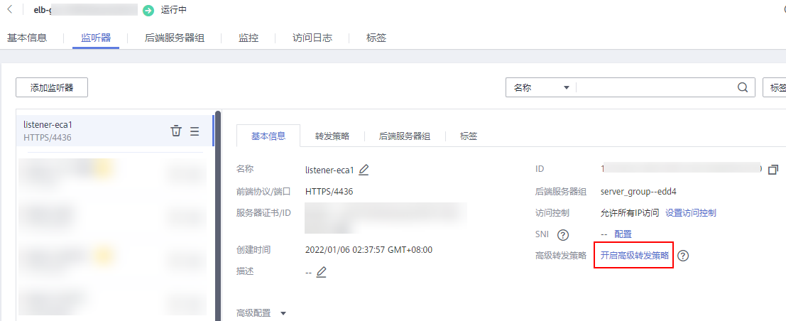
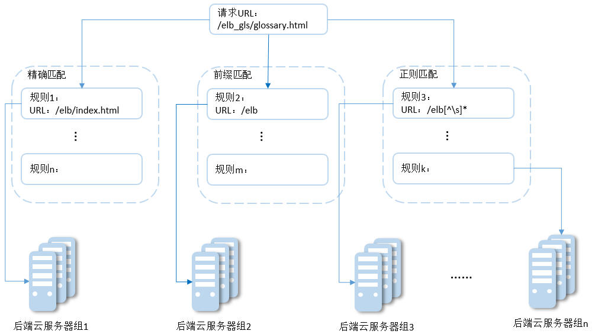

# 转发策略（独享型）

**未开启“高级转发策略”**功能时，请参考此章节为独享型负载均衡添加转发策略。

**图 1**  未开启高级转发策略  

## 操作场景

您可以通过给独享型负载均衡添加转发策略，将来自不同域名或者不同URL的请求转发到不同的后端服务器组处理。

例如：您可以通过添加转发策略，将视频、图片、音频、文本等请求分别转发到不同的后端服务器组上去处理，便于灵活的分流业务，合理的分配资源。

转发策略由**转发规则**和**动作**两部分组成：

-   支持的转发规则有：域名、URL。
-   支持的动作类型有：转发至后端服务器组、重定向至监听器（仅HTTP监听器支持）。

## 约束与限制

-   此功能目前仅支持协议类型为HTTP、HTTPS的监听器。
-   HTTPS监听器不支持“重定向至监听器”动作类型。
-   配置转发策略时，请注意以下事项：
    -   每个URL路径需要存于后端服务器（即必须是后端服务器上真实存在的路径），否则访问后端服务器时，后端服务器会返回404。
    -   不能配置转发策略完全一样的两条路径。
    -   因为正则匹配采用顺序匹配的方式，只要任意规则匹配成功就结束匹配。所以配置“URL匹配规则”为“正则匹配”的多个匹配规则时，规则之间不能重叠。
    -   输入的域名总长度不能超过46个字符。

-   在添加了转发策略后，负载均衡器将按以下规则转发前端请求：
    -   如果能匹配到监听器的转发策略，则按该转发策略将请求转发到对应的后端服务器组。
    -   如果不能匹配到监听器的转发策略，则按照默认转发策略将请求转发到监听器默认的后端服务器组（创建监听器时配置的后端服务器组）。

## 添加转发策略

1.  登录管理控制台。
2.  在管理控制台左上角单击图标，选择区域和项目。
3.  单击页面左上角的，选择“网络 \> 弹性负载均衡”。
4.  在“负载均衡器”界面，单击需要添加转发策略的负载均衡器名称。
5.  切换到监听器页签，单击目标监听器名称。
6.  单击目标监听器右侧的按钮，选择“设置转发策略”。

    或者直接单击页面右侧的“转发策略”，切换到转发策略页签，单击“添加转发策略”。

7.  在右侧“转发策略”子页签中，单击“添加转发策略”。参考[表1](#elb_ug_jt_0023_table10859681016)配置参数。

    **表 1**  添加转发策略的参数

    
    <table><thead align="left"><tr id="elb_ug_jt_0023_row109196141011"><th class="cellrowborder" colspan="2" valign="top" id="mcps1.2.5.1.1">
参数

    </th>
    <th class="cellrowborder" valign="top" id="mcps1.2.5.1.2">
说明

    </th>
    <th class="cellrowborder" valign="top" id="mcps1.2.5.1.3">
样例

    </th>
    </tr>
    </thead>
    <tbody><tr id="elb_ug_jt_0023_row15105761109"><td class="cellrowborder" rowspan="2" valign="top" width="18.39%" headers="mcps1.2.5.1.1 ">
转发规则

    </td>
    <td class="cellrowborder" valign="top" width="9.36%" headers="mcps1.2.5.1.1 ">
域名

    </td>
    <td class="cellrowborder" valign="top" width="40.58%" headers="mcps1.2.5.1.2 ">
触发转发的域名，仅支持精确域名。

    
域名或者URL至少要指定一个。

    
 说明： 

高级转发策略支持泛域名转发，详细请参考<a href="高级转发策略（独享型）.md">高级转发策略</a>。

    

    </td>
    <td class="cellrowborder" valign="top" width="31.669999999999998%" headers="mcps1.2.5.1.3 ">
www.test.com

    </td>
    </tr>
    <tr id="elb_ug_jt_0023_row16108186101017"><td class="cellrowborder" valign="top" headers="mcps1.2.5.1.1 ">
URL

    </td>
    <td class="cellrowborder" valign="top" headers="mcps1.2.5.1.1 ">
触发转发的URL。URL的匹配规则有如下三种：

    <ul id="zh-cn_topic_0114694934_ul64331319184618"><li>精确匹配
请求的URL和设定URL完全一致。

    </li><li>前缀匹配
请求的URL匹配已设定URL开头的URL。

    </li><li>正则匹配
请求的URL和设定的URL正则表达式匹配。

    </li></ul>
    </td>
    <td class="cellrowborder" valign="top" headers="mcps1.2.5.1.2 ">
/login.php

    </td>
    </tr>
    <tr id="row19520133965312"><td class="cellrowborder" rowspan="2" valign="top" width="18.39%" headers="mcps1.2.5.1.1 ">
动作

    </td>
    <td class="cellrowborder" valign="top" width="9.36%" headers="mcps1.2.5.1.1 ">
转发至后端服务器组

    </td>
    <td class="cellrowborder" valign="top" width="40.58%" headers="mcps1.2.5.1.2 ">
如果请求与配置的转发规则（条件）匹配，则将请求转发至配置的后端服务器组。

    </td>
    <td class="cellrowborder" valign="top" width="31.669999999999998%" headers="mcps1.2.5.1.3 ">
转发至后端服务器组

    </td>
    </tr>
    <tr id="row1079123617530"><td class="cellrowborder" valign="top" headers="mcps1.2.5.1.1 ">
重定向至监听器

    </td>
    <td class="cellrowborder" valign="top" headers="mcps1.2.5.1.1 ">
如果请求与配置的转发规则（条件）匹配，则将请求重定向至配置的监听器。

    
仅HTTP监听器支持配置该动作类型。

    
 说明： 

选择“重定向至监听器”并配置监听器后，除访问控制以外原有监听器配置会失效。

    
例如：配置了重定向至监听器后，当客户端通过HTTP请求访问的时候，后端服务器会返回HTTPS的响应，即强制以HTTPS请求访问网页。因此实际以HTTPS监听器的配置为准向后端服务器进行转发，原有HTTP监听器的配置就无效了。

    

    </td>
    <td class="cellrowborder" valign="top" headers="mcps1.2.5.1.2 ">
-

    </td>
    </tr>
    <tr id="elb_ug_jt_0023_row2079614577109"><td class="cellrowborder" colspan="2" valign="top" headers="mcps1.2.5.1.1 ">
后端服务器组

    </td>
    <td class="cellrowborder" valign="top" headers="mcps1.2.5.1.2 ">
为转发策略选择已有的后端服务器组。

    
“动作”选择“转发至后端服务器组”时需要设置。

    </td>
    <td class="cellrowborder" valign="top" headers="mcps1.2.5.1.3 ">
-

    </td>
    </tr>
    <tr id="elb_ug_jt_0023_row69451615812"><td class="cellrowborder" colspan="2" valign="top" headers="mcps1.2.5.1.1 ">
监听器

    </td>
    <td class="cellrowborder" valign="top" headers="mcps1.2.5.1.2 ">
为转发策略选择已有的监听器。

    
“动作”选择“重定向至监听器”时需要设置。

    </td>
    <td class="cellrowborder" valign="top" headers="mcps1.2.5.1.3 ">
-

    </td>
    </tr>
    </tbody>
    </table>

8.  配置完成，单击“保存”。

## URL匹配示例

如[表2](#table5831113119590)所示，是一个URL匹配示例，转发情况如[图2](#fig87121434403)所示。

**表 2**  URL匹配示例

<table><thead align="left"><tr id="row4697541666"><th class="cellrowborder" valign="top" id="mcps1.2.7.1.1">
模式

</th>
<th class="cellrowborder" valign="top" id="mcps1.2.7.1.2">
请求URL

</th>
<th class="cellrowborder" colspan="4" valign="top" id="mcps1.2.7.1.3">
设定URL

</th>
</tr>
</thead>
<tbody><tr id="row1289643195912"><td class="cellrowborder" valign="top" width="15.933186637327465%" headers="mcps1.2.7.1.1 ">
-

</td>
<td class="cellrowborder" valign="top" width="18.81376275255051%" headers="mcps1.2.7.1.2 ">
-

</td>
<td class="cellrowborder" valign="top" width="16.313262652530504%" headers="mcps1.2.7.1.3 ">
/elb/index.html

</td>
<td class="cellrowborder" valign="top" width="16.313262652530504%" headers="mcps1.2.7.1.3 ">
/elb

</td>
<td class="cellrowborder" valign="top" width="16.313262652530504%" headers="mcps1.2.7.1.3 ">
/elb[^\s]*

</td>
<td class="cellrowborder" valign="top" width="16.313262652530504%" headers="mcps1.2.7.1.3 ">
/index.html

</td>
</tr>
<tr id="row2896103116597"><td class="cellrowborder" valign="top" width="15.933186637327465%" headers="mcps1.2.7.1.1 ">
精确匹配

</td>
<td class="cellrowborder" rowspan="3" valign="top" width="18.81376275255051%" headers="mcps1.2.7.1.2 ">
/elb/index.html

</td>
<td class="cellrowborder" valign="top" width="16.313262652530504%" headers="mcps1.2.7.1.3 ">
√

</td>
<td class="cellrowborder" valign="top" width="16.313262652530504%" headers="mcps1.2.7.1.3 ">
-

</td>
<td class="cellrowborder" valign="top" width="16.313262652530504%" headers="mcps1.2.7.1.3 ">
-

</td>
<td class="cellrowborder" valign="top" width="16.313262652530504%" headers="mcps1.2.7.1.3 ">
-

</td>
</tr>
<tr id="row198979312599"><td class="cellrowborder" valign="top" headers="mcps1.2.7.1.1 ">
前缀匹配

</td>
<td class="cellrowborder" valign="top" headers="mcps1.2.7.1.2 ">
√

</td>
<td class="cellrowborder" valign="top" headers="mcps1.2.7.1.3 ">
√

</td>
<td class="cellrowborder" valign="top" headers="mcps1.2.7.1.3 ">
-

</td>
<td class="cellrowborder" valign="top" headers="mcps1.2.7.1.3 ">
-

</td>
</tr>
<tr id="row18971031195914"><td class="cellrowborder" valign="top" headers="mcps1.2.7.1.1 ">
正则匹配

</td>
<td class="cellrowborder" valign="top" headers="mcps1.2.7.1.2 ">
√

</td>
<td class="cellrowborder" valign="top" headers="mcps1.2.7.1.3 ">
-

</td>
<td class="cellrowborder" valign="top" headers="mcps1.2.7.1.3 ">
√

</td>
<td class="cellrowborder" valign="top" headers="mcps1.2.7.1.3 ">
-

</td>
</tr>
</tbody>
</table>

**图 2**  转发示例  

以上图为例

请求的URL：/elb\_gls/glossary.html先在精确匹配规则中查找，如果没有找到精确匹配的规则，则继续在前缀匹配规则中查找，找到匹配的规则2，将该请求转发到规则2对应的后端服务器组2。此时虽然请求URL和正则匹配规则中的规则3相匹配，但由于前缀匹配的优先级比较高，所以最终将请求转发至后端服务器组2。

## 修改转发策略

1.  登录管理控制台。
2.  在管理控制台左上角单击图标，选择区域和项目。
3.  单击页面左上角的，选择“网络 \> 弹性负载均衡”。
4.  在“负载均衡器”界面，单击需要修改转发策略的负载均衡器名称。
5.  切换到监听器页签，单击需要修改转发策略的监听器名称。
6.  单击转发策略右侧的按钮，选择“设置转发策略”。

    或者直接打开页面右侧的“转发策略”。

7.  在右侧“转发策略”子页签中，选择需要修改的转发策略，单击“编辑”。
8.  根据界面提示修改参数，单击“保存”。

## 删除转发策略

用户可以根据实际需要删除已经创建的转发策略。

转发策略删除后无法恢复，请谨慎操作。

1.  登录管理控制台。
2.  在管理控制台左上角单击图标，选择区域和项目。
3.  单击页面左上角的，选择“网络 \> 弹性负载均衡”。
4.  在“负载均衡器”界面，单击需要删除转发策略的负载均衡器名称。
5.  切换到监听器页签，单击需要删除转发策略的监听器名称。
6.  单击转发策略右侧的按钮，选择“设置转发策略”。

    或者直接打开页面右侧的“转发策略”。

7.  在右侧“转发策略”子页签中，选择需要删除的转发策略，单击“删除”。
8.  单击“是”。

