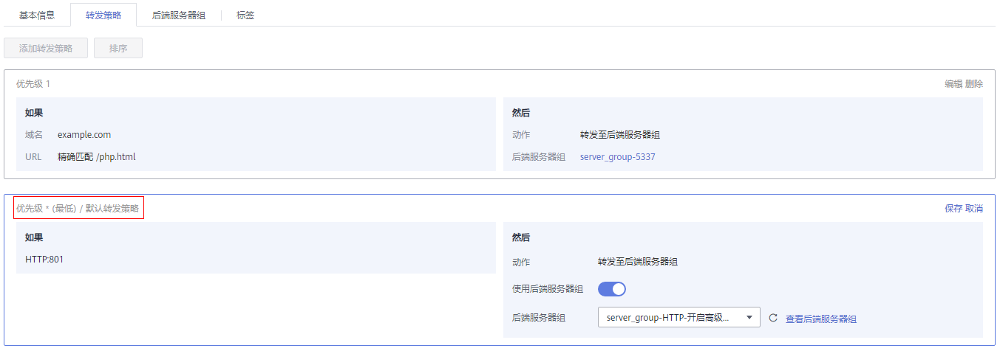

# 转发规则和动作类型<a name="elb_ug_jt_060302"></a>

每个监听器都具有默认转发策略，您也可以选择定义其他转发策略。每条转发策略由优先级、一个或多个转发规则以及转发动作组成。您可以随时添加或编辑转发策略。

## 默认转发策略<a name="zh-cn_topic_0000001182135225_section352215612588"></a>

每个HTTP/HTTPS监听器创建后，都会有一个默认的转发策略，该转发策略的的转发规则是监听器的协议和端口，动作为“转发至后端服务器组”，后端服务器组为创建监听器时配置的后端服务器组。

默认转发策略的优先级最低，不参与转发策略排序；可以编辑，但不可删除。

当开启高级转发策略时，支持设置默认转发策略是否使用后端服务器组。

**图 1**  默认转发策略<a name="zh-cn_topic_0000001182135225_fig1913531391315"></a>  


**图 2**  开启高级转发策略-默认转发策略<a name="zh-cn_topic_0000001182135225_fig208508215152"></a>  


## 转发规则类型<a name="zh-cn_topic_0000001182135225_section1351817374499"></a>

高级转发策略支持的转发规则类型有：域名、URL、HTTP请求方法、HTTP请求头、查询字符串、网段。

-   **域名**

    触发转发的域名，支持精确域名、泛域名。

    -   可以并列添加多个域名。每个域名的长度不能超过46个字符。
    -   至少包含两个字符串，字符串间以点分割，字符串只能由英文字母、数字、中划线、小数点和特殊字符\*组成。字符串中须以英文字母、数字或\*开头，不能以中划线结尾。\*只能出现在开头且必须以\*.开始。
    -   域名示例：

        ```
        请求链接为：https://www.example.com/login.php?locale=zh-cn&region=cn-north-4#videos
        转发规则选择“域名”时，填写：www.example.com
        ```


-   **URL**

    触发转发的URL。

    -   可以并列添加多个URL。
    -   由英文字母、数字和特殊字符\_\~';@^-%\#$.\*+?,=!:|\\/\(\)\[\]\{\}组成，并在精确匹配和前缀匹配时，只能由/开头。
    -   URL的匹配模式有如下三种：
        -   精确匹配

            请求的URL和设定URL完全一致。

        -   前缀匹配

            请求的URL匹配已设定URL开头的URL。

        -   正则匹配

            请求的URL和设定的URL正则表达式匹配。

    -   URL示例：

        ```
        请求链接为：https://www.example.com/login.php?locale=zh-cn&region=cn-north-4#videos
        转发规则选择“URL”时，填写：/login.php
        ```

    > **注意：** 
    >如果URL中包含特殊字符（如：?或\#），则需要先将特殊字符进行转义后再配置URL转发策略。

-   **查询字符串**

    当请求中的字符串与设置好的转发策略中的字符串相匹配时，触发转发。

    -   查询字符串是键值对的形式，需要分别设置值：
        -   键（key）：只能包含英文字母、数字和特殊字符!$'\(\)\*+,./:;=?@^-\_'。
        -   值（value）：一个键下可以配置多个值。只能包含英文字母、数字和特殊字符!$'\(\)\*+,./:;=?@^-\_'。还支持\*和？两种通配符。

    -   查询字符串示例：

        ```
        请求链接为：https://www.example.com/login.php?locale=zh-cn&region=cn-north-4#videos
        转发规则需配置两个“查询字符串”：
        查询字符串A：
        键（key）：locale
        值（value）：zh-cn
        查询字符串B：
        键（key）：region
        值（value）：cn-north-4
        ```


-   **HTTP请求方法**

    触发转发的HTTP请求方法。

    -   可以并列设置多个请求方法。
    -   主要分为以下几种：

        GET、POST、PUT、DELETE、PATCH、HEAD、OPTIONS

    -   HTTP请求方法示例：

        ```
        GET
        ```


-   **HTTP请求头**

    触发转发的HTTP请求头。

    -   请求头是键值对的形式，需要分别设置值：
        -   键（key）：只能由英文字母、数字、下划线和中划线组成。
        -   值（value）：一个键下可以配置多个值。只能包含英文字母、数字和特殊字符!\#$%&'\(\)\*+,.\\/:;<=\>?@\[\]^-\_'\{|\}\~。还支持\*和？两种通配符。

    -   HTTP请求头示例：

        ```
        键（key）：Accept-Language
        值（value）：zh-CN
        ```


-   **网段**

    触发转发的请求网段。

    网段示例：

    ```
    192.168.1.0/24或2020:50::44/127
    ```


## 动作类型<a name="zh-cn_topic_0000001182135225_section107001685017"></a>

高级转发策略支持的动作类型有：转发至后端服务器组、重定向至监听器、重定向至URL、返回固定响应。

-   **转发至后端服务器组**

    如果满足转发策略条件，则将请求转发至配置好的后端服务器组。需要配置后端服务器组。

-   **重定向至监听器**

    如果满足转发策略条件，则将请求转发至配置好的监听器上。需要配置监听器。

    > **说明：** 
    >选择“重定向至监听器”并配置监听器后，除访问控制以外原有监听器配置会失效。
    >例如：配置了重定向至监听器后，当客户端通过HTTP请求访问的时候，后端服务器会返回HTTPS的响应，即强制以HTTPS请求访问网页。因此实际以HTTPS监听器的配置为准向后端服务器进行转发，原有HTTP监听器的配置就无效了。

-   **重定向至URL**

    如果满足转发策略条件，则将请求重定向至配置好的URL。

    客户端访问ELB网址A后，ELB返回302或者其他3xx返回码和目的网址B，客户端自动跳转到网址B，网址B可自定义。

    -   需要设置如下参数：
        -   **协议**：可以选择“$\{protocol\}”或“HTTP”或“HTTPS”。$\{protocol\}表示与源协议相同。
        -   **域名**：至少包含两个字符串，字符串间以点分割，字符串只能由英文字母、数字、中划线和小数点组成。字符串必须以英文字母或数字开头，不能以中划线结尾。$\{host\}表示与源域名相同。
        -   **端口**：取值范围是1\~65535。$\{port\}表示与源端口相同。
        -   **路径**：由英文字母、数字和特殊字符\_\~';@^-%\#&$.\*+?,=!:|\\/\(\)\[\]\{\}组成，只能由/开头。$\{path\}表示与源路径相同。
        -   **查询字符串**：只能包含英文字母、数字额特殊字符!$'\(\)\*+,./:;=?@&^-\_'，&仅支持作为分隔符使用。
        -   **返回码**：可以选择“301”、“302”、“303”、“307”、“308”。

    > **说明：** 
    >协议、域名、端口和路径至少设置一条。

    -   重定向至URL示例

        ```
        重定向的链接为：http://www.example1.com/index.html?locale=zh-cn#videos
        协议：HTTP
        域名：www.example1.com
        端口：8081
        路径：/index.html
        查询字符串：locale=zh-cn
        返回码：301
        ```


-   **返回固定响应**

    如果满足转发策略条件，则返回固定响应。

    用户访问ELB实例后，ELB直接返回响应，不向后端服务器继续转发，返回响应的状态码和内容可以自定义。

    -   需要设置如下参数：
        -   **返回码**：默认支持2XX、4XX、5XX系列状态码。
        -   **Content-Type**：可以选择“text/plain”、“text/css”、“text/html”、“application/javascript”、“application/json”。
        -   **响应正文**：非必填项。

    -   响应正文示例：

        text/plain

        ```
        很抱歉,暂不支持该语言.
        ```

        text/css

        ```
        <head><style type="text/css">div {background-color:red}#div {font-size:15px;color:red}</style></head>
        ```

        text/html

        ```
        <form action="/" method="post" enctype="multipart/form-data"><input type="text" name="description" value="some text"><input type="file" name="myFile"><button type="submit">Submit</button></form>
        ```

        application/javascript

        ```
        String.prototype.trim = function() {var reExtraSpace = /^\s*(.*?)\s+$/;return this.replace(reExtraSpace, "$1")}
        ```

        application/json

        ```
        { "publicip": { "type": "5_bgp","ip_version": 4},"bandwidth": {"name": "bandwidth123","size": 10,"share_type": "PER"}}
        ```

        > **说明：** 
        >填写响应正文时，请不要有回车格式，否则无法保存。


