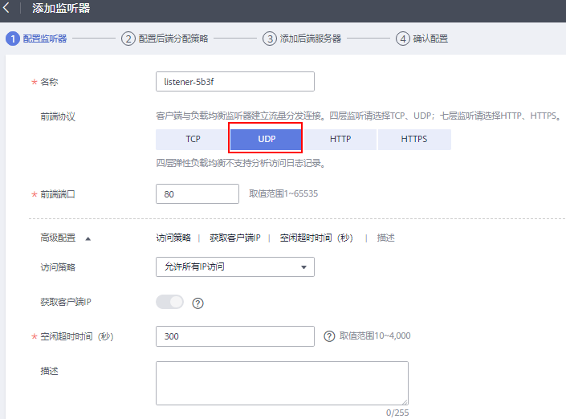
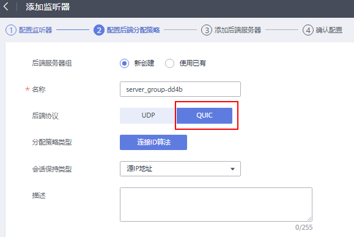

# 配置QUIC协议的UDP监听器（独享型）

## 操作场景

前端为UDP协议的监听器，支持QUIC（Quick UDP Internet Connection）作为后端监听协议。配合连接ID算法，将同一个连接ID的请求转发到后端服务器。使用QUIC协议的监听器具有低延迟、高可靠和无队头阻塞的优点，非常适合移动互联网易用、支持在WIFI和运营商网络中无缝切换，而不用重新去建立连接。

> **说明：** 
>QUIC协议的版本有：Q043、Q046、Q050。
>QUIC协议的UDP监听器不支持分片包。

## 约束与限制

-   独享型负载均衡支持使用后端监听器为QUIC协议。
-   独享型负载均衡器已经选择四层“网络型（TCP/UDP）”类型的规格。

## 添加独享型UDP监听器

1.  登录管理控制台。
2.  在管理控制台左上角单击图标，选择区域和项目。
3.  单击页面左上角的，选择“网络 \> 弹性负载均衡”。
4.  在“负载均衡器”界面，单击需要添加监听器的负载均衡名称。

    此负载均衡器需要选择“网络型（TCP/UDP）”规格，使其能够创建四层（TCP/UDP）监听器。

5.  切换到“监听器”页签，单击“添加监听器”。
6.  在“添加监听器”页签，“前端协议”请选择“UDP”，其他参数根据实际情况设置，完成后单击“下一步”。

    **图 1**  前端协议选择“UDP”  
    

7.  在“配置后端分配策略”页面，“后端协议”选择“QUIC”，其他参数根据实际情况设置。

    **图 2**  后端协议选择“QUIC”  
    

8.  根据需要配置相关参数，配置完成后，单击“提交”。

## 相关操作

监听器创建完成后，还需要添加后端服务器，具体操作请参考[添加或移除后端服务器（独享型）](添加或移除后端服务器（独享型）.md)。

