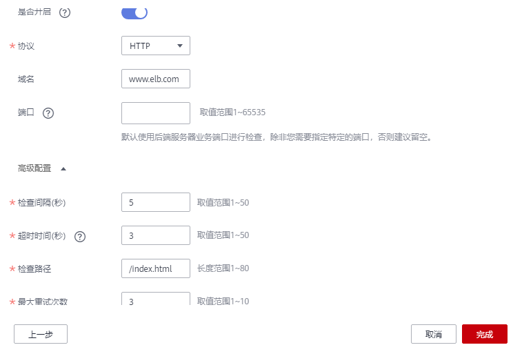

# 配置健康检查

## 操作场景

您可以在添加监听器时配置健康检查。通常，使用默认的健康检查配置即可。

## 背景信息

-   健康检查与ELB的后端协议是两个相互独立的能力，所以健康检查协议可以与ELB的后端协议相同，也可以不同。
-   为了减少后端服务器的CPU占用，建议您使用TCP协议做健康检查。如果您希望使用HTTP健康检查协议，建议使用HTTP+静态文件的方式。
-   通过增加“检查间隔”，可以降低健康检查的检测频率。
-   开启健康检查后不会影响已建立连接的流量转发，负载均衡会立即对后端服务器执行健康检查。如果健康检查正常，则新建连接的流量会根据分配策略和权重向该服务器转发流量；如果健康异常，则系统会设置该服务器状态为异常，不转发新的流量到该服务器。建议挑选无业务时间段执行此操作。

## 配置独享型负载均衡健康检查

1.  登录管理控制台。
2.  在管理控制台左上角单击图标，选择区域和项目。
3.  单击页面左上角的，选择“网络 \> 弹性负载均衡”。
4.  在“负载均衡器”界面，单击需要开启健康检查的负载均衡名称。
5.  在“后端服务器组”页签下，选择需要开启健康检查的后端服务器组名称。
6.  在基本信息页面，单击“健康检查”右侧的“配置”。
7.  在“配置健康检查”界面，可根据需要开启健康检查。参考[表1](#table1646416142718)进行配置。

    **表 1**  独享型负载均衡配置健康检查参数说明

    
    <table><thead align="left"><tr id="row1946501172713"><th class="cellrowborder" valign="top" width="23.419999999999998%" id="mcps1.2.4.1.1">
参数

    </th>
    <th class="cellrowborder" valign="top" width="46.7%" id="mcps1.2.4.1.2">
说明

    </th>
    <th class="cellrowborder" valign="top" width="29.880000000000003%" id="mcps1.2.4.1.3">
示例

    </th>
    </tr>
    </thead>
    <tbody><tr id="row194651914274"><td class="cellrowborder" valign="top" width="23.419999999999998%" headers="mcps1.2.4.1.1 ">
是否开启

    </td>
    <td class="cellrowborder" valign="top" width="46.7%" headers="mcps1.2.4.1.2 ">
开启或者关闭健康检查。

    </td>
    <td class="cellrowborder" valign="top" width="29.880000000000003%" headers="mcps1.2.4.1.3 ">
-

    </td>
    </tr>
    <tr id="row104651515273"><td class="cellrowborder" valign="top" width="23.419999999999998%" headers="mcps1.2.4.1.1 ">
协议

    </td>
    <td class="cellrowborder" valign="top" width="46.7%" headers="mcps1.2.4.1.2 "><ul id="ul2046571122713"><li>健康检查支持TCP、HTTP、HTTPS方式，设置后不可修改。</li><li>当前端协议选择UDP，健康检查协议默认为UDP。</li></ul>
    </td>
    <td class="cellrowborder" valign="top" width="29.880000000000003%" headers="mcps1.2.4.1.3 ">
HTTP

    </td>
    </tr>
    <tr id="row3466518277"><td class="cellrowborder" valign="top" width="23.419999999999998%" headers="mcps1.2.4.1.1 ">
域名

    </td>
    <td class="cellrowborder" valign="top" width="46.7%" headers="mcps1.2.4.1.2 ">
健康检查的请求域名。

    
默认值为空，由数字、字母、‘-’、‘.’组成的字符串，只能以数字或字符开头。

    
只有健康检查协议为HTTP时，需要设置。

    </td>
    <td class="cellrowborder" valign="top" width="29.880000000000003%" headers="mcps1.2.4.1.3 ">
www.elb.com

    </td>
    </tr>
    <tr id="row54660122718"><td class="cellrowborder" valign="top" width="23.419999999999998%" headers="mcps1.2.4.1.1 ">
端口

    </td>
    <td class="cellrowborder" valign="top" width="46.7%" headers="mcps1.2.4.1.2 ">
健康检查端口号，取值范围[1，65535]，为可选参数。

    
 说明： 

未配置健康检查端口时，默认使用后端云服务器端口进行健康检查。配置后，使用配置的健康检查端口进行健康检查。

    

    </td>
    <td class="cellrowborder" valign="top" width="29.880000000000003%" headers="mcps1.2.4.1.3 ">
80

    </td>
    </tr>
    <tr id="row15466141122710"><td class="cellrowborder" colspan="3" valign="top" headers="mcps1.2.4.1.1 mcps1.2.4.1.2 mcps1.2.4.1.3 ">
<strong id="b3466010276">高级配置</strong>

    </td>
    </tr>
    <tr id="row1746620162718"><td class="cellrowborder" valign="top" width="23.419999999999998%" headers="mcps1.2.4.1.1 ">
检查间隔（秒）

    </td>
    <td class="cellrowborder" valign="top" width="46.7%" headers="mcps1.2.4.1.2 ">
每次健康检查响应的最大间隔时间。

    
取值范围[1-50]。

    </td>
    <td class="cellrowborder" valign="top" width="29.880000000000003%" headers="mcps1.2.4.1.3 ">
5

    </td>
    </tr>
    <tr id="row1146621172710"><td class="cellrowborder" valign="top" width="23.419999999999998%" headers="mcps1.2.4.1.1 ">
超时时间（秒）

    </td>
    <td class="cellrowborder" valign="top" width="46.7%" headers="mcps1.2.4.1.2 ">
每次健康检查响应的最大超时时间。取值范围[1-50]。

    </td>
    <td class="cellrowborder" valign="top" width="29.880000000000003%" headers="mcps1.2.4.1.3 ">
3

    </td>
    </tr>
    <tr id="row5467318278"><td class="cellrowborder" valign="top" width="23.419999999999998%" headers="mcps1.2.4.1.1 ">
检查路径

    </td>
    <td class="cellrowborder" valign="top" width="46.7%" headers="mcps1.2.4.1.2 ">
指定健康检查的URL地址。当“协议”为HTTP时生效。检查路径只能以/开头，长度范围[1-80]。

    
支持使用英文字母、数字和‘-’、‘/’、‘.’、‘%’、‘&amp;’以及特殊字符_~';@$*+,=!:()。

    </td>
    <td class="cellrowborder" valign="top" width="29.880000000000003%" headers="mcps1.2.4.1.3 ">
/index.html

    </td>
    </tr>
    <tr id="row84672118270"><td class="cellrowborder" valign="top" width="23.419999999999998%" headers="mcps1.2.4.1.1 ">
最大重试次数

    </td>
    <td class="cellrowborder" valign="top" width="46.7%" headers="mcps1.2.4.1.2 ">
健康检查最大的重试次数，取值范围[1-10]。

    </td>
    <td class="cellrowborder" valign="top" width="29.880000000000003%" headers="mcps1.2.4.1.3 ">
3

    </td>
    </tr>
    <tr id="row087723035520"><td class="cellrowborder" valign="top" width="23.419999999999998%" headers="mcps1.2.4.1.1 ">
HTTP状态码

    </td>
    <td class="cellrowborder" valign="top" width="46.7%" headers="mcps1.2.4.1.2 ">
自定义健康检查返回的状态码。当“协议”为HTTP或HTTPS时生效。

    
可输入200-599范围内不重复的单个数字或正序的数字区间。多个HTTP状态码使用逗号隔开，最多支持5个。

    
 说明： 

如果您要使用该特性，请进入至ELB服务控制台后，单击页面左下角的“体验新版”。目前新版控制台在公测中，待公测结束后即可正常使用。

    

    </td>
    <td class="cellrowborder" valign="top" width="29.880000000000003%" headers="mcps1.2.4.1.3 ">
200

    </td>
    </tr>
    </tbody>
    </table>

    **图 1**  配置健康检查示例  
    

8.  单击“完成”。

## 配置共享型负载均衡健康检查

1.  登录管理控制台。
2.  在管理控制台左上角单击图标，选择区域和项目。
3.  单击页面左上角的，选择“网络 \> 弹性负载均衡”。
4.  在“负载均衡器”界面，单击需要开启健康检查的负载均衡名称。
5.  在“后端服务器组”页签下，选择需要开启健康检查的后端服务器组名称。
6.  在基本信息页面，单击“健康检查”右侧的“配置”。
7.  在“配置健康检查”界面，可根据需要开启健康检查。参考[表2](#table95680412371)进行配置。

    **表 2** 共享型负载均衡配置健康检查参数说明

    
    <table><thead align="left"><tr id="row1256210411378"><th class="cellrowborder" valign="top" width="23.419999999999998%" id="mcps1.2.4.1.1">
参数

    </th>
    <th class="cellrowborder" valign="top" width="46.7%" id="mcps1.2.4.1.2">
说明

    </th>
    <th class="cellrowborder" valign="top" width="29.880000000000003%" id="mcps1.2.4.1.3">
示例

    </th>
    </tr>
    </thead>
    <tbody><tr id="row456214163715"><td class="cellrowborder" valign="top" width="23.419999999999998%" headers="mcps1.2.4.1.1 ">
是否开启

    </td>
    <td class="cellrowborder" valign="top" width="46.7%" headers="mcps1.2.4.1.2 ">
开启或者关闭健康检查。

    </td>
    <td class="cellrowborder" valign="top" width="29.880000000000003%" headers="mcps1.2.4.1.3 ">
-

    </td>
    </tr>
    <tr id="row1556318453710"><td class="cellrowborder" valign="top" width="23.419999999999998%" headers="mcps1.2.4.1.1 ">
协议

    </td>
    <td class="cellrowborder" valign="top" width="46.7%" headers="mcps1.2.4.1.2 "><ul id="ul87771056182516"><li>健康检查支持TCP和HTTP方式，设置后不可修改。</li><li>当前端协议选择UDP，健康检查协议默认为UDP。</li></ul>
    </td>
    <td class="cellrowborder" valign="top" width="29.880000000000003%" headers="mcps1.2.4.1.3 ">
HTTP

    </td>
    </tr>
    <tr id="row639273671211"><td class="cellrowborder" valign="top" width="23.419999999999998%" headers="mcps1.2.4.1.1 ">
域名

    </td>
    <td class="cellrowborder" valign="top" width="46.7%" headers="mcps1.2.4.1.2 ">
健康检查的请求域名。

    
默认值为空，由数字、字母、‘-’、‘.’组成的字符串，只能以数字或字符开头。

    
只有健康检查协议为HTTP时，需要设置。

    </td>
    <td class="cellrowborder" valign="top" width="29.880000000000003%" headers="mcps1.2.4.1.3 ">
www.elb.com

    </td>
    </tr>
    <tr id="row1756314153720"><td class="cellrowborder" valign="top" width="23.419999999999998%" headers="mcps1.2.4.1.1 ">
端口

    </td>
    <td class="cellrowborder" valign="top" width="46.7%" headers="mcps1.2.4.1.2 ">
健康检查端口号，取值范围[1，65535]，为可选参数。

    
 说明： 

未配置健康检查端口时，默认使用后端云服务器端口进行健康检查。配置后，使用配置的健康检查端口进行健康检查。

    

    </td>
    <td class="cellrowborder" valign="top" width="29.880000000000003%" headers="mcps1.2.4.1.3 ">
80

    </td>
    </tr>
    <tr id="row3365201011337"><td class="cellrowborder" colspan="3" valign="top" headers="mcps1.2.4.1.1 mcps1.2.4.1.2 mcps1.2.4.1.3 ">
<strong id="b842691814334">高级配置</strong>

    </td>
    </tr>
    <tr id="row456394163714"><td class="cellrowborder" valign="top" width="23.419999999999998%" headers="mcps1.2.4.1.1 ">
检查间隔（秒）

    </td>
    <td class="cellrowborder" valign="top" width="46.7%" headers="mcps1.2.4.1.2 ">
每次健康检查响应的最大间隔时间。

    
取值范围[1-50]。

    </td>
    <td class="cellrowborder" valign="top" width="29.880000000000003%" headers="mcps1.2.4.1.3 ">
5

    </td>
    </tr>
    <tr id="row205644443718"><td class="cellrowborder" valign="top" width="23.419999999999998%" headers="mcps1.2.4.1.1 ">
超时时间（秒）

    </td>
    <td class="cellrowborder" valign="top" width="46.7%" headers="mcps1.2.4.1.2 ">
每次健康检查响应的最大超时时间。取值范围[1-50]。

    </td>
    <td class="cellrowborder" valign="top" width="29.880000000000003%" headers="mcps1.2.4.1.3 ">
3

    </td>
    </tr>
    <tr id="row7791163020103"><td class="cellrowborder" valign="top" width="23.419999999999998%" headers="mcps1.2.4.1.1 ">
检查路径

    </td>
    <td class="cellrowborder" valign="top" width="46.7%" headers="mcps1.2.4.1.2 ">
指定健康检查的URL地址。当“协议”为HTTP时生效。检查路径只能以/开头，长度范围[1-80]。

    
支持使用英文字母、数字和‘-’、‘/’、‘.’、‘%’、‘&amp;’以及特殊字符_~';@$*+,=!:()。

    </td>
    <td class="cellrowborder" valign="top" width="29.880000000000003%" headers="mcps1.2.4.1.3 ">
/index.html

    </td>
    </tr>
    <tr id="row16567144143718"><td class="cellrowborder" valign="top" width="23.419999999999998%" headers="mcps1.2.4.1.1 ">
最大重试次数

    </td>
    <td class="cellrowborder" valign="top" width="46.7%" headers="mcps1.2.4.1.2 ">
健康检查最大的重试次数，取值范围[1-10]。

    </td>
    <td class="cellrowborder" valign="top" width="29.880000000000003%" headers="mcps1.2.4.1.3 ">
3

    </td>
    </tr>
    </tbody>
    </table>

    **图 2**  配置健康检查示例  
    

8.  单击“完成”。

## 相关操作

-   [健康检查异常如何排查？](https://support.huaweicloud.com/elb_faq/zh-cn_topic_0018127975.html)
-   [健康检查为什么会导致ELB会频繁向后端服务器发送探测请求？](https://support.huaweicloud.com/elb_faq/elb_faq_0114.html)
-   [如何处理健康检查导致的大量日志？](https://support.huaweicloud.com/elb_faq/elb_faq_0070.html)

