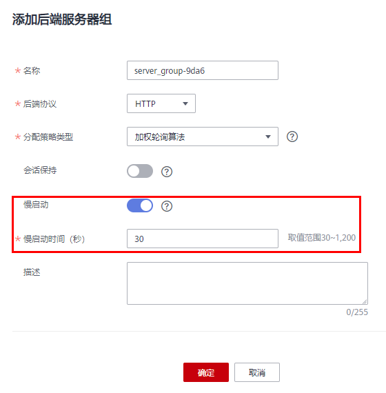
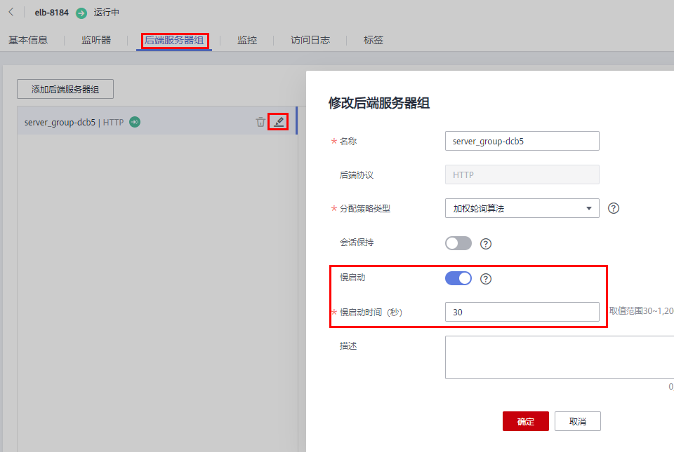

# 配置慢启动（独享型）

## 操作场景

弹性负载均衡支持七层（HTTP/HTTPS）后端协议开启慢启动功能，在设置的慢启动时间内线性增加请求分配权重，达到请求数线性增加的目的。当慢启动时间结束后，负载均衡向后端服务器发送完整比例的流量请求。慢启动能够实现业务的平滑启动，完美避免业务抖动问题。当弹性负载均衡器检测到开启慢启动的后端服务器组内的某台后端服务器状态为正常时，这台后端服务器会进入慢启动状态。

慢启动时间的取值范围为：30\~1200秒。

后端服务器在以下两种状态会退出慢启动状态。

-   到达已设定的慢启动时间。
-   慢启动时间内后端服务器变为异常。

变为异常而退出慢启动的后端服务器再次加入时，如果检测正常会重新进入到慢启动状态。

## 前提条件

-   已创建独享型负载均衡。
-   已创建七层（HTTP/HTTPS）监听器。

## 操作步骤

1.  登录管理控制台。
2.  在管理控制台左上角单击图标，选择区域和项目。
3.  单击页面左上角的，选择“网络 \> 弹性负载均衡”。
4.  在“负载均衡器”界面，单击需要添加后端服务器的负载均衡名称。
5.  切换到“后端服务器组”页签，单击“添加后端服务器组”。
6.  在“添加后端服务器组”页面，打开“慢启动”开关、并配置慢启动时间，其他参数请根据实际业务诉求填写。

    **图 1**  添加后端服务器-配置慢启动  
    

7.  单击“确定”。

## 相关操作

-   已经创建的后端服务器组可以在“后端服务器组”页签，单击已创建“后端服务器组”右侧的，开启慢启动功能。

    **图 2**  编辑后端服务器-配置慢启动  
    

-   新添加的后端服务器组，还需要添加后端服务器，具体操作请参考[添加或移除后端服务器（独享型）](添加或移除后端服务器（独享型）.md)。

