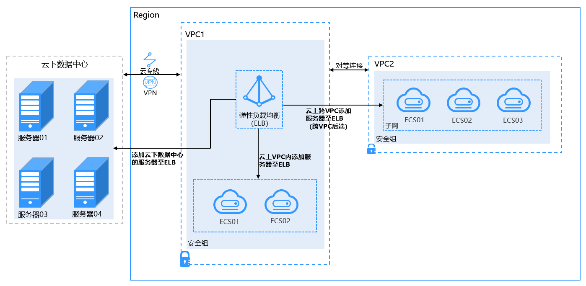
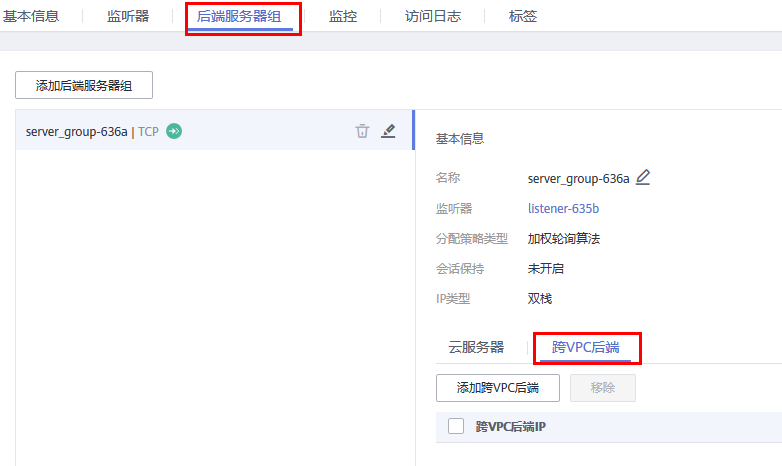
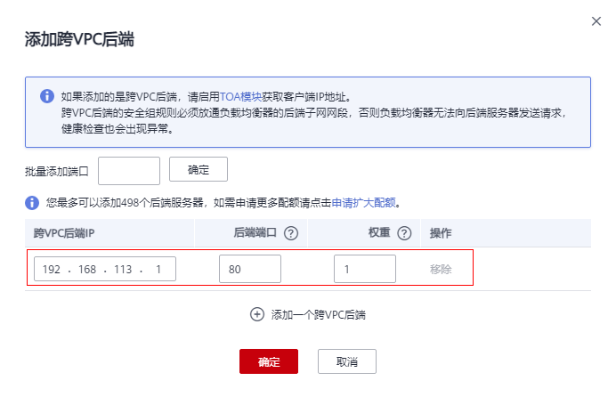

# 配置混合负载均衡-跨VPC后端（独享型）

## 操作场景

独享型负载均衡实例支持混合负载均衡的能力，后端服务器组不仅支持添加云上同VPC内的服务器，还支持跨VPC添加云上其他VPC和云下数据中心的服务器。帮助用户根据业务诉求灵活配置，将流量请求转发到云上、云下的服务器上。

-   在后端服务器组中添加云上同VPC内的服务器，请参考[添加或移除后端服务器（独享型）](添加或移除后端服务器（独享型）.md)。
-   跨VPC添加云上其他VPC中的服务器，需要先在ELB所在的VPC和云上其他VPC之间建立对等连接，然后通过跨VPC功能添加。建立对等连接详见[《虚拟私有云用户指南》](https://support.huaweicloud.com/usermanual-vpc/zh-cn_topic_0046655037.html)。
-   通过跨VPC功能添加云下数据中心的服务器，需要先通过云专线或VPN连通云上ELB所在的VPC和云下数据中心，详见[《云专线用户指南》](https://support.huaweicloud.com/qs-dc/zh-cn_topic_0145790541.html)或[《虚拟专用网络用户指南》](https://support.huaweicloud.com/bestpractice-vpn/vpn_05_0001.html)。
-   通过跨VPC功能添加同VPC内的服务器，需要对ELB所在的VPC创建对等连接并添加对等连接路由，再通过跨VPC功能添加。详情见[《通过跨VPC后端功能添加同VPC内的服务器至ELB》](https://support.huaweicloud.com/bestpractice-elb/elb_bp_0303.html)。

**图 1**  ELB支持添加云上、云下的服务器  

## 前提条件

-   已创建独享型负载均衡。
-   已创建监听器。
-   已正确配置VPC路由，确保后端可达。跨VPC后端支持添加通过以VPC对等连接、云连接、VPN连接与专线连接互通的后端服务器。

## 约束与限制

使用混合负载均衡功能时，请注意以下事项：

-   请前往负载均衡器基本信息页面开启跨VPC后端功能，否则该功能无法正常使用。
-   添加的跨VPC后端的IP地址只允许为IPv4类型的地址。
-   只有TCP，HTTP，HTTPS类型监听器支持跨VPC后端功能。
-   请确保负载均衡器的后端子网有足够的IP地址（至少有16个可用IP地址），否则该功能无法正常使用。可以通过负载均衡器的“基本信息 \> 后端子网”添加多个后端子网来增加后端子网的IP地址。
-   跨VPC后端的安全组规则必须放通负载均衡器的后端子网网段，否则会导后端业务流量与健康检查异常。
-   跨VPC后端功能开启后无法关闭。
-   一个监听器最多支持添加492个后端服务器（包含普通后端服务器和跨VPC后端服务器）。

> **说明：** 
>通过跨VPC功能添加同VPC内的服务器，需要对ELB所在的VPC创建对等连接并添加对等连接路由，再通过跨VPC功能添加。详情见[《通过跨VPC后端功能添加同VPC内的服务器至ELB》](https://support.huaweicloud.com/bestpractice-elb/elb_bp_0303.html)。

## 开启跨VPC后端

1.  登录管理控制台。
2.  在管理控制台左上角单击图标，选择区域和项目。
3.  单击页面左上角的，选择“网络 \> 弹性负载均衡”。
4.  在“负载均衡器”界面，单击需要开启跨VPC后端功能的负载均衡名称。
5.  在“基本信息”页面，单击“开启跨VPC后端”。
6.  单击“确定”。

## 添加跨VPC后端

1.  登录管理控制台。
2.  在管理控制台左上角单击图标，选择区域和项目。
3.  单击页面左上角的，选择“网络 \> 弹性负载均衡”。
4.  在“负载均衡器”界面，单击需要添加后端服务器的负载均衡名称。
5.  切换到“后端服务器组”页签，单击目标后端服务器组。
6.  单击右侧基本信息页的“跨VPC后端”。

    **图 2**  配置跨VPC后端  
    

7.  单击“添加跨VPC后端”，填写“跨VPC后端IP”、“后端端口”和“权重”。

    > **说明：** 
    >请确保“跨VPC后端IP”可达、“后端端口”为实际的后端业务端口，否则将会导致添加的后端服务器异常。

    **图 3**  添加跨VPC后端  
    

8.  单击“确定”。

