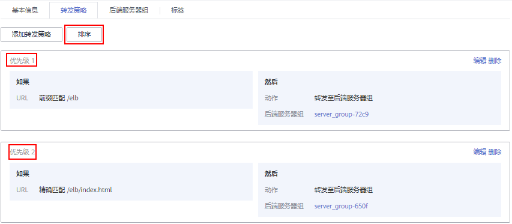

# 配置高级转发策略

## 操作场景

独享型负载均衡开启高级转发策略功能后，ELB实例会根据您配置的高级转发策略将不同的请求按照不同的方式处理。

每条高级转发策略必须包含转发规则和动作。

-   支持的转发规则有：域名、URL、HTTP请求方法、HTTP请求头、查询字符串、网段。详见[转发规则类型](转发规则和动作类型.md#zh-cn_topic_0000001182135225_section1351817374499)。
-   支持的动作类型有：转发至后端服务器组、重定向至监听器、添加重定向至URL、返回固定响应。详见[动作类型](转发规则和动作类型.md#zh-cn_topic_0000001182135225_section107001685017)。
-   支持域名类型转发规则以\*.开头。
-   支持单条转发策略中添加多个转发规则。
-   支持转发策略排序。

## 约束与限制

-   高级转发策略开启后不允许关闭。
-   一个高级转发策略支持添加10个条件（所有转发规则的条件之和）。

## 开启高级转发策略

1.  登录管理控制台。
2.  在管理控制台左上角单击图标，选择区域和项目。
3.  单击页面左上角的，选择“网络 \> 弹性负载均衡”。
4.  在“负载均衡器”界面，单击需要添加转发策略的负载均衡器名称。
5.  切换到监听器页签，单击目标监听器名称。
6.  在页面右侧“基本信息”中，单击“开启高级转发策略”
7.  单击“确定”。

## 添加高级转发策略

1.  登录管理控制台。
2.  在管理控制台左上角单击图标，选择区域和项目。
3.  单击页面左上角的，选择“网络 \> 弹性负载均衡”。
4.  在“负载均衡器”界面，单击需要添加转发策略的负载均衡器名称。
5.  切换到监听器页签，单击目标监听器名称。
6.  单击目标监听器右侧的按钮，选择“设置转发策略”。

    或者直接单击页面右侧的“转发策略”，进入到转发策略页签。

7.  在右侧“转发策略”子页签中，单击“添加转发策略”。

    参考[表1](#zh-cn_topic_0000001168961119_elb_ug_jt_0023_table10859681016)配置参数。

8.  配置完成，单击“保存”。

**表 1**  添加转发策略的参数

<table><thead align="left"><tr id="zh-cn_topic_0000001168961119_elb_ug_jt_0023_row109196141011"><th class="cellrowborder" colspan="2" valign="top" id="mcps1.2.5.1.1">
参数

</th>
<th class="cellrowborder" valign="top" id="mcps1.2.5.1.2">
说明

</th>
<th class="cellrowborder" valign="top" id="mcps1.2.5.1.3">
样例

</th>
</tr>
</thead>
<tbody><tr id="zh-cn_topic_0000001168961119_elb_ug_jt_0023_row15105761109"><td class="cellrowborder" rowspan="6" valign="top" width="12.57%" headers="mcps1.2.5.1.1 ">
转发规则

</td>
<td class="cellrowborder" valign="top" width="15.18%" headers="mcps1.2.5.1.1 ">
域名

</td>
<td class="cellrowborder" valign="top" width="44.78%" headers="mcps1.2.5.1.2 ">
触发转发的域名，支持精确域名、泛域名。

<ul id="zh-cn_topic_0000001168961119_ul1512255918358"><li>可以并列添加多个域名。</li><li>至少包含两个字符串，字符串间以点分割，字符串只能由英文字母、数字、中划线、小数点和特殊字符*组成。字符串中须以英文字母、数字或*开头，不能以中划线结尾。*只能出现在开头且必须以*.开始。</li></ul>
</td>
<td class="cellrowborder" valign="top" width="27.47%" headers="mcps1.2.5.1.3 ">
www.example.com

</td>
</tr>
<tr id="zh-cn_topic_0000001168961119_elb_ug_jt_0023_row16108186101017"><td class="cellrowborder" valign="top" headers="mcps1.2.5.1.1 ">
URL

</td>
<td class="cellrowborder" valign="top" headers="mcps1.2.5.1.1 ">
触发转发的URL。

<ul id="zh-cn_topic_0000001168961119_ul8611757153916"><li>可以并列添加多个URL。</li><li>由英文字母、数字和特殊字符_~';@^-%#$.*+?,=!:|\/()[]{}组成，并在精确匹配和前缀匹配时，只能由/开头。</li><li>URL的匹配模式有如下三种：<ul id="zh-cn_topic_0000001168961119_ul19792235436"><li>精确匹配
请求的URL和设定URL完全一致。

</li><li>前缀匹配
请求的URL匹配已设定URL开头的URL。

</li><li>正则匹配
请求的URL和设定的URL正则表达式匹配。

</li></ul>
</li></ul>
</td>
<td class="cellrowborder" valign="top" headers="mcps1.2.5.1.2 ">
请求的URL：/login.php

<ul id="ul1404102715475"><li>精确匹配：/login.php</li></ul>
<ul id="ul1447274719474"><li>前缀匹配：/log</li><li>正则匹配：/(\w)*\.php</li></ul>
</td>
</tr>
<tr id="zh-cn_topic_0000001168961119_row4263145513811"><td class="cellrowborder" valign="top" headers="mcps1.2.5.1.1 ">
HTTP请求方法

</td>
<td class="cellrowborder" valign="top" headers="mcps1.2.5.1.1 ">
触发转发的HTTP请求方法。主要分为以下几种：

GET、POST、PUT、DELETE、PATCH、HEAD、OPTIONS

可以并列设置多个请求方法。

</td>
<td class="cellrowborder" valign="top" headers="mcps1.2.5.1.2 ">
GET

</td>
</tr>
<tr id="zh-cn_topic_0000001168961119_row1126320551181"><td class="cellrowborder" valign="top" headers="mcps1.2.5.1.1 ">
HTTP请求头

</td>
<td class="cellrowborder" valign="top" headers="mcps1.2.5.1.1 ">
触发转发的HTTP请求头。

请求头是键值对的形式，需要分别设置值：

<ul id="zh-cn_topic_0000001168961119_ul18416145443516"><li>键（key）：只能由英文字母、数字、下划线和中划线组成。</li><li>值（value）：一个键下可以配置多个值。只能包含英文字母、数字和特殊字符!#$%&amp;'()*+,.\/:;&lt;=&gt;?@[]^-_'{|}~。</li></ul>
</td>
<td class="cellrowborder" valign="top" headers="mcps1.2.5.1.2 "><ul id="zh-cn_topic_0000001168961119_ul1724214811369"><li>键（key）：Accept-Language</li><li>值（value）：zh-CN</li></ul>
</td>
</tr>
<tr id="zh-cn_topic_0000001168961119_row1240912181994"><td class="cellrowborder" valign="top" headers="mcps1.2.5.1.1 ">
查询字符串

</td>
<td class="cellrowborder" valign="top" headers="mcps1.2.5.1.1 ">
触发转发的请求中的字符串。当请求中的字符串与设置好的转发策略中的字符串相匹配时，触发转发。

查询字符串是键值对的形式，需要分别设置值：

<ul id="zh-cn_topic_0000001168961119_ul98114484211"><li>键（key）：只能包含英文字母、数字和特殊字符!$'()*+,./:;=?@^-_'。</li><li>值（value）：一个键下可以配置多个值。只能包含英文字母、数字和特殊字符!$'()*+,./:;=?@^-_'。</li></ul>
</td>
<td class="cellrowborder" valign="top" headers="mcps1.2.5.1.2 "><ul id="zh-cn_topic_0000001168961119_ul21871415174317"><li>键（key）：locale</li><li>值（value）：zh-cn</li></ul>
</td>
</tr>
<tr id="zh-cn_topic_0000001168961119_row124101318199"><td class="cellrowborder" valign="top" headers="mcps1.2.5.1.1 ">
网段

</td>
<td class="cellrowborder" valign="top" headers="mcps1.2.5.1.1 ">
触发转发的请求网段。

</td>
<td class="cellrowborder" valign="top" headers="mcps1.2.5.1.2 ">
192.168.1.0/24

</td>
</tr>
<tr id="zh-cn_topic_0000001168961119_row475419411386"><td class="cellrowborder" rowspan="4" valign="top" width="12.57%" headers="mcps1.2.5.1.1 ">
动作

</td>
<td class="cellrowborder" valign="top" width="15.18%" headers="mcps1.2.5.1.1 ">
转发至后端服务器组

</td>
<td class="cellrowborder" valign="top" width="44.78%" headers="mcps1.2.5.1.2 ">
如果满足转发策略条件，则将请求转发至配置好的后端服务器组。

需要配置后端服务器组。

</td>
<td class="cellrowborder" valign="top" width="27.47%" headers="mcps1.2.5.1.3 ">
转发至后端服务器组

</td>
</tr>
<tr id="zh-cn_topic_0000001168961119_row59361322197"><td class="cellrowborder" valign="top" headers="mcps1.2.5.1.1 ">
重定向至监听器

</td>
<td class="cellrowborder" valign="top" headers="mcps1.2.5.1.1 ">
将HTTP监听器上的请求转发至配置好的HTTPS监听器上。

需要配置监听器。

 说明： 

选择“重定向至监听器”并配置监听器后，除访问控制以外原有监听器配置会失效。

例如：配置了重定向至监听器后，当客户端通过HTTP请求访问的时候，后端服务器会返回HTTPS的响应，即强制以HTTPS请求访问网页。因此实际以HTTPS监听器的配置为准向后端服务器进行转发，原有HTTP监听器的配置就无效了。

</td>
<td class="cellrowborder" valign="top" headers="mcps1.2.5.1.2 ">
-

</td>
</tr>
<tr id="zh-cn_topic_0000001168961119_row2017191541010"><td class="cellrowborder" valign="top" headers="mcps1.2.5.1.1 ">
重定向至URL

</td>
<td class="cellrowborder" valign="top" headers="mcps1.2.5.1.1 ">
如果满足转发策略条件，则将请求重定向至配置好的URL。

客户端访问ELB网址A后，ELB返回302或者其他3xx返回码和目的网址B，客户端自动跳转到网址B，网址B可自定义。

需要设置如下参数：

<ul id="zh-cn_topic_0000001168961119_ul11271746205316"><li><strong id="zh-cn_topic_0000001168961119_b152781725133819">协议</strong>：可以选择“${protocol}”或“HTTP”或“HTTPS”。${protocol}表示与源协议相同。</li><li><strong id="zh-cn_topic_0000001168961119_b25962318387">域名</strong>：至少包含两个字符串，字符串间以点分割，字符串只能由英文字母、数字、中划线和小数点组成。字符串必须以英文字母或数字开头，不能以中划线结尾。${host}表示与源域名相同。</li><li><strong id="zh-cn_topic_0000001168961119_b106659359384">端口</strong>：取值范围是1~65535。${port}表示与源端口相同。</li><li><strong id="zh-cn_topic_0000001168961119_b397413913389">路径</strong>：由英文字母、数字和特殊字符_~';@^-%#&amp;$.*+?,=!:|\/()[]{}组成，只能由/开头。${path}表示与源路径相同。</li><li><strong id="zh-cn_topic_0000001168961119_b7897154315389">查询字符串</strong>：只能包含英文字母、数字额特殊字符!$'()*+,./:;=?@&amp;^-_'，&amp;仅支持作为分隔符使用。</li><li><strong id="zh-cn_topic_0000001168961119_b11758104823816">返回码</strong>：可以选择“301”、“302”、“303”、“307”、“308”。</li></ul>

 说明： 

协议、域名、端口和路径至少设置一条。

</td>
<td class="cellrowborder" valign="top" headers="mcps1.2.5.1.2 ">
协议：HTTP

域名：www.example1.com

端口：8081

路径：/index.html

查询字符串：locale=zh-cn

返回码：301

</td>
</tr>
<tr id="zh-cn_topic_0000001168961119_row12500507510"><td class="cellrowborder" valign="top" headers="mcps1.2.5.1.1 ">
返回固定响应

</td>
<td class="cellrowborder" valign="top" headers="mcps1.2.5.1.1 ">
如果满足转发策略条件，则返回固定响应。

用户访问ELB实例后，ELB直接返回响应，不向后端服务器继续转发，返回响应的状态码和内容可以自定义。

需要设置如下参数：

<ul id="zh-cn_topic_0000001168961119_ul895043615387"><li><strong id="zh-cn_topic_0000001168961119_b127544110398">返回码</strong>：只能由数字组成，默认以2、4、5开头，且总长度为3个字符。</li><li><strong id="zh-cn_topic_0000001168961119_b12696135113912">Content-Type</strong>：可以选择“text/plain”、“text/css”、“text/html”、“application/javascript”、“application/json”。</li><li><strong id="zh-cn_topic_0000001168961119_b09006923917">响应正文</strong>：非必填项。</li></ul>
</td>
<td class="cellrowborder" valign="top" headers="mcps1.2.5.1.2 ">
返回码：200

Content-Type：text/plain

响应正文：服务器访问正常

</td>
</tr>
</tbody>
</table>

## 转发策略排序

一个监听器可以添加多个转发策略，多个转发策略之间可以通过排序来设置优先级。

1.  登录管理控制台。
2.  在管理控制台左上角单击图标，选择区域和项目。
3.  单击页面左上角的，选择“网络 \> 弹性负载均衡”。
4.  在“负载均衡器”界面，单击需要修改转发策略的负载均衡器名称。
5.  切换到监听器页签，单击需要修改转发策略的监听器名称。
6.  单击转发策略右侧的按钮，选择“设置转发策略”。

    或者直接打开页面右侧的“转发策略”。

7.  在右侧“转发策略”子页签中，单击上方的“排序”。
8.  单击转发策略右上角的“上移”或“下移”。
9.  单击“保存”。

**图 1**  转发策略排序  

## URL高级转发策略匹配示例

配置了5个URL高级转发策略，如[表2](#table39051294411)所示。

**表 2**  URL高级转发策略匹配示例

<table><thead align="left"><tr id="row89181214445"><th class="cellrowborder" valign="top" width="18.228177182281772%" id="mcps1.2.7.1.1">
请求URL

</th>
<th class="cellrowborder" valign="top" width="13.17868213178682%" id="mcps1.2.7.1.2">
转发策略

</th>
<th class="cellrowborder" valign="top" width="19.37806219378062%" id="mcps1.2.7.1.3">
设定的URL

</th>
<th class="cellrowborder" valign="top" width="11.38886111388861%" id="mcps1.2.7.1.4">
匹配模式

</th>
<th class="cellrowborder" valign="top" width="16.76832316768323%" id="mcps1.2.7.1.5">
转发策略优先级

</th>
<th class="cellrowborder" valign="top" width="21.057894210578944%" id="mcps1.2.7.1.6">
转发至后端服务器组

</th>
</tr>
</thead>
<tbody><tr id="row12911412144414"><td class="cellrowborder" rowspan="2" valign="top" width="18.228177182281772%" headers="mcps1.2.7.1.1 ">
/elb/abc.html

</td>
<td class="cellrowborder" valign="top" width="13.17868213178682%" headers="mcps1.2.7.1.2 ">
转发策略01

</td>
<td class="cellrowborder" valign="top" width="19.37806219378062%" headers="mcps1.2.7.1.3 ">
/elb/php.html

</td>
<td class="cellrowborder" valign="top" width="11.38886111388861%" headers="mcps1.2.7.1.4 ">
前缀匹配

</td>
<td class="cellrowborder" valign="top" width="16.76832316768323%" headers="mcps1.2.7.1.5 ">
优先级 1

</td>
<td class="cellrowborder" valign="top" width="21.057894210578944%" headers="mcps1.2.7.1.6 ">
后端服务器组01

</td>
</tr>
<tr id="row191612104413"><td class="cellrowborder" valign="top" headers="mcps1.2.7.1.1 ">
转发策略02

</td>
<td class="cellrowborder" valign="top" headers="mcps1.2.7.1.2 ">
/elb

</td>
<td class="cellrowborder" valign="top" headers="mcps1.2.7.1.3 ">
前缀匹配

</td>
<td class="cellrowborder" valign="top" headers="mcps1.2.7.1.4 ">
优先级 2

</td>
<td class="cellrowborder" valign="top" headers="mcps1.2.7.1.5 ">
后端服务器组02

</td>
</tr>
<tr id="row1891121215442"><td class="cellrowborder" rowspan="2" valign="top" width="18.228177182281772%" headers="mcps1.2.7.1.1 ">
/exa/index.html

</td>
<td class="cellrowborder" valign="top" width="13.17868213178682%" headers="mcps1.2.7.1.2 ">
转发策略03

</td>
<td class="cellrowborder" valign="top" width="19.37806219378062%" headers="mcps1.2.7.1.3 ">
/exa[^\s]*

</td>
<td class="cellrowborder" valign="top" width="11.38886111388861%" headers="mcps1.2.7.1.4 ">
正则匹配

</td>
<td class="cellrowborder" valign="top" width="16.76832316768323%" headers="mcps1.2.7.1.5 ">
优先级 3

</td>
<td class="cellrowborder" valign="top" width="21.057894210578944%" headers="mcps1.2.7.1.6 ">
后端服务器组03

</td>
</tr>
<tr id="row1491121234419"><td class="cellrowborder" valign="top" headers="mcps1.2.7.1.1 ">
转发策略04

</td>
<td class="cellrowborder" valign="top" headers="mcps1.2.7.1.2 ">
/exa/index.html

</td>
<td class="cellrowborder" valign="top" headers="mcps1.2.7.1.3 ">
正则匹配

</td>
<td class="cellrowborder" valign="top" headers="mcps1.2.7.1.4 ">
优先级 4

</td>
<td class="cellrowborder" valign="top" headers="mcps1.2.7.1.5 ">
后端服务器组04

</td>
</tr>
<tr id="row29111224419"><td class="cellrowborder" valign="top" width="18.228177182281772%" headers="mcps1.2.7.1.1 ">
/mpl/index.html

</td>
<td class="cellrowborder" valign="top" width="13.17868213178682%" headers="mcps1.2.7.1.2 ">
转发策略05

</td>
<td class="cellrowborder" valign="top" width="19.37806219378062%" headers="mcps1.2.7.1.3 ">
/mpl/index.html

</td>
<td class="cellrowborder" valign="top" width="11.38886111388861%" headers="mcps1.2.7.1.4 ">
精确匹配

</td>
<td class="cellrowborder" valign="top" width="16.76832316768323%" headers="mcps1.2.7.1.5 ">
优先级 5

</td>
<td class="cellrowborder" valign="top" width="21.057894210578944%" headers="mcps1.2.7.1.6 ">
后端服务器组05

</td>
</tr>
</tbody>
</table>

转发情况如下：

-   当请求URL为“**/elb/abc.html**”时，初步可以匹配到**两个前缀匹配**：**转发策略01**、**转发策略02**，但由于转发策略01的优先级高于转发策略02的优先级（优先级 2 < 优先级 1），因此最终匹配到**转发策略01**，将请求转发至**后端服务器组01**。
-   当请求URL为“**/exa/index.html**”时，初步可以匹配到**两个正则匹配**：**转发策略03**、**转发策略04**，但由于转发策略03的优先级高于转发策略04的优先级（优先级 4 < 优先级 3），因此最终匹配到**转发策略03**，将请求转发至**后端服务器组03**。
-   当请求URL为“**/mpl/index.html**”时，可以通过精确匹配，匹配到**转发策略05**，将请求转发至**后端服务器组05**。

## 修改转发策略

1.  登录管理控制台。
2.  在管理控制台左上角单击图标，选择区域和项目。
3.  单击页面左上角的，选择“网络 \> 弹性负载均衡”。
4.  在“负载均衡器”界面，单击需要修改转发策略的负载均衡器名称。
5.  切换到监听器页签，单击需要修改转发策略的监听器名称。
6.  单击转发策略右侧的按钮，选择“设置转发策略”。

    或者直接打开页面右侧的“转发策略”。

7.  在右侧“转发策略”子页签中，选择需要修改的转发策略，单击“编辑”。
8.  根据界面提示修改参数，单击“保存”。

## 删除转发策略

用户可以根据实际需要删除已经创建的转发策略。

转发策略删除后无法恢复，请谨慎操作。

1.  登录管理控制台。
2.  在管理控制台左上角单击图标，选择区域和项目。
3.  单击页面左上角的，选择“网络 \> 弹性负载均衡”。
4.  在“负载均衡器”界面，单击需要删除转发策略的负载均衡器名称。
5.  切换到监听器页签，单击需要删除转发策略的监听器名称。
6.  单击转发策略右侧的按钮，选择“设置转发策略”。

    或者直接打开页面右侧的“转发策略”。

7.  在右侧“转发策略”子页签中，选择需要删除的转发策略，单击“删除”。
8.  单击“是”。

