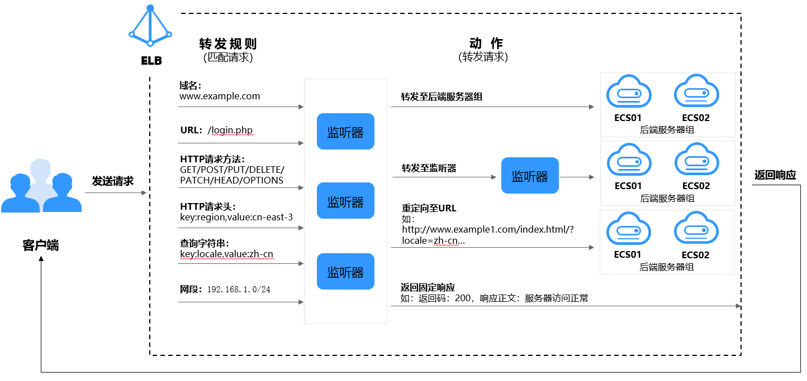

# 高级转发策略简介

独享型负载均衡支持开启高级转发策略功能。开启后，ELB实例会根据您配置的高级转发策略将不同的请求按照不同的方式处理。

> **说明：** 
>当前高级转发策略支持的区域有：“华北-北京四”、“华东-上海一”、“华南-广州”、“西南-贵阳一”、“中国-香港”、“亚太-新加坡”

**图 1**  高级转发策略（独享型）示意图  

1.  客户端发送请求至ELB；
2.  ELB首先根据事先设置好的高级转发策略中的转发规则匹配请求；
3.  ELB再根据转发规则对应的动作将客户端请求转发至对应的后端服务器进行处理；
4.  最后由后端服务器返回响应至客户端。
    -   每条高级转发策略必须包含**转发规则**和**动作**。
        -   支持的转发规则有：域名、URL、HTTP请求方法、HTTP请求头、查询字符串、网段。详见[转发规则类型](转发规则和动作类型.md#zh-cn_topic_0000001182135225_section1351817374499)。
        -   支持的动作类型有：转发至后端服务器组、重定向至监听器、添加重定向至URL、返回固定响应。详见[动作类型](转发规则和动作类型.md#zh-cn_topic_0000001182135225_section107001685017)。

